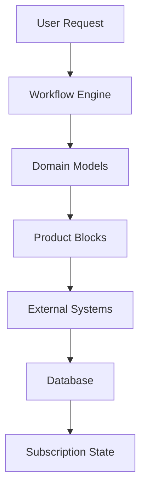
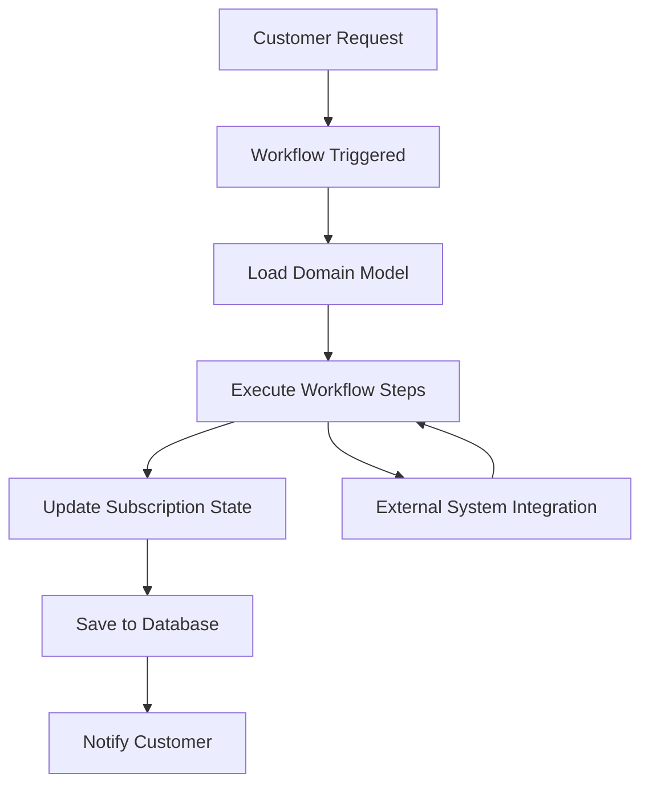

## Architecture Overview

Workflow Orchestrator is built around several key concepts that work together to provide a comprehensive service management platform. Understanding these concepts is essential for effectively using the framework.



## Core Components

<CardGroup cols={2}>
  <Card
    title="Domain Models"
    icon="cube"
    href="/concepts/domain-models"
  >
    Pydantic-based models that represent your business entities and their relationships
  </Card>
  <Card
    title="Workflows"
    icon="workflow"
    href="/concepts/workflows"
  >
    Python functions that define business processes and service lifecycle management
  </Card>
  <Card
    title="Products"
    icon="box"
    href="/concepts/products"
  >
    Service offerings that customers can subscribe to, composed of product blocks
  </Card>
  <Card
    title="Subscriptions"
    icon="users"
    href="/concepts/subscriptions"
  >
    Customer instances of products with specific configurations and lifecycle states
  </Card>
</CardGroup>

## How It All Works Together

The Workflow Orchestrator follows a **domain-driven design** approach where your business logic is clearly separated from technical infrastructure concerns.

### 1. Define Your Domain

Start by modeling your business domain using **Domain Models**:

```python
class NetworkServiceInactive(SubscriptionModel, is_base=True):
    """Base model for network service subscriptions."""
    customer_id: str
    service_type: str
    bandwidth: BandwidthBlock

class BandwidthBlock(ProductBlockModel, product_block_name="Bandwidth"):
    """Represents bandwidth allocation."""
    speed_mbps: int
    burst_limit: Optional[int] = None
```

### 2. Create Products

**Products** define what services you offer to customers:

```python
# In your database/configuration
{
    "name": "Internet Service",
    "description": "High-speed internet connectivity",
    "product_blocks": ["Bandwidth", "IPAddress", "VLAN"],
    "fixed_inputs": {
        "service_level": "premium"
    }
}
```

### 3. Build Workflows

**Workflows** define how services are provisioned, modified, and terminated:

```python
@workflow("Provision Internet Service")
def provision_internet_service():
    return (
        init
        >> allocate_bandwidth
        >> assign_ip_address
        >> configure_vlan
        >> activate_service
        >> done
    )
```

### 4. Manage Subscriptions

**Subscriptions** are customer instances with specific configurations and states:

- `INITIAL` → `PROVISIONING` → `ACTIVE` → `TERMINATED`
- Each state has different validation rules and available actions

## Key Principles

<AccordionGroup>
  <Accordion title="Type Safety">
    Everything is strongly typed using Pydantic models, providing runtime validation and excellent IDE support.

    ```python
    # This will raise a validation error at runtime
    subscription = NetworkService(
        bandwidth=BandwidthBlock(speed_mbps="invalid")  # Should be int
    )
    ```
  </Accordion>

  <Accordion title="Lifecycle Management">
    All services follow a well-defined lifecycle with automatic state transitions and validation.

    ```python
    # Different models for different lifecycle states
    class ServiceProvisioning(ServiceInactive, lifecycle=[SubscriptionLifecycle.PROVISIONING]):
        bandwidth: BandwidthBlockProvisioning  # Required fields for provisioning

    class ServiceActive(ServiceProvisioning, lifecycle=[SubscriptionLifecycle.ACTIVE]):
        bandwidth: BandwidthBlockActive  # All fields required when active
    ```
  </Accordion>

  <Accordion title="Composability">
    Services are built from reusable product blocks that can be combined in different ways.

    ```python
    class BasicInternet(SubscriptionModel):
        bandwidth: BandwidthBlock

    class PremiumInternet(SubscriptionModel):
        bandwidth: BandwidthBlock
        static_ip: IPAddressBlock
        priority_support: SupportBlock
    ```
  </Accordion>

  <Accordion title="Auditability">
    Every change is tracked with complete audit trails, including who made changes and when.

    ```python
    # Automatic tracking of:
    # - Workflow executions
    # - State transitions
    # - Configuration changes
    # - User actions
    ```
  </Accordion>
</AccordionGroup>

## Data Flow

Understanding how data flows through the system:



<Steps>
  <Step title="Request Initiation">
    A customer or operator initiates a request (create, modify, terminate service)
  </Step>

  <Step title="Workflow Execution">
    The appropriate workflow is triggered based on the request type and current state
  </Step>

  <Step title="Domain Model Loading">
    Current subscription state is loaded into strongly-typed domain models
  </Step>

  <Step title="Business Logic Execution">
    Workflow steps execute business logic, potentially calling external systems
  </Step>

  <Step title="State Persistence">
    Updated domain models are validated and saved to the database
  </Step>

  <Step title="Notification">
    Customers and operators are notified of completion or errors
  </Step>
</Steps>

## Benefits of This Architecture

<CardGroup cols={2}>
  <Card title="Maintainability" icon="wrench">
    Clear separation of concerns makes code easy to understand and modify
  </Card>
  <Card title="Reliability" icon="shield">
    Strong typing and validation catch errors early in development
  </Card>
  <Card title="Scalability" icon="chart-line">
    Async processing and database optimization support high throughput
  </Card>
  <Card title="Flexibility" icon="puzzle">
    Modular design allows easy customization and extension
  </Card>
</CardGroup>

## Next Steps

Now that you understand the core concepts, dive deeper into each area:

<CardGroup cols={2}>
  <Card
    title="Learn Domain Models"
    icon="cube"
    href="/concepts/domain-models"
  >
    Master the foundation of your service definitions
  </Card>
  <Card
    title="Build Workflows"
    icon="workflow"
    href="/concepts/workflows"
  >
    Create automated processes for your services
  </Card>
  <Card
    title="Design Products"
    icon="box"
    href="/concepts/products"
  >
    Structure your service offerings effectively
  </Card>
  <Card
    title="Manage Subscriptions"
    icon="users"
    href="/concepts/subscriptions"
  >
    Handle customer service instances and their lifecycles
  </Card>
</CardGroup>
