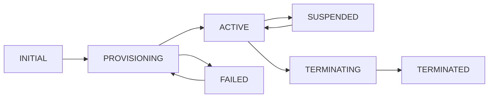

## What are Subscriptions?

**Subscriptions** are customer instances of products with specific configurations and lifecycle states. They represent the actual services that customers have purchased and are using, containing all the configuration details, state information, and history for that particular service instance.

<Note>
Think of products as **templates** and subscriptions as **instances**. A product defines what's possible; a subscription defines what's actually configured for a specific customer.
</Note>

## Subscription Lifecycle

Every subscription follows a well-defined lifecycle with automatic state transitions and validation:



<Tabs>
  <Tab title="INITIAL">
    **Purpose**: Subscription created but not yet provisioned

    **Characteristics**:
    - Basic customer information collected
    - Most technical fields optional
    - No external resources allocated
    - Can be modified freely

    ```python
    subscription = InternetServiceInactive(
        customer_id="CUST123",
        service_type="business_internet",
        bandwidth=BandwidthBlock(speed_mbps=None),  # Optional
        installation_address="123 Main St"
    )
    ```
  </Tab>

  <Tab title="PROVISIONING">
    ```python
    class InternetServiceProvisioning(InternetServiceInactive, lifecycle=[SubscriptionLifecycle.PROVISIONING]):
        # More fields become required
        bandwidth: BandwidthBlockProvisioning  # speed_mbps now required
        installation_date: datetime
        technician_assigned: str
    ```

    **Purpose**: Service being set up and configured

    **Characteristics**:
    - Technical configuration required
    - External systems being configured
    - Resources allocated but not active
    - Limited modifications allowed
  </Tab>

  <Tab title="ACTIVE">
    ```python
    class InternetServiceActive(InternetServiceProvisioning, lifecycle=[SubscriptionLifecycle.ACTIVE]):
        # All fields required and validated
        bandwidth: BandwidthBlockActive
        service_id: str  # Required when active
        activation_date: datetime
        billing_start_date: datetime
    ```

    **Purpose**: Service fully operational and in use

    **Characteristics**:
    - All configuration complete and validated
    - Service actively providing value to customer
    - Billing typically starts
    - Modifications require workflows
  </Tab>

  <Tab title="TERMINATED">
    **Purpose**: Service permanently shut down

    **Characteristics**:
    - All resources released
    - Final billing completed
    - Configuration preserved for audit
    - Cannot be reactivated

    ```python
    # Terminated subscriptions keep configuration for audit
    terminated_subscription.status == SubscriptionLifecycle.TERMINATED
    terminated_subscription.end_date  # When service ended
    terminated_subscription.termination_reason  # Why it was terminated
    ```
  </Tab>
</Tabs>

## Subscription Structure

Subscriptions contain several types of information:

### Core Metadata

```python
class SubscriptionModel(DomainModel):
    # Identity and ownership
    subscription_id: UUID
    customer_id: str
    product: ProductModel

    # Lifecycle management
    status: SubscriptionLifecycle
    description: str
    start_date: Optional[datetime]
    end_date: Optional[datetime]

    # Operational state
    insync: bool  # Whether actual state matches desired state
    version: int  # For optimistic locking
    note: Optional[str]  # Operational notes
```

### Product Configuration

```python
class BusinessInternetSubscription(SubscriptionModel, is_base=True):
    # Fixed inputs (from product definition)
    service_level_agreement: str = "99.9% uptime"
    installation_type: str = "professional"

    # Configurable product blocks
    bandwidth: BandwidthBlock
    ip_address: IPAddressBlock
    connection: NetworkConnectionBlock

    # Customer-specific information
    site_name: str
    technical_contact: ContactInfo
    billing_contact: ContactInfo
    installation_address: Address
```

### Computed Properties

```python
class BusinessInternetSubscription(SubscriptionModel, is_base=True):
    # ... other fields ...

    @computed_field
    @property
    def monthly_recurring_cost(self) -> Decimal:
        """Calculate total monthly cost."""
        return (
            self.bandwidth.monthly_cost +
            self.ip_address.monthly_cost +
            self.connection.monthly_cost
        )

    @computed_field
    @property
    def contract_end_date(self) -> Optional[datetime]:
        """Calculate when contract expires."""
        if self.start_date and hasattr(self, 'contract_term_months'):
            return self.start_date + timedelta(days=30 * self.contract_term_months)
        return None

    @computed_field
    @property
    def service_summary(self) -> str:
        """Generate human-readable service summary."""
        return f"{self.bandwidth.speed_mbps}Mbps Internet at {self.site_name}"
```

## Creating Subscriptions

### From Product Definition

```python
# Create new subscription from product
subscription = BusinessInternetInactive.from_product_id(
    product_id=product_uuid,
    customer_id="CUST123",
    status=SubscriptionLifecycle.INITIAL,
    description="New business internet service"
)

# Configure the subscription
subscription.site_name = "Main Office"
subscription.bandwidth.speed_mbps = 500
subscription.installation_address = Address(
    street="123 Business Blvd",
    city="Tech City",
    state="CA",
    zip_code="90210"
)

# Save to database
subscription.save()
```

### Loading Existing Subscriptions

```python
# Load subscription from database
subscription = BusinessInternetActive.from_subscription(subscription_id)

# Access configuration
print(f"Customer: {subscription.customer_id}")
print(f"Speed: {subscription.bandwidth.speed_mbps}Mbps")
print(f"Monthly cost: ${subscription.monthly_recurring_cost}")
print(f"Status: {subscription.status}")
```

## Subscription Relationships

Subscriptions can have complex relationships with each other:

### Hierarchical Services

```python
class EnterpriseWANSubscription(SubscriptionModel, is_base=True):
    """Main WAN service subscription."""
    primary_site: SiteConnectionBlock
    remote_sites: List[SiteConnectionBlock] = []

class SiteConnectionBlock(ProductBlockModel, product_block_name="SiteConnection"):
    """Individual site connection within WAN."""
    site_name: str
    bandwidth: BandwidthBlock
    local_network: NetworkBlock

    # Reference to separate internet subscription at this site
    internet_subscription_id: Optional[UUID] = None
```

### Service Dependencies

```python
class VoIPServiceSubscription(SubscriptionModel, is_base=True):
    """VoIP service that depends on internet connectivity."""

    # Core VoIP configuration
    phone_numbers: List[PhoneNumberBlock] = []
    pbx_config: PBXConfigBlock

    # Dependency on internet service
    internet_subscription_id: UUID  # Required internet service

    @computed_field
    @property
    def internet_subscription(self) -> InternetServiceSubscription:
        """Get the underlying internet service."""
        return InternetServiceSubscription.from_subscription(
            self.internet_subscription_id
        )

    def validate_bandwidth_requirements(self) -> None:
        """Ensure internet service has sufficient bandwidth for VoIP."""
        internet = self.internet_subscription
        required_bandwidth = len(self.phone_numbers) * 100  # 100kbps per line

        if internet.bandwidth.speed_mbps * 1000 < required_bandwidth:
            raise ValueError(
                f"Internet service ({internet.bandwidth.speed_mbps}Mbps) "
                f"insufficient for {len(self.phone_numbers)} VoIP lines"
            )
```

### Shared Resources

```python
class SharedNetworkResource(ProductBlockModel, product_block_name="SharedNetwork"):
    """Network resource shared across multiple subscriptions."""

    network_id: str
    vlan_pool: List[int] = []
    ip_pool: List[IPv4Network] = []

    def allocate_vlan(self) -> int:
        """Allocate next available VLAN."""
        if not self.vlan_pool:
            raise ValueError("No VLANs available")
        return self.vlan_pool.pop(0)

    def release_vlan(self, vlan_id: int) -> None:
        """Return VLAN to available pool."""
        if vlan_id not in self.vlan_pool:
            self.vlan_pool.append(vlan_id)
            self.vlan_pool.sort()

# Multiple subscriptions can reference the same shared resource
class CustomerASubscription(SubscriptionModel, is_base=True):
    shared_network: SharedNetworkResource  # Same instance
    allocated_vlan: int

class CustomerBSubscription(SubscriptionModel, is_base=True):
    shared_network: SharedNetworkResource  # Same instance
    allocated_vlan: int
```

## Subscription Operations

### Lifecycle Transitions

```python
def provision_internet_service(subscription_id: UUID) -> None:
    """Transition subscription from INITIAL to ACTIVE."""

    # Load current subscription
    subscription = BusinessInternetInactive.from_subscription(subscription_id)

    # Validate ready for provisioning
    if not subscription.bandwidth.speed_mbps:
        raise ValueError("Bandwidth must be configured before provisioning")

    # Transition to provisioning state
    provisioning_subscription = BusinessInternetProvisioning.from_other_lifecycle(
        subscription,
        SubscriptionLifecycle.PROVISIONING
    )

    # Perform provisioning steps
    provisioning_subscription.installation_date = datetime.now()
    provisioning_subscription.technician_assigned = "TECH001"

    # ... external system calls ...

    # Transition to active
    active_subscription = BusinessInternetActive.from_other_lifecycle(
        provisioning_subscription,
        SubscriptionLifecycle.ACTIVE
    )

    active_subscription.service_id = generate_service_id()
    active_subscription.activation_date = datetime.now()
    active_subscription.save()
```

### Configuration Changes

```python
def modify_bandwidth(subscription_id: UUID, new_speed: int) -> None:
    """Modify bandwidth for existing subscription."""

    # Load active subscription
    subscription = BusinessInternetActive.from_subscription(subscription_id)

    # Validate change is allowed
    if new_speed < subscription.bandwidth.speed_mbps:
        # Downgrade requires different validation
        validate_downgrade_impact(subscription, new_speed)

    # Apply change
    old_speed = subscription.bandwidth.speed_mbps
    subscription.bandwidth.speed_mbps = new_speed

    # Update external systems
    network_api.update_bandwidth(
        service_id=subscription.service_id,
        new_bandwidth=new_speed
    )

    # Save changes
    subscription.save()

    # Log change for audit
    log_subscription_change(
        subscription_id=subscription_id,
        change_type="bandwidth_modification",
        old_value=old_speed,
        new_value=new_speed,
        changed_by=get_current_user()
    )
```

## Subscription Queries

### Finding Subscriptions

```python
from orchestrator.db import SubscriptionTable
from sqlalchemy import select

# Find subscriptions by customer
customer_subscriptions = db.session.scalars(
    select(SubscriptionTable)
    .where(SubscriptionTable.customer_id == "CUST123")
    .where(SubscriptionTable.status == SubscriptionLifecycle.ACTIVE)
).all()

# Find subscriptions by product type
internet_subscriptions = db.session.scalars(
    select(SubscriptionTable)
    .join(ProductTable)
    .where(ProductTable.product_type == "Internet")
    .where(SubscriptionTable.status == SubscriptionLifecycle.ACTIVE)
).all()

# Find subscriptions needing renewal
from datetime import datetime, timedelta

expiring_soon = db.session.scalars(
    select(SubscriptionTable)
    .where(SubscriptionTable.end_date <= datetime.now() + timedelta(days=30))
    .where(SubscriptionTable.status == SubscriptionLifecycle.ACTIVE)
).all()
```

### Aggregation Queries

```python
def get_customer_service_summary(customer_id: str) -> Dict[str, Any]:
    """Get summary of all services for a customer."""

    subscriptions = [
        BusinessInternetActive.from_subscription(sub.subscription_id)
        for sub in customer_subscriptions
        if sub.customer_id == customer_id
    ]

    return {
        "total_subscriptions": len(subscriptions),
        "active_services": len([s for s in subscriptions if s.status == SubscriptionLifecycle.ACTIVE]),
        "total_monthly_cost": sum(s.monthly_recurring_cost for s in subscriptions),
        "total_bandwidth": sum(s.bandwidth.speed_mbps for s in subscriptions),
        "service_types": list(set(s.product.product_type for s in subscriptions))
    }
```

## Subscription Events and Audit

### Event Tracking

```python
class SubscriptionEvent:
    """Track important subscription events."""

    def __init__(self, subscription_id: UUID, event_type: str, details: Dict[str, Any]):
        self.subscription_id = subscription_id
        self.event_type = event_type
        self.details = details
        self.timestamp = datetime.now()
        self.user_id = get_current_user_id()

    def save(self) -> None:
        """Save event to audit log."""
        audit_log.record_event(
            subscription_id=self.subscription_id,
            event_type=self.event_type,
            details=self.details,
            timestamp=self.timestamp,
            user_id=self.user_id
        )

# Usage in workflows
def activate_service_step(state: State) -> State:
    subscription = state.subscription

    # Perform activation
    subscription.status = SubscriptionLifecycle.ACTIVE
    subscription.activation_date = datetime.now()

    # Record event
    event = SubscriptionEvent(
        subscription_id=subscription.subscription_id,
        event_type="service_activated",
        details={
            "service_type": subscription.product.name,
            "bandwidth": subscription.bandwidth.speed_mbps,
            "activation_method": "automated_workflow"
        }
    )
    event.save()

    return {**state, "subscription": subscription}
```

### Change History

```python
class SubscriptionChangeTracker:
    """Track changes to subscription configuration."""

    @staticmethod
    def track_change(
        subscription_id: UUID,
        field_path: str,
        old_value: Any,
        new_value: Any,
        change_reason: str
    ) -> None:
        """Record a configuration change."""

        change_record = {
            "subscription_id": subscription_id,
            "field_path": field_path,
            "old_value": serialize_value(old_value),
            "new_value": serialize_value(new_value),
            "change_reason": change_reason,
            "timestamp": datetime.now(),
            "user_id": get_current_user_id()
        }

        db.session.add(SubscriptionChangeTable(**change_record))
        db.session.commit()

# Automatic change tracking in domain models
class BandwidthBlock(ProductBlockModel, product_block_name="Bandwidth"):
    speed_mbps: int

    def __setattr__(self, name: str, value: Any) -> None:
        """Override to track changes."""
        if hasattr(self, name) and getattr(self, name) != value:
            # Track the change
            SubscriptionChangeTracker.track_change(
                subscription_id=self.owner_subscription_id,
                field_path=f"bandwidth.{name}",
                old_value=getattr(self, name),
                new_value=value,
                change_reason="direct_modification"
            )

        super().__setattr__(name, value)
```

## Best Practices

<AccordionGroup>
  <Accordion title="Lifecycle Management">
    - **Validate transitions**: Ensure subscriptions can only move to valid next states
    - **Preserve history**: Keep configuration history for audit and troubleshooting
    - **Handle failures**: Plan for rollback when provisioning fails
    - **Clear states**: Make subscription states obvious to operators and customers
  </Accordion>

  <Accordion title="Data Integrity">
    - **Validation rules**: Implement comprehensive validation at each lifecycle stage
    - **Referential integrity**: Ensure subscription references remain valid
    - **Concurrent access**: Handle multiple users modifying the same subscription
    - **Backup strategy**: Regular backups of subscription configuration data
  </Accordion>

  <Accordion title="Performance">
    - **Lazy loading**: Load subscription data only when needed
    - **Caching**: Cache frequently accessed subscription data
    - **Batch operations**: Process multiple subscriptions efficiently
    - **Database optimization**: Index commonly queried fields
  </Accordion>

  <Accordion title="Customer Experience">
    - **Clear status**: Provide clear status information to customers
    - **Change notifications**: Notify customers of important changes
    - **Self-service**: Enable customers to view and modify their services
    - **Support integration**: Integrate with customer support systems
  </Accordion>
</AccordionGroup>

## Next Steps

<CardGroup cols={2}>
  <Card
    title="Create Your First Product"
    icon="plus"
    href="/getting-started/first-product"
  >
    Build and provision a subscription
  </Card>
  <Card
    title="Workflows Overview"
    icon="workflow"
    href="/workflows/overview"
  >
    Learn about workflow management
  </Card>
  <Card
    title="Domain Models"
    icon="cube"
    href="/concepts/domain-models"
  >
    Understand subscription modeling
  </Card>
  <Card
    title="API Reference"
    icon="code"
    href="/api-reference/introduction"
  >
    Explore the API documentation
  </Card>
</CardGroup>
