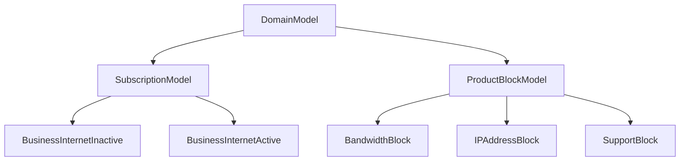

## What are Domain Models?

Domain Models are the foundation of Workflow Orchestrator, representing your business entities as strongly-typed Python classes. They provide a clear, validated structure for your services while maintaining separation between business logic and technical implementation.

<Note>
Domain Models follow Domain-Driven Design (DDD) principles, ensuring your code accurately reflects your business domain and requirements.
</Note>

## Model Hierarchy



## Core Model Types

<CardGroup cols={2}>
  <Card
    title="Subscription Models"
    icon="users"
    href="/domain-models/subscription-models"
  >
    Customer service instances with lifecycle management
  </Card>
  <Card
    title="Product Blocks"
    icon="cube"
    href="/domain-models/product-blocks"
  >
    Reusable service components and building blocks
  </Card>
  <Card
    title="Lifecycle Management"
    icon="cycle"
    href="/domain-models/lifecycle"
  >
    State transitions and validation rules
  </Card>
  <Card
    title="Validation Patterns"
    icon="shield"
    href="/domain-models/validation"
  >
    Business rule validation and constraints
  </Card>
</CardGroup>

## Key Features

### Type Safety
All models use Pydantic for runtime validation and excellent IDE support:

```python
class InternetService(SubscriptionModel, is_base=True):
    customer_id: str
    bandwidth: BandwidthBlock
    monthly_cost: Decimal

    @computed_field
    @property
    def service_summary(self) -> str:
        return f"{self.bandwidth.speed_mbps}Mbps for {self.customer_id}"
```

### Lifecycle Awareness
Different validation rules for different subscription states:

```python
class ServiceInactive(SubscriptionModel, is_base=True):
    bandwidth: Optional[BandwidthBlock] = None  # Optional initially

class ServiceActive(ServiceInactive, lifecycle=[SubscriptionLifecycle.ACTIVE]):
    bandwidth: BandwidthBlock  # Required when active
    activation_date: datetime
```

### Automatic Database Mapping
Models automatically map to database tables with relationships:

```python
# Domain model automatically creates:
# - SubscriptionTable (main record)
# - SubscriptionInstanceTable (product blocks)
# - SubscriptionInstanceValueTable (field values)
# - Relationships and foreign keys
```

## Model Design Patterns

### Composition over Inheritance
Build complex services from simple, reusable components:

```python
class EnterpriseService(SubscriptionModel, is_base=True):
    # Composed of multiple product blocks
    primary_connection: NetworkConnectionBlock
    backup_connection: Optional[NetworkConnectionBlock] = None
    security_services: SecurityBlock
    monitoring: MonitoringBlock
    support: PremiumSupportBlock
```

### Progressive Validation
Increase validation strictness through lifecycle states:

```python
# Initial state - minimal validation
class ServiceInactive(SubscriptionModel, is_base=True):
    customer_id: str
    service_type: Optional[str] = None

# Provisioning state - more validation
class ServiceProvisioning(ServiceInactive, lifecycle=[SubscriptionLifecycle.PROVISIONING]):
    service_type: str  # Now required
    technical_contact: ContactInfo

# Active state - full validation
class ServiceActive(ServiceProvisioning, lifecycle=[SubscriptionLifecycle.ACTIVE]):
    service_id: str
    activation_date: datetime
    all_required_fields: str
```

## Best Practices

<AccordionGroup>
  <Accordion title="Naming Conventions">
    - **Descriptive Names**: Use clear, business-friendly names
    - **Lifecycle Suffixes**: Add state suffixes like `Inactive`, `Active`
    - **Consistent Patterns**: Follow consistent naming across models
    - **Avoid Technical Jargon**: Use business terminology, not implementation details
  </Accordion>

  <Accordion title="Field Design">
    - **Optional by Default**: Start with optional fields, make required in later states
    - **Business Types**: Use appropriate types (Decimal for money, datetime for dates)
    - **Validation**: Add field-level validation for business rules
    - **Documentation**: Include clear descriptions for all fields
  </Accordion>

  <Accordion title="Relationship Management">
    - **Composition**: Prefer composition over inheritance for flexibility
    - **Dependency Direction**: Product blocks should not depend on subscriptions
    - **Shared Resources**: Handle shared resources carefully with proper cleanup
    - **Circular References**: Avoid circular dependencies between models
  </Accordion>

  <Accordion title="Performance Considerations">
    - **Lazy Loading**: Load related data only when needed
    - **Computed Fields**: Use `@computed_field` for calculated properties
    - **Caching**: Cache expensive calculations and external data
    - **Database Queries**: Optimize database access patterns
  </Accordion>
</AccordionGroup>

## Next Steps

<CardGroup cols={2}>
  <Card
    title="Domain Models Concepts"
    icon="cube"
    href="/concepts/domain-models"
  >
    Learn about domain model concepts
  </Card>
  <Card
    title="Products Overview"
    icon="box"
    href="/concepts/products"
  >
    Understand product definitions
  </Card>
  <Card
    title="Subscriptions Overview"
    icon="users"
    href="/concepts/subscriptions"
  >
    Master subscription lifecycle
  </Card>
  <Card
    title="Create Your First Product"
    icon="plus"
    href="/getting-started/first-product"
  >
    Build a complete product with domain models
  </Card>
</CardGroup>
