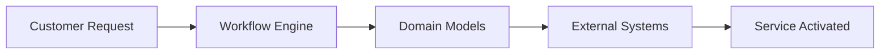

## Welcome to Workflow Orchestrator

The **Workflow Orchestrator** is a production-ready framework developed by [SURF](https://www.surf.nl) and [ESnet](https://www.es.net) to facilitate the orchestration of services. This open-source project helps you manage complex service lifecycles through intelligent automation and comprehensive audit logging.

<CardGroup cols={2}>
  <Card
    title="Quick Start"
    icon="rocket"
    href="/quickstart"
  >
    Get up and running in minutes with our step-by-step guide
  </Card>
  <Card
    title="Domain Models"
    icon="cube"
    href="/concepts/domain-models"
  >
    Learn about the core building blocks of your services
  </Card>
  <Card
    title="Workflows"
    icon="workflow"
    href="/concepts/workflows"
  >
    Understand how to create and manage service workflows
  </Card>
  <Card
    title="API Reference"
    icon="code"
    href="/api-reference"
  >
    Explore the complete API documentation
  </Card>
</CardGroup>

## Why Orchestration?

When do you orchestrate and when do you automate? The answer is you probably need both. **Automation** helps you execute repetitive tasks reliably and easily. **Orchestration** adds a layer and allows you to add more intelligence to the tasks you need to automate and to have a complete audit log of changes.

<Note>
**Orchestrate** - *Transitive Verb* `/ˈôrkəˌstrāt/`

1. Arrange or score (music) for orchestral performance.
2. Arrange or direct the elements of (a situation) to produce a desired effect.
</Note>

## Key Features

<AccordionGroup>
  <Accordion title="Service Lifecycle Management">
    Manage the complete lifecycle of your services from creation to termination with built-in validation and state management.
  </Accordion>

  <Accordion title="Workflow Engine">
    Define complex business processes as simple Python functions with automatic state management and error handling.
  </Accordion>

  <Accordion title="Domain-Driven Design">
    Use Pydantic-based domain models to represent your business entities with type safety and validation.
  </Accordion>

  <Accordion title="FastAPI Integration">
    Built on FastAPI, providing automatic API documentation, async support, and modern Python features.
  </Accordion>

  <Accordion title="GraphQL Support">
    Query your data efficiently with built-in GraphQL support and automatic schema generation.
  </Accordion>

  <Accordion title="Audit & Monitoring">
    Complete audit trails, monitoring capabilities, and observability out of the box.
  </Accordion>
</AccordionGroup>

## What does a workflow look like?

Programming a new workflow is really easy. By defining workflows as Python functions, all you need to do is understand how to write basic Python code - the framework takes care of the rest.

```python
@workflow("Name of the workflow", initial_input_form=input_form_generator)
def workflow():
    return (
        init
        >> arbitrary_step_func_1
        >> arbitrary_step_func_2
        >> arbitrary_step_func_3
        >> done
    )
```

<Tip>
Workflows are composed of simple Python functions chained together with the `>>` operator, making them easy to read and maintain.
</Tip>

## Getting Started Options

<CardGroup cols={3}>
  <Card
    title="Demo Environment"
    icon="play"
    href="https://demo.workfloworchestrator.org/"
  >
    Try our live demo to see workflows in action
  </Card>
  <Card
    title="Example Repository"
    icon="github"
    href="https://github.com/workfloworchestrator/example-orchestrator"
  >
    Clone and run a complete example with Docker Compose
  </Card>
  <Card
    title="Quick Installation"
    icon="download"
    href="/installation"
  >
    Install and start coding right away
  </Card>
</CardGroup>

## Community & Support

Join our growing community of developers and network engineers:

- **Discord**: Get help and discuss features on our [Discord server](https://discord.gg/QkQn5ajFR)
- **GitHub**: Contribute to the project on [GitHub](https://github.com/workfloworchestrator/orchestrator-core)
- **Documentation**: Comprehensive guides and API reference available

<Warning>
This project is actively maintained and used in production environments. We welcome contributions and feedback from the community.
</Warning>
