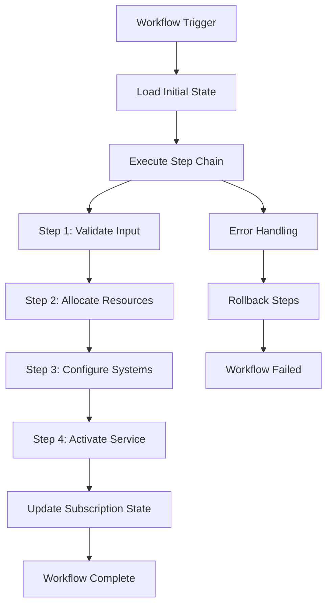

## What are Workflows?

Workflows are the heart of the Workflow Orchestrator - they define **how** your business processes execute. While domain models define **what** your services look like, workflows define the automated steps to create, modify, validate, and terminate those services.

<Note>
Workflows in the orchestrator are **Python functions** that chain together individual steps using the `>>` operator. This makes them easy to read, write, and maintain.
</Note>

## Workflow Architecture



## Core Components

<CardGroup cols={2}>
  <Card title="Workflow Definition" icon="code">
    Python function decorated with `@workflow` that defines the step sequence
  </Card>
  <Card title="Workflow Steps" icon="list">
    Individual Python functions that perform specific business operations
  </Card>
  <Card title="State Management" icon="database">
    Automatic persistence of workflow state between steps
  </Card>
  <Card title="Error Handling" icon="shield">
    Built-in retry mechanisms and failure recovery
  </Card>
</CardGroup>

## Workflow Types

The orchestrator supports different workflow types for various business processes:

### Creation Workflows

**Purpose**: Provision new services for customers

```python
@workflow("Create Internet Service", initial_input_form=create_service_form)
def create_internet_service():
    return (
        init
        >> validate_customer_eligibility
        >> allocate_bandwidth
        >> assign_ip_address
        >> configure_network_equipment
        >> activate_service
        >> send_welcome_notification
        >> done
    )
```

**Characteristics**:
- Transform subscription from `INITIAL` → `ACTIVE`
- Allocate new resources
- Configure external systems
- Handle provisioning failures gracefully

### Modification Workflows

**Purpose**: Change existing service configurations

```python
@workflow("Modify Bandwidth", initial_input_form=modify_bandwidth_form)
def modify_bandwidth():
    return (
        init
        >> validate_modification_request
        >> check_network_capacity
        >> update_service_configuration
        >> apply_network_changes
        >> update_billing_system
        >> notify_customer_of_change
        >> done
    )
```

**Characteristics**:
- Modify active subscriptions
- Validate changes don't break dependencies
- Coordinate updates across multiple systems
- Maintain service continuity

### Termination Workflows

**Purpose**: Safely decommission services

```python
@workflow("Terminate Service", initial_input_form=terminate_service_form)
def terminate_service():
    return (
        init
        >> validate_termination_eligibility
        >> backup_service_configuration
        >> disconnect_service_safely
        >> release_allocated_resources
        >> process_final_billing
        >> send_termination_confirmation
        >> done
    )
```

**Characteristics**:
- Transition subscription to `TERMINATED`
- Clean up resources properly
- Handle dependencies and shared resources
- Ensure proper audit trail

### Validation Workflows

**Purpose**: Verify service health and compliance

```python
@workflow("Validate Network Service")
def validate_network_service():
    return (
        init
        >> test_network_connectivity
        >> verify_bandwidth_allocation
        >> check_security_compliance
        >> validate_monitoring_setup
        >> generate_health_report
        >> done
    )
```

**Characteristics**:
- Don't modify subscription state
- Perform health checks and diagnostics
- Generate compliance reports
- Can run on schedules or triggers

## Workflow Execution Model

### State Persistence

Workflows automatically persist state between steps:

```python
def allocate_bandwidth_step(state: State) -> State:
    """Allocate bandwidth and store allocation details."""

    subscription = state.subscription

    # Perform allocation
    allocation = bandwidth_service.allocate(
        speed_mbps=subscription.bandwidth.speed_mbps,
        customer_id=subscription.customer_id
    )

    # Update state - automatically persisted
    return {
        **state,
        "bandwidth_allocation_id": allocation.id,
        "allocated_at": datetime.now(),
        "allocation_details": allocation.to_dict()
    }

def configure_equipment_step(state: State) -> State:
    """Configure equipment using previous allocation."""

    # Access data from previous step
    allocation_id = state["bandwidth_allocation_id"]
    allocation_details = state["allocation_details"]

    # Configure equipment
    config_result = network_api.configure_port(
        allocation_id=allocation_id,
        bandwidth=allocation_details["speed_mbps"]
    )

    return {**state, "equipment_config": config_result}
```

### Async Execution

Workflows support async operations for better performance:

```python
import asyncio
from orchestrator.workflows import StepList, State

async def provision_multiple_services_step(state: State) -> State:
    """Provision multiple services in parallel."""

    services = state["services_to_provision"]

    # Execute provisioning tasks in parallel
    tasks = [
        provision_service_async(service)
        for service in services
    ]

    results = await asyncio.gather(*tasks, return_exceptions=True)

    # Handle results and exceptions
    successful_provisions = []
    failed_provisions = []

    for service, result in zip(services, results):
        if isinstance(result, Exception):
            failed_provisions.append({"service": service, "error": str(result)})
        else:
            successful_provisions.append(result)

    return {
        **state,
        "successful_provisions": successful_provisions,
        "failed_provisions": failed_provisions
    }
```

### Error Handling and Retries

Built-in error handling with configurable retry policies:

```python
from orchestrator.workflows.exceptions import WorkflowStepException

def external_api_step(state: State) -> State:
    """Call external API with retry logic."""

    try:
        result = external_api.provision_service(
            customer_id=state.subscription.customer_id,
            config=state["service_config"]
        )

        return {**state, "external_service_id": result.service_id}

    except ExternalAPITemporaryError as e:
        # Temporary error - retry with backoff
        raise WorkflowStepException(
            f"Temporary API error: {e}",
            retry_after=300,  # Retry after 5 minutes
            max_retries=3
        )

    except ExternalAPIAuthError as e:
        # Auth error - don't retry, fail workflow
        raise WorkflowStepException(
            f"Authentication failed: {e}",
            retry=False
        )

    except Exception as e:
        # Unexpected error - retry once then fail
        raise WorkflowStepException(
            f"Unexpected error: {e}",
            retry_after=60,
            max_retries=1
        )
```

## Advanced Workflow Patterns

### Conditional Execution

Execute different steps based on conditions:

```python
from orchestrator.workflows import ConditionalStep

def determine_provisioning_method(state: State) -> str:
    """Choose provisioning method based on service type."""

    service_type = state.subscription.service_type
    bandwidth = state.subscription.bandwidth.speed_mbps

    if service_type == "enterprise" and bandwidth >= 1000:
        return "dedicated_fiber_provisioning"
    elif service_type == "business":
        return "business_provisioning"
    else:
        return "standard_provisioning"

@workflow("Adaptive Service Provisioning")
def adaptive_provisioning():
    return (
        init
        >> validate_service_request
        >> ConditionalStep(
            condition=determine_provisioning_method,
            branches={
                "dedicated_fiber_provisioning": (
                    allocate_dedicated_fiber
                    >> configure_enterprise_equipment
                    >> setup_dedicated_monitoring
                ),
                "business_provisioning": (
                    allocate_business_bandwidth
                    >> configure_business_equipment
                ),
                "standard_provisioning": (
                    allocate_standard_bandwidth
                    >> configure_standard_equipment
                )
            }
        )
        >> finalize_service_activation
        >> done
    )
```

### Parallel Execution

Execute multiple steps simultaneously:

```python
from orchestrator.workflows import ParallelStep

@workflow("Complex Service Provisioning")
def complex_service_provisioning():
    return (
        init
        >> validate_and_prepare
        >> ParallelStep(
            # These steps run in parallel
            allocate_bandwidth,
            assign_ip_addresses,
            create_vlans,
            setup_monitoring_probes,
            configure_backup_systems
        )
        >> wait_for_all_allocations
        >> configure_primary_equipment
        >> activate_service
        >> done
    )
```

### Compensation and Rollback

Handle failures with automatic rollback:

```python
from orchestrator.workflows import CompensatableStep

def allocate_ip_address(state: State) -> State:
    """Allocate IP address with rollback capability."""

    ip_allocation = ip_manager.allocate(
        customer_id=state.subscription.customer_id,
        subnet_size=state["requested_subnet_size"]
    )

    return {
        **state,
        "ip_allocation": ip_allocation,
        "rollback_ip_allocation_id": ip_allocation.id
    }

def rollback_ip_allocation(state: State) -> State:
    """Rollback IP allocation if workflow fails."""

    allocation_id = state.get("rollback_ip_allocation_id")
    if allocation_id:
        ip_manager.release(allocation_id)
        logger.info(f"Rolled back IP allocation {allocation_id}")

    return state

@workflow("Service Provisioning with Rollback")
def provisioning_with_rollback():
    return (
        init
        >> CompensatableStep(
            forward=allocate_ip_address,
            compensate=rollback_ip_allocation
        )
        >> CompensatableStep(
            forward=configure_network_equipment,
            compensate=rollback_equipment_config
        )
        >> finalize_provisioning
        >> done
    )
```

## Workflow Testing

Comprehensive testing strategies for workflows:

```python
import pytest
from unittest.mock import patch, MagicMock
from orchestrator.workflows.testing import WorkflowTester

def test_create_internet_service_success():
    """Test successful internet service creation."""

    # Setup test data
    initial_state = {
        "subscription": BusinessInternetInactive(
            customer_id="CUST123",
            bandwidth=BandwidthBlock(speed_mbps=500),
            # ... other required fields
        )
    }

    # Mock external services
    with patch('external_services.bandwidth_service') as mock_bandwidth, \
         patch('external_services.network_api') as mock_network:

        mock_bandwidth.allocate.return_value = MagicMock(id="ALLOC123")
        mock_network.configure.return_value = {"status": "success"}

        # Run workflow
        tester = WorkflowTester(create_internet_service)
        result = tester.run(initial_state)

        # Verify success
        assert result.status == "completed"
        assert result.subscription.status == SubscriptionLifecycle.ACTIVE

        # Verify external calls
        mock_bandwidth.allocate.assert_called_once()
        mock_network.configure.assert_called_once()

def test_create_internet_service_bandwidth_failure():
    """Test workflow behavior when bandwidth allocation fails."""

    initial_state = {...}  # Same as above

    with patch('external_services.bandwidth_service') as mock_bandwidth:
        # Simulate bandwidth allocation failure
        mock_bandwidth.allocate.side_effect = BandwidthAllocationError("No capacity")

        tester = WorkflowTester(create_internet_service)
        result = tester.run(initial_state)

        # Verify failure handling
        assert result.status == "failed"
        assert "No capacity" in result.error_message
        assert result.subscription.status == SubscriptionLifecycle.INITIAL

def test_workflow_step_isolation():
    """Test individual workflow steps in isolation."""

    # Test single step
    state = {
        "subscription": test_subscription,
        "bandwidth_allocation_id": "ALLOC123"
    }

    with patch('external_services.network_api') as mock_api:
        mock_api.configure.return_value = {"config_id": "CFG456"}

        result_state = configure_equipment_step(state)

        assert result_state["equipment_config"]["config_id"] == "CFG456"
        mock_api.configure.assert_called_once()
```

## Workflow Monitoring

Built-in monitoring and observability:

```python
from orchestrator.workflows.monitoring import workflow_metrics

@workflow("Monitored Service Creation")
def monitored_service_creation():
    return (
        init
        >> workflow_metrics.time_step("validation")(validate_input)
        >> workflow_metrics.count_step("allocations")(allocate_resources)
        >> workflow_metrics.track_external_call("network_api")(configure_equipment)
        >> done
    )

# Metrics are automatically collected:
# - Step execution times
# - Success/failure rates
# - External API call latencies
# - Resource allocation counts
```

## Best Practices

<AccordionGroup>
  <Accordion title="Step Design">
    - **Single Responsibility**: Each step should have one clear purpose
    - **Idempotent**: Steps should be safe to retry
    - **Stateless**: Don't rely on global state, use workflow state
    - **Error Handling**: Always handle expected failures gracefully
  </Accordion>

  <Accordion title="State Management">
    - **Minimal State**: Only store what's needed for subsequent steps
    - **Serializable Data**: Ensure state can be persisted and restored
    - **Clear Naming**: Use descriptive keys for state data
    - **State Validation**: Validate state structure in critical steps
  </Accordion>

  <Accordion title="External Integration">
    - **Timeout Handling**: Set appropriate timeouts for external calls
    - **Retry Logic**: Implement exponential backoff for retries
    - **Circuit Breakers**: Fail fast when external systems are down
    - **Monitoring**: Track external service health and performance
  </Accordion>

  <Accordion title="Testing Strategy">
    - **Unit Tests**: Test individual steps in isolation
    - **Integration Tests**: Test complete workflow execution
    - **Mock External Services**: Use mocks for external dependencies
    - **Error Scenarios**: Test failure cases and error handling
  </Accordion>
</AccordionGroup>

## Next Steps

<CardGroup cols={2}>
  <Card
    title="Create Your First Workflow"
    icon="plus"
    href="/getting-started/first-workflow"
  >
    Build a workflow for your service
  </Card>
  <Card
    title="Workflow Steps"
    icon="list"
    href="/workflows/workflow-steps"
  >
    Learn about individual workflow steps
  </Card>
  <Card
    title="Forms and Input"
    icon="form"
    href="/workflows/forms"
  >
    Handle user input in workflows
  </Card>
  <Card
    title="Testing Workflows"
    icon="flask"
    href="/workflows/testing"
  >
    Comprehensive testing strategies
  </Card>
</CardGroup>
