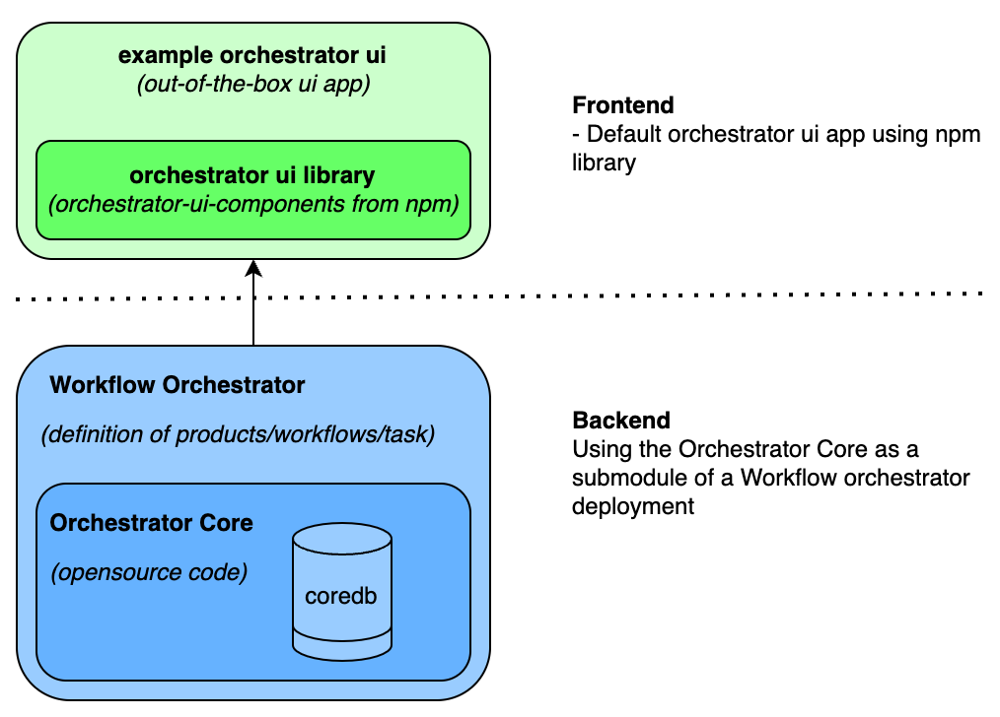
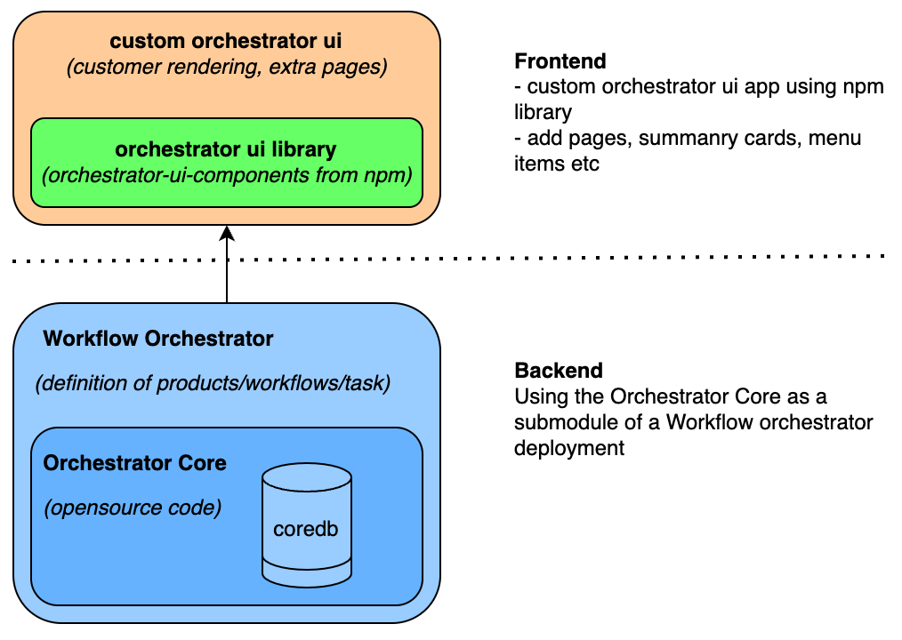

The framework of the Workflow Orchestrator consists of multiple components for frontend and backend, like shown below:

## Backend

### Orchestrator Core
The `orchestrator-core` component is an opensource backend component, which defines the ruleset for product modeling and workflows.  The `orchestrator-core` is a mandatory component to have functional workflow orchestrator application. This component is written in Python and makes use fo the Fastapi framework,  it's repo can be found [here](https://github.com/workfloworchestrator/orchestrator-core). The `orchestrator-core` cannot be run standalone, as it contains no definition of any products and workflows.

### Workflow Orchestrator
The `Workflow Orchestrator` is the custom implementation the orchestrator backend. It is the application which defines all your products, workflows and tasks to create/modify/terminate/validate your product instances, the so-called `subscriptions`. All product modelling, run tasks/wokflows and subscription details are stored in the `orchestrator-coredb` which is part of the orchestrator-core package. This custom implementation of the workflow orchestrator uses the `orchestrator-core` as sub-module.

With the two backend components are set up correctly you have a running workflow orchestrator which can be reached via the API. But with minimal effort you can get a running frontend application.

###  Example Orchestrator
An example of the orchestrator using the orchestrator core and some example products and workflow are available [here](https://github.com/workfloworchestrator/example-orchestrator).

## Frontend

### Workflow Orchestrator UI library
The Workflow Orchestrator can also be split into 2 major components. A frontend library called the `components orchestrator-ui` library as available on [npm](https://www.npmjs.com/package/@orchestrator-ui/orchestrator-ui-components). And the out-of-the-box `Workflow Orchestrator UI`, which uses the npm library in it's pages. The example of this frontend is the `example-orchestrator-ui` and can be found [here](https://github.com/workfloworchestrator/example-orchestrator-ui) and running instance can be found [here](https://demo.workfloworchestrator.org/). In most cases the example orchestrator is the best deployment model to start with, as is contains a fully functional userinterface, while you can focus your effort on developing products, workflows and tasks.

### More advanced UI deployment models
By tweaking the example-orchestrator-ui it is possible to easily add extra pages, cards on dashboard page, or change the rending of certain resource type. Examples of the possible changes is shown [here](architecture/orchestration/orchestration-ui) . The architectural change is minimal, like shown below:

Another approach could be to use individual components from the npm library and build your own application or integrate the components in an existing application.
