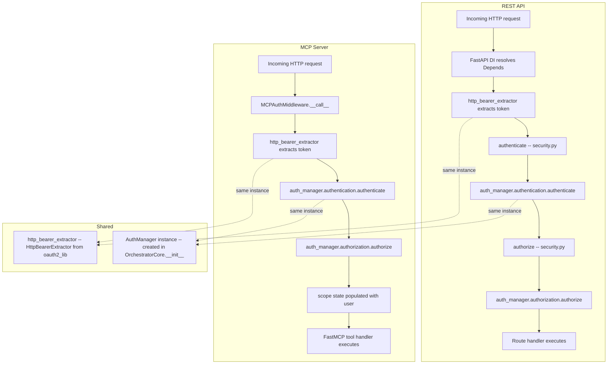

# MCP Authentication Architecture

## Overview

The orchestrator has two HTTP-facing surfaces that require authentication and authorization:

1. **REST API** — served by FastAPI route handlers under `/api`
2. **MCP server** — served by FastMCP, mounted as a sub-application at `/mcp`

Both surfaces enforce the **exact same auth rules** by calling the same underlying `AuthManager` methods. This document explains *why* they use different integration patterns and *how* DRY is maintained.

## Auth Call Chain



## Why Two Patterns?

### REST API: FastAPI Dependency Injection

The REST API uses FastAPI's `Depends()` system for auth. In [`orchestrator/security.py`](../orchestrator/security.py):

```python
async def authenticate(
    request: Request,
    http_auth_credentials: Annotated[... | None, Depends(http_bearer_extractor)] = None,
) -> OIDCUserModel | None:
    token = http_auth_credentials.credentials if http_auth_credentials else None
    return await request.app.auth_manager.authentication.authenticate(request, token)

async def authorize(
    request: Request,
    user: Annotated[OIDCUserModel | None, Depends(authenticate)]
) -> bool | None:
    return await request.app.auth_manager.authorization.authorize(request, user)
```

This works because:
- FastAPI resolves `Depends()` chains automatically before calling route handlers
- `request.app` points to the `OrchestratorCore` instance, which has `auth_manager`
- The DI system handles parameter injection transparently

### MCP Server: ASGI Middleware

The MCP server **cannot** use FastAPI's `Depends()` system for two reasons:

1. **FastMCP is not a FastAPI app** — it's a standalone ASGI application. FastAPI's dependency injection only works inside FastAPI route handlers. The MCP server uses its own routing and handler system.

2. **Mounted sub-apps don't share the parent's `app` instance** — when the MCP app is mounted via `app.mount("/mcp", mcp_app)`, requests to `/mcp/*` have `request.app` pointing to the *MCP* app, not the parent `OrchestratorCore`. Therefore `request.app.auth_manager` would fail with an `AttributeError`.

The solution is [`MCPAuthMiddleware`](../orchestrator/mcp/auth.py), an ASGI middleware that:
1. Receives `auth_manager` by **closure** (injected in [`create_mcp_app()`](../orchestrator/mcp/server.py))
2. Runs *before* FastMCP's handlers
3. Calls the same `auth_manager` methods directly

## How DRY Is Maintained

The key insight is that **`AuthManager` is the single source of truth** for auth logic. Both pathways call:

| Step | REST API | MCP Middleware |
|------|----------|----------------|
| Token extraction | `http_bearer_extractor(request)` | `http_bearer_extractor(request)` |
| Authentication | `auth_manager.authentication.authenticate(request, token)` | `auth_manager.authentication.authenticate(request, token)` |
| Authorization | `auth_manager.authorization.authorize(request, user)` | `auth_manager.authorization.authorize(request, user)` |

The `AuthManager` instance is created once in [`OrchestratorCore.__init__()`](../orchestrator/app.py) and shared:
- REST API accesses it via `request.app.auth_manager`
- MCP middleware receives it via constructor injection

Any change to the `AuthManager`'s authentication or authorization behavior — including custom implementations registered via `register_authentication()` or `register_authorization()` — automatically applies to **both** surfaces.

## Why Not Extract Shared Functions?

One might consider extracting `authenticate_request(auth_manager, request, token)` and `authorize_request(auth_manager, request, user)` into standalone functions that both pathways call. This was evaluated and rejected because:

1. **The shared logic already exists** — it's `auth_manager.authentication.authenticate()` and `auth_manager.authorization.authorize()`. Adding wrapper functions would just add indirection without reducing duplication.

2. **Modifying `security.py` is unnecessary** — the REST API's FastAPI dependencies are already minimal wrappers. Adding another layer of wrapping doesn't improve clarity.

3. **The `AuthManager` is the abstraction boundary** — it's the pluggable interface that downstream projects customize. Both pathways correctly delegate to it.

## File Reference

| File | Role |
|------|------|
| [`orchestrator/security.py`](../orchestrator/security.py) | FastAPI dependency functions for REST API auth |
| [`orchestrator/mcp/auth.py`](../orchestrator/mcp/auth.py) | ASGI middleware for MCP auth |
| [`orchestrator/mcp/server.py`](../orchestrator/mcp/server.py) | MCP app factory; injects `auth_manager` into middleware |
| [`orchestrator/app.py`](../orchestrator/app.py) | Creates `AuthManager`; mounts MCP sub-app |
| `oauth2_lib/fastapi.py` | External: `AuthManager`, `OIDCAuth`, `Authorization`, `HttpBearerExtractor` |
