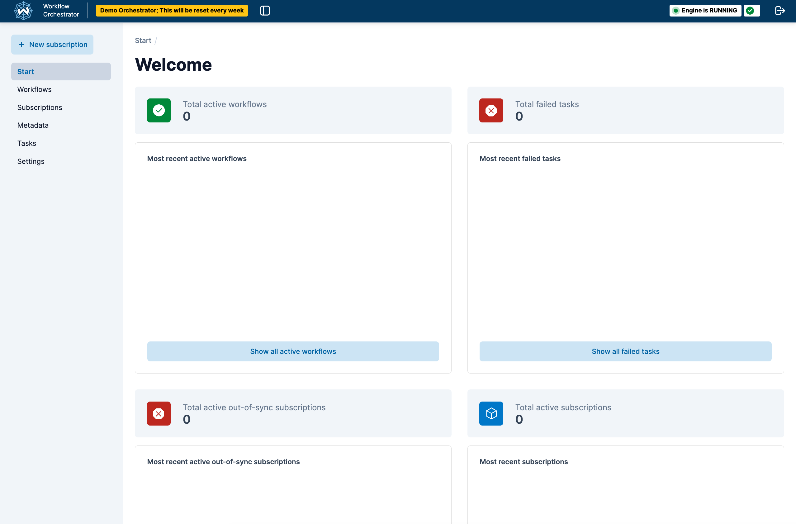
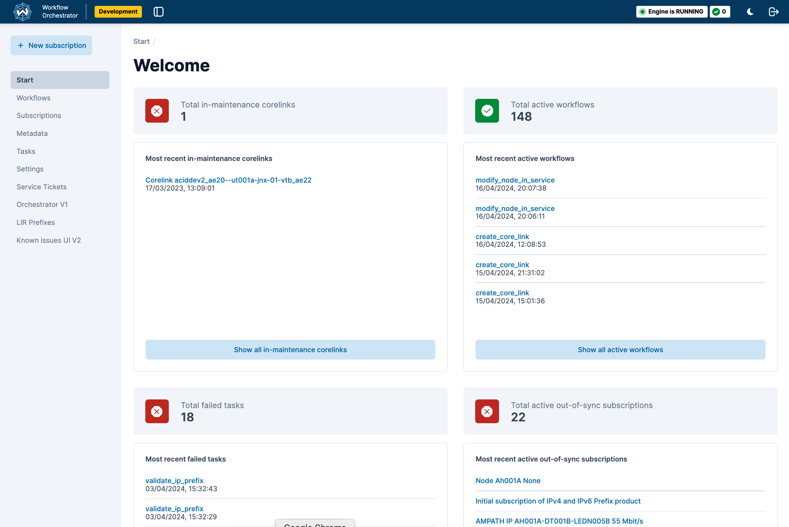

# Workflow Orchestrator UI

The default Workflow Orchestrator UI app should offer sufficient functionality to start working with, and experiencing, the workflow orchestrator. For this an [example-orchestrator-ui](https://github.com/workfloworchestrator/example-orchestrator-ui) is available to start working with a ready to deploy example workflow orchestrator backend.

At the same time the UI is developed with the concept in mind that any user of the workflow orchestrator can customize the UI to meet their own requirements. There are two possible ways to accomplish this:

- Overriding components
- Using components from the npm UI library


## Overriding components
The first solution is based on using the orchestrator-ui library in its full extend and just add/tweak components. Examples of this approach would be:
- render certain resource type differently then the npm normally does
- add menu items to the navigation
- add summary cards to the dashboard page

An example of a custom orchestrator-ui is shown below, which shows a custom summary card and additional menu items compared to the standard orchestrator-ui.

## Using components from the npm UI library
The second solution will probably require more work, but could be interesting to extend an existing application with
orchestrator components.

Both customization solutions rely on the npm package of the components libray published in [npm](https://www.npmjs.com/package/@orchestrator-ui/orchestrator-ui-components). This package contains the pages and components that are meant to be used in an app that serves the frontend to a workflow orchestrator backend.

To have a development setup where both the source code of the app and the source code of this package are available have a look at the [Orchestrator UI library repository](https://github.com/workfloworchestrator/orchestrator-ui-library) at the location packages/orchestrator-ui.


## Example screenshots of orchestrator-ui
### Standard orchestrator-ui


### Custom orchestrator-ui
- showing additional summary card component (in-maintence corelink)
- additional menu items



### Env variables

The env variables from .env.example are meant to work with an example workflow orchestrator backend. They can be changed as needed.
The variable available are:

```
ENVIRONMENT_NAME=Development
PROCESS_DETAIL_REFETCH_INTERVAL: Determines the interval in milliseconds the process detail page refreshes at. DEPRECATED. Number
ORCHESTRATOR_API_HOST: The base url of the workflow orchestrator engine. String
ORCHESTRATOR_API_PATH: The path to the api from the base url. String
ORCHESTRATOR_GRAPHQL_HOST: The base url to the graphql server. String
ORCHESTRATOR_GRAPHQL_PATH: The path to the graphql endpoint. String
ORCHESTRATOR_WEBSOCKET_URL: The url to the websocket server that emits cache invalidation events. String
AUTH_ACTIVE: If authorization is active or not. Boolean
USE_WEBSOCKET: Establishes a websocket connection that allows the backend to send cachekey invalidation messages to let the frontend now something has changed on the backend. Boolean
USE_THEME_TOGGLE: Show a toggle that allows a user to switch from light to dark theme and back. Boolean
SHOW_WORKFLOW_INFORMATION_LINK: Show a information icon on the workflow detail pages that allows for linking to an external documentation system. Boolean
WORKFLOW_INFORMATION_LINK_URL: The url used to build the url that the information icon links to. The format of the link is: <WORKFLOW_INFORMATION_LINK_URL><WORKFLOW_NAME>. The contents at this url should be maintained in the external documentation system.
```

### Starting a workflow from the orchestrator UI - User input forms

Creating a Workflow orchestrator workflow is explained here: [Creating a workflow][5].

Once a workflow is created it will - automatically - show up in the dropdown list that opens from '+ New Subscription'. When selected a request will be made to the <api>/processes/<workflowName> endpoint which will return a form definition describing the form that needs to be displayed to collect user input. The form definition is turned into a form automatically.

The example UI contains an example form that shows an example of a form definition and the form it renders at: http://localhost:3000/example-form

### Deployment to other environments

For deployments to your own environment it's recommended to copy or fork the code of the [Example orchestrator UI][1] repository into your own code repository, add your customizations and configuration and deploy from there.

### Extensibility:

The Orchestrator UI allows for a number of customizations:

#### Adding extra pages

The Orchestrator UI is based on NextJs and its [pages router][6]. Files that are added to the `pages` folder are automatically rendered at the url <url>/<filename>. For example a file a the location `pages/cats.tsx` will cause the contents of the file to be rendered at the location http://localhost/cats.
Please note the pages routes is deprecated by NextJS and might be replaced by the newer [app router][7].

#### Adding menu items

The file 'pages/\_app.tsx' contains the rendering of 'WfoPageTemplate' component. This component takes a callback called overrideMenuItems which receives the current menu items and can later them

```
.... in _app.tsx ...
<WfoPageTemplate
    overrideMenuItems={
        (currentMenuItems) => {
            return [
                ...currentMenuItems,
                {
                    ... extra menu item
                }
            ]
        }
    }
>
... see _app.tsx .. for an actual example
```

#### Adding a custom logo

The file 'pages/\_app.tsx' contains the rendering of 'WfoPageTemplate' component. This component takes a callback called getAppLogo.
The React component that is returned by this function get's displayed as the apps logo.

```
.... in _app.tsx ...
<WfoPageTemplate
    appLogo={() => {
        return <div>LOGO</div>
    }}
>
```

#### Authorization and RBAC

The Orchestrator UI library provides a standard isAllowed handler that wraps certain components and can be used to wrap pages. The default behavior is to always return true allowing everything inside it to show. By providing a custom implementation you can implement your own rules for allowing or disallowing things.

```
...in _app.tsx...
    <WfoAuth isAllowedHandler={(routerPath: string, resource?: string) => {... custom rules ... }}>
        <EuiProvider
            colorMode={themeMode}
            modify={defaultOrchestratorTheme}
        >
        ....
        </EuiProvider>
    </WfoAuth>

...
```

#### Overriding fields, sections and start page content

Field values are displayed as plain strings by default and the sections on a page have a set order. For some fields and sections you might want more control, this is made possible by supplying a orchestratorComponentOverride object to the StoreProvider in \_app.tsx.
Currently this is possible for the subscription detail and the start page only.

The orchestratorComponentOverride has these options

```
...in _app.tsx...
    <StoreProvider
        ...
        orchestratorComponentOverride={
            startPage?: {
                summaryCardConfigurationOverride?:
                    defaultItems: ReactElement[],
                ) => ReactElement[];
            };
            subscriptionDetail?: {
                valueOverrides?: Record<string, (fieldValue: FieldValue) => ReactNode>;
                generalSectionConfigurationOverride?: (
                    defaultSections: WfoSubscriptionDetailGeneralConfiguration[],
                    subscriptionDetail: SubscriptionDetail,
                ) => WfoSubscriptionDetailGeneralConfiguration[];
            };
        }
        ...
    >
```

##### Available functions

**startpage: summaryCardConfigurationOverride**: A function that gets the default items as input and should return a new list of items

**subscriptionsDetail: valueOverrides**: A function that should supply a field name to function mapping where the function will be called with the field value when the field is rendered.

**subscriptionDetail: generalSectionConfigurationOverride**: A function that receives the default sections and the subscription detail object and returns a new list of sections

### Component library

The repository that publishes the npm package that is used to supply the layout components is [Orchestrator UI Component library][8]
Next to pages it exports page components that can be used to build custom pages.


### Theming

#### Customizing the theme

The Workflow Orchestrator frontend ships with a default theme leveraging the theming mechanism of Elastic UI. This theme can be partially adjusted or completely overridden.

As part of the boilerplate code, the `_app.tsx` file applies a `defaultOrchestratorTheme` object to the EuiProvider.

```tsx
..._app.tsx...

<SeveralProviders>
    <EuiProvider
        colorMode={themeMode}
        modify={defaultOrchestratorTheme}
    >
        ...
    </EuiProvider>
</SeveralProviders>
```

The default defaultOrchestratorTheme object contains adjustments of the standard theme provided by Elastic UI and can be imported from the [@orchestrator-ui/orchestrator-ui-components](https://www.npmjs.com/package/@orchestrator-ui/orchestrator-ui-components) package.

To make small adjustments, simply use [defaultOrchestratorTheme](https://github.com/workfloworchestrator/orchestrator-ui-library/blob/main/packages/orchestrator-ui-components/src/theme/defaultOrchestratorTheme.ts) as a base and override the desired properties:

```tsx
// _app.tsx
...
import { EuiThemeModifications } from '@elastic/eui';
import { defaultOrchestratorTheme } from '@orchestrator-ui/orchestrator-ui-components';
...

function CustomApp(...) {
    ...
    const myTheme: EuiThemeModifications = {
        ...defaultOrchestratorTheme,
        colors: {
            DARK: {
                primary: '#FF69B4',
            },
            LIGHT: {
                primary: '#32CD32',
            },
        },
    };

    ...

    return (
        <SeveralProviders>
            <EuiProvider
                colorMode={themeMode}
                modify={myTheme}
            >
                ...
            </EuiProvider>
        </SeveralProviders>
    )
}
```

The usage of defaultOrchestratorTheme is not required, a new `EuiThemeModifications` can also be made from scratch or using the [helper tool](https://eui.elastic.co/#/theming/customizing-themes) on the EUI website.

#### Color Mode

The `color` property of the theme object contains a `DARK` and `LIGHT` object representing the color mode. The _app.tsx file contains a mechanism to switch and store the color mode. In any given component the `useOrchestratorTheme` hook can be used to get the current color mode. For more convenience, there is also the `isDarkThemeActive` boolean:

```tsx
...
import { useOrchestratorTheme } from '@orchestrator-ui/orchestrator-ui-components';
...

const WfoAnyComponent: FC<WfoAnyComponentProps> = (...) => {
    const {
        colorMode,          // type: EuiThemeColorModeStandard
        isDarkThemeActive   // type: boolean
    } = useOrchestratorTheme();

    return(...);
}
```


[1]: https://github.com/workfloworchestrator/example-orchestrator-ui
[2]: https://nextjs.org
[3]: https://react.dev
[4]: https://www.npmjs.com/package/@orchestrator-uiorchestrator-ui-components
[5]: https://workfloworchestrator.org/orchestrator-core/architecture/application/workflow
[6]: https://nextjs.org/docs/pages
[7]: https://nextjs.org/docs/app/building-your-application/routing
[8]: https://github.com/workfloworchestrator/orchestrator-ui-library
