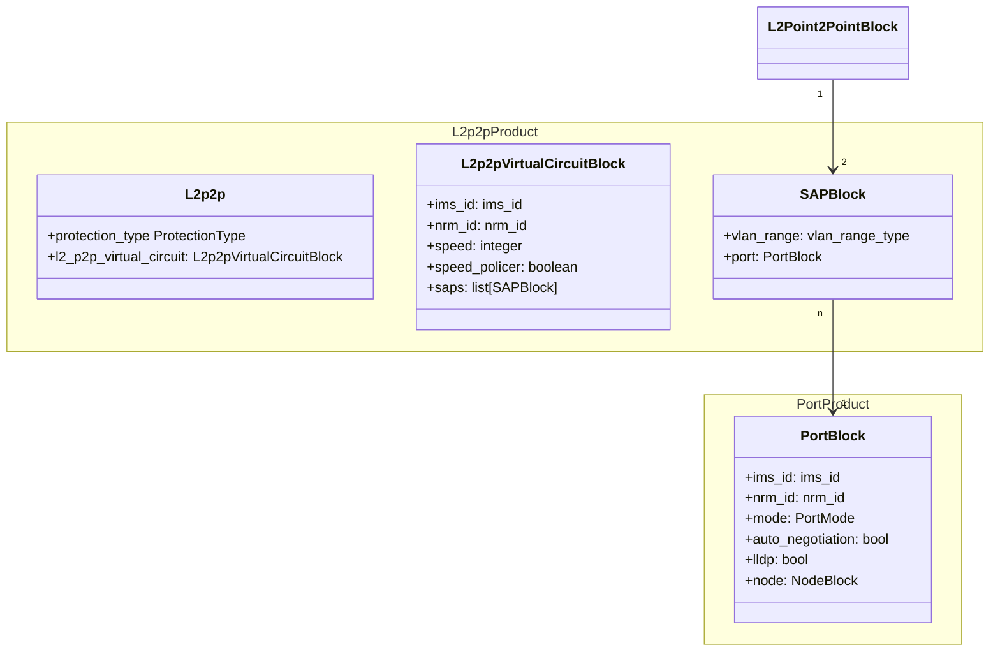

# L2 Point-to-Point

The Layer 2 point-to-point service is modeled using two product blocks. The `L2p2pVirtualCircuitBlock` root product block holds the
pointers to IMS and the NRM, the speed of the circuit, and whether the speed policer is enabled or not, as well as
pointers to the two service attach points. The latter are modeled with the `SAPBlock` product block and
keep track of the port associated with that endpoint and, in the case where 802.1Q has to be enabled, the VLAN range
used. The service can either be deployed protected or unprotected in the service provider network. This is administered
with the fixed input protection_type.

class `L2p2p` defines the product type:

* **protection_type**: fixed input, describes whether the p2p is unprotected or protected
* **l2_p2p_virtual_circuit**: link to the root product block

class `L2p2pVirtualCircuitBlock` defines the root product block:

* **ims_id**: ID of the node in the inventory management system
* **nrm_id**: ID of the node in the network resource manager
* **speed**: the speed of the point-to-point service in Mbit/s
* **speed_policer**: enable the speed policer for this service
* **saps**: a constrained list of exactly two Layer2 service attach points
* **vlan_range**: range of Layer 2 labels to be used on this endpoint of the service
* **port**: link to the Port product block this service endpoint connects to

class `SAPBlock` links to the l2 service attach point product block, as already defined for the L2vpn product.

class `PortBlock` links to the product product block, as already defined for the Port product.
