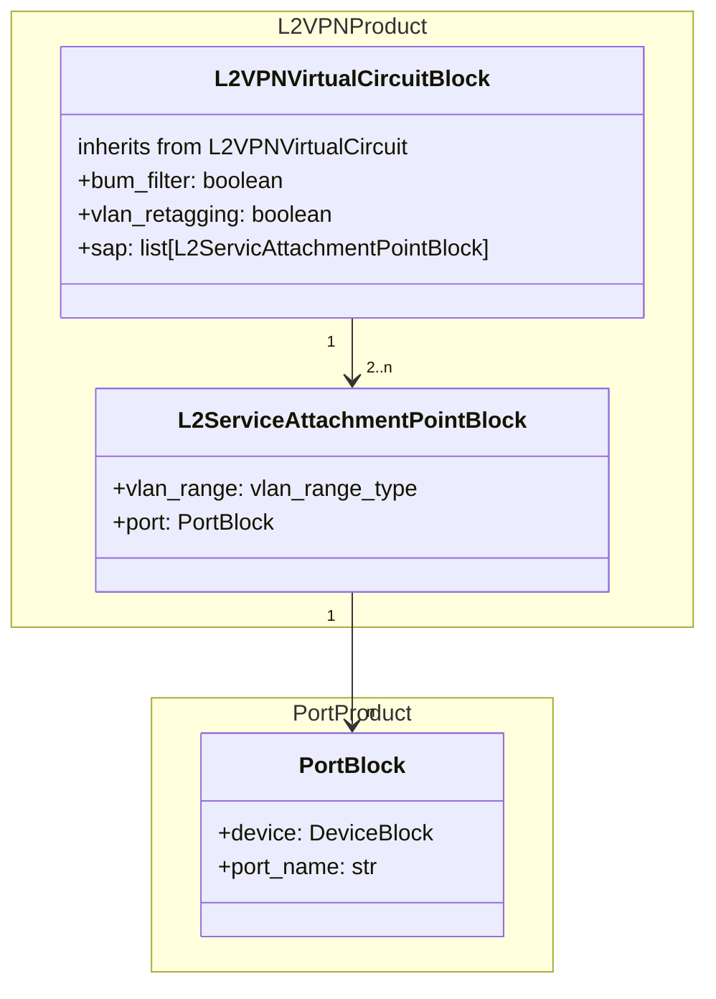

# L2 VPN

The Layer 2 VPN service is much like the Layer 2 point-to-point service, which
makes it possible to reuse existing product blocks, with a few differences such
as the absence of fixed inputs. The L2_vpn_virtual_circuit product block
inherits from the L2_ptp_virtual_circuit product block, and adds attributes to
(dis)allow VLAN retagging and control over the BUM filter. And because a VPN
can have one or more endpoints, unlike a point-to-point that has exactly two
endpoints, the list of service attach points is overridden to reflect this.

* **bum_filter**: enable broadcast, unknown unicast, and multicast (BUM) traffic filter
* **vlan_retagging**: allow VLAN retagging on endpoints
* **sap**: a constrained list of at least one Layer2 service attach point
