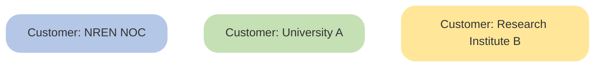
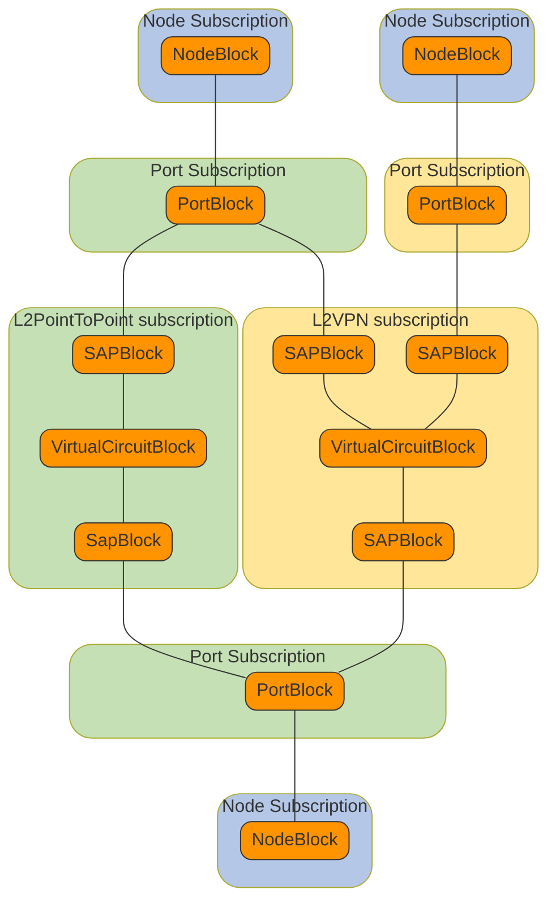

# Product Block Instance Graph

A subscription for a specific customer for a product that is deployed on the
network is stored in the Workflow Orchestrator database. The notion of
subscription ownership allows for fine-grained control over which customer is
allowed to change what attribute. By correctly adding references from one
product block to another, a graph of product block instances is generated that
accurately reflects the relations between the snippets of network node
configuration that are deployed to the network. The graph is automatically added
to when a new subscription is created, allowing easy and intuitive navigation
through all configuration data. Once every network service is modelled and
provisioned to the network through the Workflow Orchestrator, every line of
network node configuration can be linked to the corresponding subscription that
holds the configuration parameters.

The example below shows the product block instance graph for a L2 point-to-point
and a L2 VPN service between three ports on three different nodes. The nodes are
owned by the respective NREN’s Network Operations Centre (NOC). University A has
ports on nodes on two different locations, and uses a L2 point-to-point service
to connect these locations. Research Institute B has one port of its own, and
uses a L2 VPN service for their collaboration with the university. The business
rules that describe the (optional) authorisation logic for connecting
subscriptions from different customers to each other are coded in the Workflow
Orchestrator workflows related to these products.

## Customers

## Example Subscription Diagram

