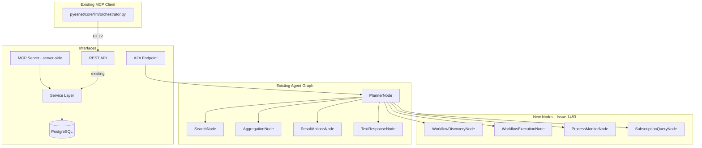
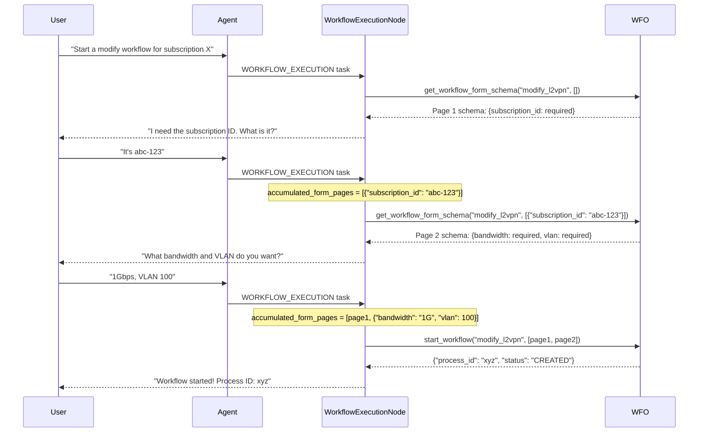
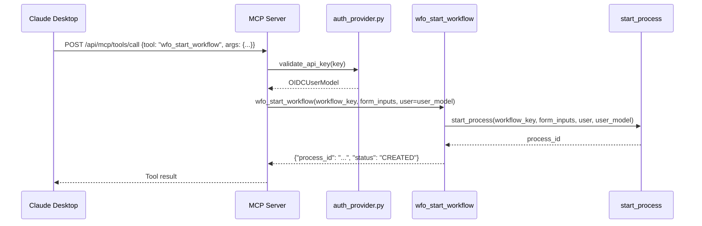
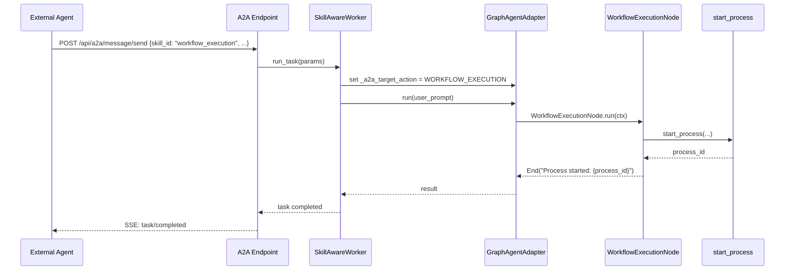

# Design: Enable AI Workflow Operations (Issue #1483)

**Issue:** [#1483 — Enable running Workflows and WFO operations from AI tools](https://github.com/workfloworchestrator/orchestrator-core/issues/1483)
**Status:** Draft
**Author:** Architecture Team
**Date:** 2026-04-13

---

## Table of Contents

1. [Overview & Goals](#1-overview--goals)
2. [Existing MCP Client — Baseline](#2-existing-mcp-client--baseline)
3. [Architecture Decision: Extending the Existing Graph Agent](#3-architecture-decision-extending-the-existing-graph-agent)
4. [New Graph Nodes](#4-new-graph-nodes)
5. [New Tools (FunctionToolset)](#5-new-tools-functiontoolset)
6. [State Model](#6-state-model)
7. [A2A Skill Definitions](#7-a2a-skill-definitions)
8. [MCP Server Integration](#8-mcp-server-integration)
9. [Authentication & Authorization](#9-authentication--authorization)
10. [Form Handling Strategy for AI Tools](#10-form-handling-strategy-for-ai-tools)
11. [Error Handling](#11-error-handling)
12. [Security Considerations](#12-security-considerations)
13. [Implementation Plan](#13-implementation-plan)
    - [Phase 1: MCP Parity with Existing Client](#phase-1-mcp-parity-with-existing-client)
    - [Phase 2: New Read-Only MCP Tools and Agent Graph Nodes](#phase-2-new-read-only-mcp-tools-and-agent-graph-nodes)
    - [Phase 3: Write Operations](#phase-3-write-operations-create-resume-abort)
    - [Phase 4: Smart Form Handling and Suggestions](#phase-4-smart-form-handling-and-suggestions)
    - [Phase 5: End-to-End Testing with Claude](#phase-5-end-to-end-testing-with-claude)
14. [Testing Strategy](#14-testing-strategy)
15. [Open Questions](#15-open-questions)

---

## 1. Overview & Goals

### Problem Statement

The orchestrator-core is a workflow orchestration framework for network automation. Currently, AI tools (Claude, external agent frameworks, automated pipelines) have no structured way to:

- Discover what workflows are available and what inputs they require
- Start, resume, or abort workflows programmatically
- Monitor process status and retrieve results
- Query subscription details to understand the current network state

Operators must use the web UI or raw REST API calls, which are not AI-friendly. Issue #1483 requests first-class AI tool support via three complementary interfaces: **MCP** (for Claude Desktop and similar tools), **A2A** (for agent-to-agent communication), and the existing **REST/GraphQL** APIs (already usable but not AI-optimized).

### Target Users

| User | Interface | Use Case |
|------|-----------|----------|
| Claude Desktop user | MCP tools | "Start a modify workflow for subscription X" |
| External agent framework | A2A protocol | Automated provisioning pipelines |
| CI/CD pipeline | REST API | Trigger validation workflows on deploy |
| Internal WFO agent | Graph agent nodes | Compound tasks: "find failing subscriptions and restart their workflows" |

### Success Criteria

1. Claude can list available workflows and their required form inputs via MCP
2. Claude can start a workflow by filling in a multi-page form through guided conversation
3. Claude can check process status and report results to the user
4. Claude can query subscription details to inform workflow decisions
5. A2A clients can trigger workflow operations using skill routing
6. All AI-initiated operations are authenticated, authorized, and audited
7. Form validation errors are surfaced with actionable suggestions (e.g., "VLAN 100 is taken, try 101–110")
8. End-to-end test: trigger a real workflow from Claude via MCP

---

## 2. Existing MCP Client — Baseline

An external MCP client already exists at [`pyesnet/core/llm/orchestrator.py`](../../../pyesnet/pyesnet/core/llm/orchestrator.py) in the `pyesnet` repo. It uses `fastmcp` and calls the WFO REST API via `AsyncOrchestratorClient`. The server-side MCP implementation in `orchestrator-core` **must provide 1:1 tool parity** with this client so that the client can be migrated to point at the server-side MCP without behavioral changes.

### Existing Client Tools (Read-Only)

| Client Tool | Signature | Backing REST Endpoint |
|-------------|-----------|----------------------|
| `search_subscriptions` | `(query, range="0,20", sort="start_date,DESC")` | `GET /api/subscriptions/search` |
| `get_subscription_details` | `(subscription_id)` | `GET /api/subscriptions/domain-model/{id}` |
| `list_processes` | `(subscription_id?, workflow_name?, last_status?, assignee?, created_by?, product?, customer?, range="0,15", sort="last_modified_at,DESC")` | `GET /api/processes/` |
| `get_process_details` | `(process_id)` | `GET /api/processes/{id}` |
| `list_products` | `()` | `GET /api/products/` |
| `get_orchestrator_health` | `()` | `GET /api/health/` |

All existing tools are decorated with `annotations={"readOnlyHint": True}` and return `str` (JSON-serialized). Error handling returns `{"error": {"message": ..., "details": ...}}` JSON.

### New Tools Required by Issue #1483

The following tools must be **added** to the server-side MCP to enable workflow operations:

| New Tool | Signature | Backing REST Endpoint |
|----------|-----------|----------------------|
| `list_workflows` | `(target?, product_type?, is_task?)` | `GET /api/workflows/` (via service layer) |
| `get_workflow_form` | `(workflow_key, page_inputs?)` | `pydantic_forms.generate_form()` |
| `get_subscription_workflows` | `(subscription_id)` | `GET /api/subscriptions/workflows/{id}` |
| `create_workflow` | `(workflow_key, form_inputs)` | `POST /api/processes/{workflow_key}` |
| `resume_process` | `(process_id, form_inputs?)` | `PUT /api/processes/{id}/resume` |
| `abort_process` | `(process_id)` | `PUT /api/processes/{id}/abort` |

### Parity Principle

> **The server-side MCP must expose every operation available via the REST API that is useful to an AI tool. The existing client tools define the minimum baseline; new tools extend it.**

---

## 3. Architecture Decision: Extending the Existing Graph Agent

### Why Extend Rather Than Create a Separate System (Agent Graph)

The existing `feat/a2a` branch already contains a production-quality agent architecture:

- [`GraphAgentAdapter`](orchestrator/search/agent/agent.py:60) — pydantic-ai `Agent` subclass with pydantic-graph execution
- [`BaseGraphNode`](orchestrator/search/agent/graph_nodes.py:49) — standardized node pattern with streaming, tool tracking, and error handling
- [`SKILLS`](orchestrator/search/agent/skills.py:59) — declarative skill registry that drives both A2A routing and agent card generation
- [`SearchState`](orchestrator/search/agent/state.py:90) — Pydantic state model with `ConversationEnvironment` for cross-turn memory
- [`PostgresStatePersistence`](orchestrator/search/agent/persistence.py:15) — graph state persistence across conversation turns
- [`SkillAwareWorker`](orchestrator/api/api_v1/endpoints/a2a.py:43) — A2A worker that routes by `skill_id` metadata

Creating a parallel system would duplicate all of this infrastructure. Instead, we add new `TaskAction` values, new graph nodes, new toolsets, and new A2A skills — all following the exact same patterns already established.

### Architectural Fit



### New `TaskAction` Enum Values

Extend [`TaskAction`](orchestrator/search/agent/state.py:24) with four new values (agent graph only — MCP tools are independent):

```python
class TaskAction(str, Enum):
    # Existing
    SEARCH = "search"
    AGGREGATION = "aggregation"
    RESULT_ACTIONS = "result_actions"
    TEXT_RESPONSE = "text_response"

    # New — Issue #1483
    WORKFLOW_DISCOVERY = "workflow_discovery"
    WORKFLOW_EXECUTION = "workflow_execution"
    PROCESS_MONITOR = "process_monitor"
    SUBSCRIPTION_QUERY = "subscription_query"
```

### How New Skills Integrate with `PlannerNode` Routing

The [`PlannerNode._execute_next_task()`](orchestrator/search/agent/graph_nodes.py:221) method uses `ACTION_TO_NODE` dict for deterministic routing. Adding new nodes requires:

1. Adding new `TaskAction` values (above)
2. Implementing new `BaseGraphNode` subclasses (Section 3)
3. Registering them in `ACTION_TO_NODE` in [`graph_nodes.py`](orchestrator/search/agent/graph_nodes.py)
4. Adding `Skill` entries to [`SKILLS`](orchestrator/search/agent/skills.py:59)
5. Adding A2A `Skill` entries to [`A2A_SKILLS`](orchestrator/api/api_v1/endpoints/a2a.py:30)

The `PlannerNode` LLM prompt must be updated to describe the new action types so the planner can route compound requests like "find all active L2VPN subscriptions and start a modify workflow for each one."

---

## ADR: Custom-Coded MCP Tools vs. OpenAPI Auto-Generation

### Decision

Use **custom-coded MCP tools exclusively**. Do not use [`FastMCP.from_openapi()`](https://gofastmcp.com/integrations/openapi).

### Context

FastMCP 2.0+ offers [`FastMCP.from_openapi()`](https://gofastmcp.com/integrations/openapi) which auto-generates MCP tools from any OpenAPI specification. This was evaluated as an alternative to hand-coding the ~12 MCP tool functions described in Section 8. The evaluation concluded that `from_openapi()` is fundamentally incompatible with orchestrator-core's architecture.

### Evaluation Summary

| Dimension | `from_openapi()` | Custom-Coded |
|---|---|---|
| Initial effort | Low — auto-generated from spec | Higher — ~12 tool functions |
| Ongoing REST API changes | Zero — auto-syncs | Must update tool signatures manually |
| New workflow types | Zero — auto-syncs | Zero — tools are generic (`workflow_key` param) |
| Tool quality | Poor — no descriptions, opaque types | Full control — curated docstrings, examples |
| Missing capabilities | Cannot fill gaps | Can implement any logic |
| Auth model | Single shared `httpx` client | Per-request `OIDCUserModel` |
| Audit trail | Not possible | Full control (`created_by` field) |
| Form introspection | Impossible | Direct `generate_form()` call |

### Three Structural Reasons `from_openapi()` Fails for This Use Case

#### 1. `generate_form()` Has No REST Endpoint

The form introspection capability — the feature that makes AI-driven workflow execution possible — lives in [`pydantic_forms.core.generate_form()`](https://github.com/workfloworchestrator/pydantic-forms) and is called internally by the service layer. No amount of OpenAPI spec maintenance exposes it. The `get_workflow_form` MCP tool (Section 8) calls `generate_form()` directly; this call path is invisible to `from_openapi()`.

#### 2. The Workflow Start Body Is Semantically Opaque

`POST /api/processes/{workflow_key}` accepts `list[dict[str, Any]]` — the OpenAPI schema becomes `array of object`, which is useless to an LLM. An auto-generated tool provides zero information about:

- Valid `workflow_key` values
- Required fields per form page
- Field types, constraints, and valid options
- The multi-page accumulation pattern

The custom [`create_workflow(workflow_key, form_inputs)`](orchestrator/mcp/tools/execution.py) tool includes curated docstrings, typed parameters, and usage examples that guide the LLM through the multi-page form pattern.

#### 3. Workflow Listing Has No REST Endpoint

[`get_workflows()`](orchestrator/services/workflows.py) is a service-layer function. The REST API only exposes `GET /api/workflows/{id}` (by UUID). Discovery of available workflow names and their targets is impossible via `from_openapi()`. The custom [`list_workflows(target?, product_type?, is_task?)`](orchestrator/mcp/tools/workflows.py) tool calls the service layer directly.

### Additional Concerns

- **FastMCP's own documentation warns:** *"LLMs achieve significantly better performance with well-designed and curated MCP servers than with auto-converted OpenAPI servers."*
- **GraphQL endpoints are invisible:** The `startProcess` GraphQL mutation and `processes` query are invisible to `from_openapi()` — it sees `POST /api/graphql` as a single opaque endpoint.
- **Stateful multi-page forms:** The multi-page form pattern requires accumulating inputs across conversation turns. `from_openapi()` generates stateless one-shot tool calls with no mechanism for this accumulation.
- **Per-request auth:** The audit trail requires setting `created_by` to a per-request `OIDCUserModel`-derived identity. `from_openapi()` uses a single shared `httpx` client configured at startup — it cannot resolve per-request user identity.

### Why Maintenance Is a Non-Issue

The primary argument for `from_openapi()` is zero-maintenance sync with the REST API. This argument does not apply here:

- **Custom tools call the service layer, not REST endpoints.** [`create_workflow`](orchestrator/mcp/tools/execution.py) calls [`start_process()`](orchestrator/services/processes.py) directly — it is insulated from REST API churn.
- **Tools are generic by design.** `create_workflow(workflow_key, form_inputs)` handles all workflow types. Adding a new workflow type requires zero MCP changes.
- **REST API changes break both approaches equally.** Any change to [`start_process()`](orchestrator/services/processes.py) signature would also break the REST endpoint — maintenance is unavoidable regardless of which MCP approach is used.

### Conclusion

The custom-coded approach is the only implementation that can deliver the success criteria in issue #1483. `from_openapi()` is suitable for simple CRUD APIs but fundamentally incompatible with orchestrator-core's dynamic form system, service-layer-only capabilities, and per-request authentication model.

**Reference:** [FastMCP OpenAPI Integration docs](https://gofastmcp.com/integrations/openapi)

---

## 4. New Graph Nodes

All new nodes follow the [`BaseGraphNode`](orchestrator/search/agent/graph_nodes.py:49) pattern: they are `@dataclass` classes that inherit from both `BaseGraphNode` and `BaseNode[SearchState, None, str]`, declare a `ClassVar[TaskAction] action`, and implement `async def run(ctx)`.

### 4.1 `WorkflowDiscoveryNode`

**Purpose:** Read-only operations to discover what workflows exist, what inputs they need, and which workflows are available for a given subscription.

**Location:** `orchestrator/search/agent/graph_nodes.py` (alongside existing nodes)

```python
@dataclass
class WorkflowDiscoveryNode(BaseGraphNode, BaseNode[SearchState, None, str]):
    action: ClassVar[TaskAction] = TaskAction.WORKFLOW_DISCOVERY
    description: str = field(
        default="Lists workflows, retrieves form schemas, checks subscription eligibility",
        init=False
    )

    async def run(self, ctx: GraphRunContext[SearchState, None]) -> PlannerNode | End[str]:
        ...
```

**Toolset:** `workflow_discovery_toolset` (see Section 4.1)

**Memory scope:** `MemoryScope.LIGHTWEIGHT` — needs conversation context to understand what the user is looking for

### 3.2 `WorkflowExecutionNode`

**Purpose:** Write operations — start, resume, and abort workflows. Handles multi-page form accumulation.

**Location:** `orchestrator/search/agent/graph_nodes.py`

```python
@dataclass
class WorkflowExecutionNode(BaseGraphNode, BaseNode[SearchState, None, str]):
    action: ClassVar[TaskAction] = TaskAction.WORKFLOW_EXECUTION
    description: str = field(
        default="Starts, resumes, and aborts workflow processes with form input handling",
        init=False
    )

    async def run(self, ctx: GraphRunContext[SearchState, None]) -> PlannerNode | End[str]:
        ...
```

**Toolset:** `workflow_execution_toolset` (see Section 4.2)

**Memory scope:** `MemoryScope.FULL` — needs full conversation history to reconstruct multi-page form state

### 4.3 `ProcessMonitorNode`

**Purpose:** Read-only process status queries — check status, list recent processes, get step details.

**Location:** `orchestrator/search/agent/graph_nodes.py`

```python
@dataclass
class ProcessMonitorNode(BaseGraphNode, BaseNode[SearchState, None, str]):
    action: ClassVar[TaskAction] = TaskAction.PROCESS_MONITOR
    description: str = field(
        default="Checks process status, lists recent processes, retrieves step details",
        init=False
    )

    async def run(self, ctx: GraphRunContext[SearchState, None]) -> PlannerNode | End[str]:
        ...
```

**Toolset:** `process_monitor_toolset` (see Section 4.3)

**Memory scope:** `MemoryScope.LIGHTWEIGHT`

### 4.4 `SubscriptionQueryNode`

**Purpose:** Fetch subscription details, search subscriptions by customer/product, get available workflows for a subscription.

**Location:** `orchestrator/search/agent/graph_nodes.py`

```python
@dataclass
class SubscriptionQueryNode(BaseGraphNode, BaseNode[SearchState, None, str]):
    action: ClassVar[TaskAction] = TaskAction.SUBSCRIPTION_QUERY
    description: str = field(
        default="Fetches subscription details and domain model data",
        init=False
    )

    async def run(self, ctx: GraphRunContext[SearchState, None]) -> PlannerNode | End[str]:
        ...
```

**Toolset:** `subscription_query_toolset` (see Section 4.4)

**Memory scope:** `MemoryScope.LIGHTWEIGHT`

### Node Registration

Update `ACTION_TO_NODE` in [`graph_nodes.py`](orchestrator/search/agent/graph_nodes.py):

```python
ACTION_TO_NODE: dict[TaskAction, type[BaseNode]] = {
    TaskAction.SEARCH: SearchNode,
    TaskAction.AGGREGATION: AggregationNode,
    TaskAction.RESULT_ACTIONS: ResultActionsNode,
    TaskAction.TEXT_RESPONSE: TextResponseNode,
    # New
    TaskAction.WORKFLOW_DISCOVERY: WorkflowDiscoveryNode,
    TaskAction.WORKFLOW_EXECUTION: WorkflowExecutionNode,
    TaskAction.PROCESS_MONITOR: ProcessMonitorNode,
    TaskAction.SUBSCRIPTION_QUERY: SubscriptionQueryNode,
}
```

---

## 5. New Tools (FunctionToolset)

All toolsets follow the [`FunctionToolset`](orchestrator/search/agent/tools.py:98) pattern. Tools are decorated functions that receive a `RunContext[StateDeps[SearchState]]` and return structured data.

**New file:** `orchestrator/search/agent/workflow_tools.py`

### 5.1 Workflow Discovery Tools

```python
workflow_discovery_toolset: FunctionToolset[StateDeps[SearchState]] = FunctionToolset(max_retries=2)
```

#### `list_workflows`

```python
@workflow_discovery_toolset.tool
async def list_workflows(
    ctx: RunContext[StateDeps[SearchState]],
    target: str | None = None,        # "CREATE", "MODIFY", "TERMINATE", "VALIDATE", "SYSTEM"
    product_type: str | None = None,  # e.g. "L2VPN", "Node"
    is_task: bool | None = None,      # True = tasks only, False = workflows only
) -> list[dict]:
    """List available workflows with their descriptions and targets.

    Returns a list of dicts with keys: name, description, target, is_task, product_types.
    Use this to discover what workflows are available before starting one.
    """
```

**Implementation:** Calls [`get_workflows()`](orchestrator/services/workflows.py:49) with optional filters. Joins with `WorkflowTable.products` to include product type info.

#### `get_workflow_form_schema`

```python
@workflow_discovery_toolset.tool
async def get_workflow_form_schema(
    ctx: RunContext[StateDeps[SearchState]],
    workflow_key: str,
    page_inputs: list[dict] | None = None,  # Previously submitted pages (for multi-page forms)
) -> dict:
    """Get the JSON Schema for the next form page of a workflow.

    For multi-page forms, pass previously submitted page inputs to get the schema
    for the next page. Returns a JSON Schema object describing required fields,
    types, constraints, and available options (e.g., valid VLANs, customer IDs).

    Returns: {"schema": {...}, "page": N, "total_pages_hint": N | null}
    """
```

**Implementation:** Calls `generate_form(workflow.initial_input_form, initial_state, page_inputs or [])` from `pydantic_forms.core`. Returns the JSON Schema for the next page. Handles `StopIteration` (no more pages) gracefully.

#### `get_subscription_workflows`

```python
@workflow_discovery_toolset.tool
async def get_subscription_workflows(
    ctx: RunContext[StateDeps[SearchState]],
    subscription_id: str,  # UUID string
) -> dict:
    """Get available workflows for a specific subscription.

    Returns workflows grouped by target (CREATE, MODIFY, TERMINATE, VALIDATE, SYSTEM)
    with eligibility information — including block reasons if a workflow cannot be run.

    Returns: {"reason": str | null, "workflows": {"modify": [...], "terminate": [...], ...}}
    """
```

**Implementation:** Calls [`subscription_workflows(subscription)`](orchestrator/services/subscriptions.py) which returns `SubscriptionWorkflowListsSchema`. Converts to AI-friendly dict.

### 5.2 Workflow Execution Tools

```python
workflow_execution_toolset: FunctionToolset[StateDeps[SearchState]] = FunctionToolset(max_retries=1)
```

> **Note:** `max_retries=1` for write operations — we do not want to accidentally start a workflow twice.

#### `start_workflow`

```python
@workflow_execution_toolset.tool
async def start_workflow(
    ctx: RunContext[StateDeps[SearchState]],
    workflow_key: str,
    form_inputs: list[dict],  # One dict per form page
) -> dict:
    """Start a workflow process.

    form_inputs is a list of dicts, one per form page. For single-page forms,
    pass a list with one dict. For multi-page forms, accumulate all pages.

    Returns: {"process_id": "uuid", "status": "CREATED", "message": str}
    On validation error: {"error": "validation_error", "details": {...}, "suggestions": [...]}
    """
```

**Implementation:** Calls [`start_process(workflow_key, form_inputs, user, user_model)`](orchestrator/services/processes.py). Catches `FormValidationError` and returns structured error with suggestions (see Section 9). The `user` is extracted from `ctx.deps.state` (see Section 8).

#### `resume_process`

```python
@workflow_execution_toolset.tool
async def resume_process(
    ctx: RunContext[StateDeps[SearchState]],
    process_id: str,  # UUID string
    form_inputs: list[dict] | None = None,  # Required if process is SUSPENDED with a form
) -> dict:
    """Resume a suspended or failed process.

    For SUSPENDED processes with a form, provide form_inputs.
    For FAILED processes, form_inputs is optional (retry with same inputs).

    Returns: {"success": bool, "status": str, "message": str}
    """
```

**Implementation:** Calls [`resume_process(process, form_inputs, user)`](orchestrator/services/processes.py:52). Validates that the process is in a resumable status (`RESUMABLE_STATUSES`).

#### `abort_process`

```python
@workflow_execution_toolset.tool
async def abort_process(
    ctx: RunContext[StateDeps[SearchState]],
    process_id: str,  # UUID string
    reason: str | None = None,  # Optional reason for audit trail
) -> dict:
    """Abort a running or suspended process.

    This is a destructive operation. Confirm with the user before calling.
    Returns: {"success": bool, "status": str, "message": str}
    """
```

**Implementation:** Calls [`abort_process(process, user)`](orchestrator/services/processes.py). The tool docstring explicitly instructs the LLM to confirm before calling.

### 5.3 Process Monitoring Tools

```python
process_monitor_toolset: FunctionToolset[StateDeps[SearchState]] = FunctionToolset(max_retries=2)
```

#### `get_process_status`

```python
@process_monitor_toolset.tool
async def get_process_status(
    ctx: RunContext[StateDeps[SearchState]],
    process_id: str,  # UUID string
) -> dict:
    """Get the current status of a process.

    Returns: {
        "process_id": str,
        "workflow_name": str,
        "status": str,           # CREATED, RUNNING, SUSPENDED, COMPLETED, FAILED, etc.
        "last_step": str | null,
        "created_at": str,
        "created_by": str,
        "form": dict | null,     # JSON Schema if process is SUSPENDED waiting for input
        "failed_reason": str | null,
    }
    """
```

**Implementation:** Queries `ProcessTable` directly. If `last_status == SUSPENDED`, also calls `generate_form()` to include the form schema so the agent knows what input is needed to resume.

#### `list_recent_processes`

```python
@process_monitor_toolset.tool
async def list_recent_processes(
    ctx: RunContext[StateDeps[SearchState]],
    status: str | None = None,         # Filter by ProcessStatus
    workflow_name: str | None = None,  # Filter by workflow name
    subscription_id: str | None = None,
    limit: int = 20,
) -> list[dict]:
    """List recent workflow processes with optional filtering.

    Returns a list of process summaries ordered by creation date (newest first).
    Each item: {"process_id", "workflow_name", "status", "last_step", "created_at", "created_by"}
    """
```

**Implementation:** Queries `ProcessTable` with optional filters, ordered by `created_at DESC`, limited to `limit` rows.

#### `get_process_details`

```python
@process_monitor_toolset.tool
async def get_process_details(
    ctx: RunContext[StateDeps[SearchState]],
    process_id: str,  # UUID string
) -> dict:
    """Get full process details including all execution steps.

    Returns the complete process record with step history.
    Use this to understand why a process failed or what it did.
    """
```

**Implementation:** Calls [`_get_process(process_id)`](orchestrator/services/processes.py) and [`enrich_process()`](orchestrator/utils/enrich_process.py) to get the full process with steps.

### 5.4 Subscription Query Tools

```python
subscription_query_toolset: FunctionToolset[StateDeps[SearchState]] = FunctionToolset(max_retries=2)
```

#### `get_subscription`

```python
@subscription_query_toolset.tool
async def get_subscription(
    ctx: RunContext[StateDeps[SearchState]],
    subscription_id: str,  # UUID string
) -> dict:
    """Get subscription details including product type and lifecycle status.

    Returns: {"subscription_id", "description", "status", "product_name",
              "product_type", "customer_id", "start_date", "end_date"}
    """
```

#### `get_subscription_domain_model`

```python
@subscription_query_toolset.tool
async def get_subscription_domain_model(
    ctx: RunContext[StateDeps[SearchState]],
    subscription_id: str,  # UUID string
) -> dict:
    """Get the full domain model for a subscription including all product blocks.

    Returns the complete product block tree — use this to understand the
    current configuration of a subscription before modifying it.
    """
```

**Implementation:** Calls [`format_extended_domain_model()`](orchestrator/services/subscriptions.py) which returns the full domain model as a dict.

#### `search_subscriptions`

```python
@subscription_query_toolset.tool
async def search_subscriptions(
    ctx: RunContext[StateDeps[SearchState]],
    query: str | None = None,          # Free-text search
    customer_id: str | None = None,
    product_type: str | None = None,
    status: str | None = None,         # SubscriptionLifecycle value
    limit: int = 20,
) -> list[dict]:
    """Search subscriptions by various criteria.

    Returns a list of subscription summaries.
    Each item: {"subscription_id", "description", "status", "product_name", "customer_id"}
    """
```

**Implementation:** Queries `SubscriptionTable` with filters. For free-text search, delegates to the existing search infrastructure if available.

---

## 6. State Model

### Option A: Extend [`SearchState`](orchestrator/search/agent/state.py:90) (Recommended)

Add workflow-specific fields directly to [`SearchState`](orchestrator/search/agent/state.py:90):

```python
class SearchState(BaseModel):
    """Agent state for search and workflow operations."""

    # Existing fields
    user_input: str = ""
    run_id: UUID | None = None
    query_id: UUID | None = None
    query: Query | None = None
    pending_filters: FilterTree | None = None
    environment: ConversationEnvironment = Field(default_factory=ConversationEnvironment)
    execution_plan: ExecutionPlan | None = None

    # New — Issue #1483
    workflow_context: WorkflowContext | None = None

    class Config:
        arbitrary_types_allowed = True
```

### `WorkflowContext` Model

```python
class WorkflowContext(BaseModel):
    """Tracks in-progress workflow form filling across conversation turns."""

    # Active workflow being filled
    active_workflow_key: str | None = None
    active_process_id: UUID | None = None

    # Multi-page form accumulation
    # Each entry is one completed form page (dict of field values)
    accumulated_form_pages: list[dict] = Field(default_factory=list)

    # Current page number (0-indexed)
    current_page: int = 0

    # Cached form schema for current page (avoids re-fetching)
    current_page_schema: dict | None = None

    # Last validation error (for retry with suggestions)
    last_validation_error: dict | None = None

    # Confirmation pending (for destructive operations)
    pending_confirmation: dict | None = None  # {"action": str, "params": dict}
```

### Why Extend Rather Than Create a Separate State Model

- `ConversationEnvironment` already handles cross-turn memory and message history
- `PostgresStatePersistence` already persists state across turns
- `ExecutionPlan` already handles multi-step task sequencing
- Adding `workflow_context` is minimal and keeps state in one place

### Multi-Page Form Accumulation Pattern (Agent Graph)



---

## 7. A2A Skill Definitions

### New Skills in Agent Card

Extend [`A2A_SKILLS`](orchestrator/api/api_v1/endpoints/a2a.py:30) with four new entries:

```python
A2A_SKILLS = [
    # Existing skills (search, aggregation, result_actions, text_response)
    ...

    # New — Issue #1483
    Skill(
        id=TaskAction.WORKFLOW_DISCOVERY.value,  # "workflow_discovery"
        name="Workflow Discovery",
        description="List available workflows, get form schemas, check subscription eligibility",
        tags=["workflows", "discovery", "forms"],
        input_modes=["application/json"],
        output_modes=["application/json"],
    ),
    Skill(
        id=TaskAction.WORKFLOW_EXECUTION.value,  # "workflow_execution"
        name="Workflow Execution",
        description="Start, resume, and abort workflow processes",
        tags=["workflows", "execution", "provisioning"],
        input_modes=["application/json"],
        output_modes=["application/json"],
    ),
    Skill(
        id=TaskAction.PROCESS_MONITOR.value,  # "process_monitor"
        name="Process Monitor",
        description="Check process status, list recent processes, get step details",
        tags=["processes", "monitoring", "status"],
        input_modes=["application/json"],
        output_modes=["application/json"],
    ),
    Skill(
        id=TaskAction.SUBSCRIPTION_QUERY.value,  # "subscription_query"
        name="Subscription Query",
        description="Fetch subscription details and domain model data",
        tags=["subscriptions", "domain-model", "query"],
        input_modes=["application/json"],
        output_modes=["application/json"],
    ),
]
```

### A2A Routing

The existing [`SkillAwareWorker`](orchestrator/api/api_v1/endpoints/a2a.py:43) already handles routing by `skill_id` metadata — no changes needed. An A2A client sends:

```json
{
  "message": {
    "role": "user",
    "parts": [{"type": "text", "text": "Start a modify workflow for subscription abc-123"}],
    "metadata": {"skill_id": "workflow_execution"}
  }
}
```

The `SkillAwareWorker` sets `agent._a2a_target_action = TaskAction.WORKFLOW_EXECUTION`, bypassing the planner and routing directly to `WorkflowExecutionNode`.

### A2A Authentication

A2A requests must include a bearer token in the `Authorization` header. The `SkillAwareWorker` should extract and validate this token before calling `run_task`. See Section 8 for details.

---

## 8. MCP Server Integration

### Overview

MCP (Model Context Protocol) enables Claude Desktop and other MCP clients to call tools directly. Unlike the A2A/agent graph (which is stateful and conversational), MCP tools are **stateless function calls** — each call is independent.

### Relationship to Existing MCP Client

The `pyesnet` repo contains an existing MCP client ([`pyesnet/core/llm/orchestrator.py`](../../../pyesnet/pyesnet/core/llm/orchestrator.py)) that calls the WFO REST API externally. This design moves the MCP server **into** `orchestrator-core` so that:

1. The server-side MCP calls the service layer directly (no HTTP round-trip)
2. Authentication is handled server-side (no API key management in the client)
3. New tools (workflow execution) are available without updating the external client
4. The external client can be migrated to point at the server-side MCP endpoint

### MCP Server Location

New module: `orchestrator/mcp/` (currently empty, referenced in open tabs)

```
orchestrator/mcp/
├── __init__.py
├── server.py          # FastMCP server definition and mounting
├── auth_provider.py   # MCP API key validation → OIDCUserModel
├── tool_generator.py  # Dynamic tool generation from workflow registry
└── tools/
    ├── __init__.py
    ├── subscriptions.py  # search_subscriptions, get_subscription_details
    ├── processes.py      # list_processes, get_process_details
    ├── products.py       # list_products
    ├── health.py         # get_orchestrator_health
    ├── workflows.py      # list_workflows, get_workflow_form, get_subscription_workflows
    └── execution.py      # create_workflow, resume_process, abort_process
```

### Complete MCP Tool Inventory

The server-side MCP must expose **all** of the following tools. The first six match the existing client exactly (same names, same signatures, same return format). The remaining six are new.

#### Existing Tools (Parity with `pyesnet/core/llm/orchestrator.py`)

| Tool Name | Annotations | Backing Service |
|-----------|-------------|-----------------|
| `search_subscriptions(query, range, sort)` | `readOnlyHint: True` | `SubscriptionTable` search |
| `get_subscription_details(subscription_id)` | `readOnlyHint: True` | `format_extended_domain_model()` |
| `list_processes(subscription_id?, workflow_name?, last_status?, assignee?, created_by?, product?, customer?, range, sort)` | `readOnlyHint: True` | `ProcessTable` query |
| `get_process_details(process_id)` | `readOnlyHint: True` | `_get_process()` + `enrich_process()` |
| `list_products()` | `readOnlyHint: True` | `ProductTable` query |
| `get_orchestrator_health()` | `readOnlyHint: True` | DB connectivity check |

#### New Tools (Issue #1483)

| Tool Name | Annotations | Backing Service |
|-----------|-------------|-----------------|
| `list_workflows(target?, product_type?, is_task?)` | `readOnlyHint: True` | `get_workflows()` |
| `get_workflow_form(workflow_key, page_inputs?)` | `readOnlyHint: True` | `generate_form()` |
| `get_subscription_workflows(subscription_id)` | `readOnlyHint: True` | `subscription_workflows()` |
| `create_workflow(workflow_key, form_inputs)` | _(write)_ | `start_process()` |
| `resume_process(process_id, form_inputs?)` | _(write)_ | `resume_process()` |
| `abort_process(process_id)` | _(write)_ | `abort_process()` |

> **Note on naming:** The new workflow-start tool is named `create_workflow` (not `start_workflow`) to match the pattern used in the existing client codebase and to be consistent with the `create_*` naming convention for provisioning operations.

### FastMCP Server Definition

```python
# orchestrator/mcp/server.py
from fastmcp import FastMCP

mcp_server = FastMCP(
    name="WFO Orchestrator",
    description="Workflow orchestration tools for network automation",
)

# Import tool modules to register tools via @mcp_server.tool() decorators
from orchestrator.mcp.tools import (  # noqa: F401, E402
    subscriptions,
    processes,
    products,
    health,
    workflows,
    execution,
)
```

### Existing Tool Implementation Example

The existing client tools call the REST API via HTTP. The server-side equivalents call the service layer directly:

```python
# orchestrator/mcp/tools/subscriptions.py
import json
from fastmcp.utilities.logging import get_logger
from orchestrator.mcp.server import mcp_server
from orchestrator.db import SubscriptionTable, db
from orchestrator.api.helpers import add_subscription_search_query_filter

logger = get_logger("orchestrator.subscriptions")


@mcp_server.tool(annotations={"readOnlyHint": True})
async def search_subscriptions(
    query: str, range: str = "0,20", sort: str = "start_date,DESC"
) -> str:
    """
    Search subscriptions in the Workflow Orchestrator.
    [... same docstring as existing client tool ...]
    """
    try:
        # Direct service layer call — no HTTP round-trip
        results = _search_subscriptions_db(query=query, range=range, sort=sort)
        return json.dumps(results, indent=2, default=str)
    except Exception as e:
        logger.error(f"Subscription search failed: {e}")
        return json.dumps(
            {"error": {"message": "Failed to search subscriptions", "details": str(e)}},
            indent=2,
        )
```

### New Tool Implementation Example

```python
# orchestrator/mcp/tools/execution.py
import json
from fastmcp.utilities.logging import get_logger
from orchestrator.mcp.server import mcp_server
from orchestrator.mcp.auth_provider import get_request_user
from orchestrator.services.processes import start_process
from orchestrator.workflows import get_workflow
from pydantic_forms.exceptions import FormValidationError

logger = get_logger("orchestrator.execution")


@mcp_server.tool()
async def create_workflow(workflow_key: str, form_inputs: list[dict]) -> str:
    """
    Start a new workflow process.

    Args:
        workflow_key: The workflow name (snake_case, e.g. "create_l3vpn").
            Use list_workflows() to discover available workflow names.
        form_inputs: List of form page dicts. For single-page forms, pass a
            list with one dict. For multi-page forms, accumulate all pages.
            Use get_workflow_form() to discover required fields for each page.

    Returns:
        str: JSON with process_id and status on success, or error details on failure.

    Examples:
        - create_workflow("modify_note", [{"subscription_id": "abc-123", "note": "test"}])
    """
    try:
        user_model = get_request_user()  # From MCP request context
        workflow = get_workflow(workflow_key)
        if not workflow:
            return json.dumps({"error": {"message": f"Workflow '{workflow_key}' not found"}}, indent=2)

        # Authorization check
        workflow.authorize_callback(user_model)

        process_id = await start_process(
            workflow_key=workflow_key,
            user_inputs=form_inputs,
            user=f"mcp:{user_model.user_name}",
            user_model=user_model,
        )
        logger.info(f"Workflow started via MCP", workflow_key=workflow_key, process_id=str(process_id))
        return json.dumps({"process_id": str(process_id), "status": "CREATED"}, indent=2)

    except FormValidationError as e:
        return json.dumps(
            {"error": {"message": "Form validation failed", "details": e.errors}}, indent=2
        )
    except Exception as e:
        logger.error(f"Failed to start workflow: {e}")
        return json.dumps(
            {"error": {"message": f"Failed to start workflow '{workflow_key}'", "details": str(e)}},
            indent=2,
        )
```

### MCP Server Mounting

Mount the MCP server in [`LLMOrchestratorCore`](orchestrator/agentic_app.py:31) when `MCP_ENABLED=True`:

```python
# In LLMOrchestratorCore.__init__()
if self.llm_settings.MCP_ENABLED:
    from orchestrator.mcp.server import create_mcp_app
    mcp_app = create_mcp_app()
    self.mount("/api/mcp", mcp_app)
```

### MCP vs. Agent Graph: When to Use Which

| Scenario | Use MCP | Use Agent Graph |
|----------|---------|-----------------|
| Claude Desktop user — single operation | ✓ | |
| Claude Desktop user — multi-step compound task | ✓ (Claude manages state) | ✓ (graph manages state) |
| Multi-page form filling | ✓ (client accumulates pages) | ✓ (WorkflowContext accumulates) |
| External agent framework | | ✓ (A2A) |
| CI/CD pipeline | ✓ (simpler) | |
| Existing `pyesnet` client migration | ✓ (drop-in replacement) | |

### MCP-Specific Considerations

1. **Stateless calls:** Each MCP tool call is independent. For multi-page forms, the MCP client (Claude) must pass `page_inputs` (all previously submitted pages) on each call to `get_workflow_form`.
2. **Return type:** All tools return `str` (JSON-serialized), matching the existing client convention. This ensures Claude can read the output as text.
3. **Error format:** All tools return `{"error": {"message": ..., "details": ...}}` JSON on failure — matching the existing client's error format exactly.
4. **`readOnlyHint`:** Read-only tools are annotated with `annotations={"readOnlyHint": True}` — matching the existing client convention.
5. **Streaming:** Long-running workflow starts return immediately with a `process_id`. Clients poll `get_process_details` for status.
6. **`fastmcp` dependency:** Add `fastmcp>=2.0.0` to the `[agent]` extra in [`pyproject.toml`](pyproject.toml:86).

---

## 9. Authentication & Authorization

### Current Auth Architecture

The REST API uses [`Depends(authenticate)`](orchestrator/security.py) which returns an `OIDCUserModel`. Workflows check authorization via `workflow.authorize_callback(user_model)`.

### AI Tool Authentication Approaches

#### Approach A: Service Account Token (Recommended for MCP)

MCP clients (Claude Desktop) authenticate with a long-lived API key that maps to a service account `OIDCUserModel`. The `auth_provider.py` module validates the key and returns a synthetic `OIDCUserModel`:

```python
# orchestrator/mcp/auth_provider.py
async def get_mcp_user(api_key: str) -> OIDCUserModel:
    """Validate MCP API key and return a synthetic OIDCUserModel."""
    # Look up api_key in a secure store (env var, secrets manager, DB)
    # Return OIDCUserModel with appropriate roles
    ...
```

The `OIDCUserModel` is stored in the MCP request context and passed to all tool calls.

#### Approach B: OIDC Token Forwarding (Recommended for A2A)

A2A clients include a bearer token in the `Authorization` header. The `SkillAwareWorker` extracts and validates it via the existing OIDC infrastructure:

```python
class SkillAwareWorker(AgentWorker):
    async def run_task(self, params: TaskSendParams) -> None:
        # Extract bearer token from params metadata
        token = params["message"].get("metadata", {}).get("authorization")
        user_model = await validate_oidc_token(token)
        # Store on agent for tool access
        self.agent._current_user = user_model
        ...
```

#### Approach C: Agent Identity (For Internal Graph Agent)

When the graph agent calls workflow tools internally, it uses the identity of the user who initiated the conversation. The `SearchState` should carry the `OIDCUserModel`:

```python
class SearchState(BaseModel):
    ...
    current_user: OIDCUserModel | None = None  # Set at conversation start
```

### Authorization Enforcement

All write tools (`start_workflow`, `resume_process`, `abort_process`) must:

1. Extract `user_model` from state/context
2. Load the workflow: `workflow = get_workflow(workflow_key)`
3. Call `workflow.authorize_callback(user_model)` — raises `HTTPException(403)` if unauthorized
4. Proceed with the operation

```python
@workflow_execution_toolset.tool
async def start_workflow(ctx, workflow_key, form_inputs):
    user_model = ctx.deps.state.current_user
    if not user_model:
        raise ModelRetry("Authentication required to start workflows")

    workflow = get_workflow(workflow_key)
    if not workflow:
        raise ModelRetry(f"Workflow '{workflow_key}' not found")

    # Authorization check
    try:
        workflow.authorize_callback(user_model)
    except HTTPException as e:
        return {"error": "unauthorized", "message": str(e.detail)}

    # Proceed with start_process(...)
```

### Token/API Key Management for MCP Clients

1. MCP API keys are stored as environment variables or in a secrets manager
2. Keys are scoped to specific roles (read-only vs. read-write)
3. Keys are rotatable without restarting the server
4. Each key maps to a named service account for audit trail purposes

### Settings

Add to [`LLMSettings`](orchestrator/llm_settings.py):

```python
class LLMSettings(BaseSettings):
    ...
    MCP_ENABLED: bool = False
    MCP_API_KEYS: list[str] = []  # Comma-separated in env: MCP_API_KEYS=key1,key2
    MCP_READ_ONLY: bool = False   # If True, disable write tools
```

---

## 10. Form Handling Strategy for AI Tools

### The Multi-Page Form Challenge

WFO workflows use `pydantic-forms` for input validation. Forms can have multiple pages, where each page's schema may depend on the values submitted in previous pages (dynamic forms). The AI tool must:

1. Fetch the schema for page 1
2. Collect values from the user
3. Submit page 1 values to get the schema for page 2
4. Repeat until all pages are complete
5. Submit all pages together to start the workflow

### Presenting Form Schemas to AI Tools

The `get_workflow_form_schema` tool returns a JSON Schema. The agent's prompt instructs it to:

1. Extract required fields and their types
2. Ask the user for values in natural language
3. Validate types before submitting (e.g., UUID format, integer ranges)
4. For enum fields, present the options as a numbered list

**Example prompt guidance:**
```
When you receive a form schema, extract the required fields and ask the user
for each value in a friendly way. For fields with 'enum' or 'anyOf' constraints,
list the valid options. For UUID fields, ask for the subscription ID.
Do not ask for all fields at once if there are more than 3 — group them logically.
```

### Handling `FormValidationError` Gracefully

When `start_workflow` or `resume_process` raises `FormValidationError`, the tool catches it and returns a structured error with suggestions:

```python
try:
    process_id = await start_process(workflow_key, form_inputs, user, user_model)
    return {"process_id": str(process_id), "status": "CREATED"}
except FormValidationError as e:
    # Parse validation errors into field-level messages
    field_errors = {}
    for error in e.errors:
        field = error.get("loc", ["unknown"])[-1]
        msg = error.get("msg", "Invalid value")
        field_errors[field] = msg

    # Generate suggestions for common errors
    suggestions = await _generate_suggestions(workflow_key, form_inputs, field_errors)

    return {
        "error": "validation_error",
        "field_errors": field_errors,
        "suggestions": suggestions,
        "message": "Form validation failed. Please correct the errors and try again.",
    }
```

### Suggestion Generation

For common validation errors, generate actionable suggestions:

| Error Type | Suggestion Strategy |
|------------|---------------------|
| VLAN already in use | Query available VLANs from the network resource pool |
| Invalid subscription ID | Suggest searching for subscriptions by description |
| Customer ID not found | Suggest listing customers |
| Bandwidth out of range | Return the valid range from the schema |
| Required field missing | Remind the user which field is missing |

```python
async def _generate_suggestions(
    workflow_key: str,
    form_inputs: list[dict],
    field_errors: dict[str, str],
) -> list[str]:
    suggestions = []
    for field, error in field_errors.items():
        if "vlan" in field.lower() and "in use" in error.lower():
            # Query available VLANs
            available = await _get_available_vlans()
            suggestions.append(f"Available VLANs: {available[:10]}")
        elif "subscription" in field.lower():
            suggestions.append(
                f"Use wfo_search_subscriptions to find the correct subscription ID"
            )
        # ... more patterns
    return suggestions
```

### Complex Form Fields

| Field Type | AI Handling Strategy |
|------------|---------------------|
| `enum` | Present options as numbered list, accept number or value |
| `UUID` | Accept any UUID-format string, validate format before submit |
| `anyOf` with subscription refs | Call `search_subscriptions` to find valid IDs |
| `integer` with min/max | State the range explicitly in the question |
| `boolean` | Ask yes/no question |
| `array` | Ask for comma-separated values |

---

## 11. Error Handling

### Error Categories

| Category | Source | AI Tool Response |
|----------|--------|-----------------|
| Validation error | `FormValidationError` | Return field errors + suggestions |
| Authorization error | `HTTPException(403)` | Return "unauthorized" with explanation |
| Not found | `HTTPException(404)` | Return "not found" with search suggestion |
| Engine locked | `HTTPException(503)` | Return "engine locked, try again later" |
| Workflow not registered | `AssertionError` | Return "workflow not available" |
| Process in wrong state | `HTTPException(400)` | Return current status + valid actions |
| Database error | `SQLAlchemyError` | Return "internal error" + log details |

### Tool-Level Error Handling Pattern

```python
@workflow_execution_toolset.tool
async def start_workflow(ctx, workflow_key, form_inputs):
    try:
        ...
    except FormValidationError as e:
        return {"error": "validation_error", "details": e.errors, "suggestions": [...]}
    except HTTPException as e:
        if e.status_code == 403:
            return {"error": "unauthorized", "message": e.detail}
        elif e.status_code == 404:
            return {"error": "not_found", "message": e.detail}
        elif e.status_code == 503:
            return {"error": "engine_locked", "message": "The engine is locked. Try again later."}
        return {"error": "http_error", "status_code": e.status_code, "message": e.detail}
    except Exception as e:
        logger.error("Unexpected error in start_workflow", error=str(e), exc_info=True)
        return {"error": "internal_error", "message": "An unexpected error occurred"}
```

### Retry Strategies

- **Validation errors:** Retry with corrected inputs (agent asks user for corrections)
- **Engine locked:** Retry after a delay (agent tells user to wait)
- **Authorization errors:** Do not retry (agent explains the user lacks permission)
- **Network/DB errors:** Retry up to 2 times with exponential backoff (handled by `FunctionToolset(max_retries=2)`)

### Graceful Degradation

If the workflow registry is unavailable (e.g., during startup), tools return a degraded response:

```python
try:
    workflows = list(get_workflows())
except Exception:
    return {"error": "unavailable", "message": "Workflow registry is temporarily unavailable"}
```

---

## 12. Security Considerations

### Rate Limiting for AI-Initiated Workflows

AI tools can generate many requests quickly. Implement rate limiting at the MCP/A2A layer:

```python
# Per API key: max 10 workflow starts per minute
# Per API key: max 100 read operations per minute
RATE_LIMITS = {
    "write": RateLimit(requests=10, window_seconds=60),
    "read": RateLimit(requests=100, window_seconds=60),
}
```

Use Redis for distributed rate limiting (already a dependency).

### Audit Trail for AI-Triggered Operations

All AI-initiated operations must be traceable:

1. **Process `created_by` field:** Set to `"ai-agent:{user_id}"` or `"mcp:{api_key_name}"` instead of a human username
2. **Structured logging:** Log all tool calls with `tool_name`, `user_id`, `api_key_name`, `workflow_key`, `process_id`
3. **Process metadata:** Store `{"initiated_by": "mcp", "client": "claude-desktop"}` in process state

```python
# In start_workflow tool
user_label = f"mcp:{api_key_name}" if is_mcp_request else f"a2a:{user_id}"
process_id = await start_process(workflow_key, form_inputs, user=user_label, user_model=user_model)
logger.info(
    "AI-initiated workflow started",
    tool="start_workflow",
    workflow_key=workflow_key,
    process_id=str(process_id),
    initiated_by=user_label,
    interface="mcp",
)
```

### Preventing Dangerous Operations

#### Confirmation Pattern for Destructive Operations

The `abort_process` and any bulk-operation tools must require explicit confirmation:

```python
@workflow_execution_toolset.tool
async def abort_process(ctx, process_id, reason=None):
    """Abort a running process. IMPORTANT: Always confirm with the user before calling this tool.
    This operation cannot be undone."""

    # Check for pending confirmation in state
    if not ctx.deps.state.workflow_context.pending_confirmation:
        # Store the pending action and ask for confirmation
        ctx.deps.state.workflow_context.pending_confirmation = {
            "action": "abort_process",
            "params": {"process_id": process_id, "reason": reason},
        }
        return {
            "status": "confirmation_required",
            "message": f"Are you sure you want to abort process {process_id}? This cannot be undone.",
        }

    # Confirmation received — proceed
    ctx.deps.state.workflow_context.pending_confirmation = None
    ...
```

#### Scope Restrictions

- **MCP read-only mode:** When `MCP_READ_ONLY=True`, write tools (`start_workflow`, `resume_process`, `abort_process`) are not registered
- **Workflow allowlist:** Optionally configure `MCP_ALLOWED_WORKFLOWS` to restrict which workflows AI tools can start
- **Subscription scope:** Optionally restrict AI tools to subscriptions owned by a specific customer

#### Mass Operation Prevention

Prevent AI tools from starting workflows on many subscriptions at once:

```python
MAX_BULK_OPERATIONS = 5  # Configurable

@workflow_execution_toolset.tool
async def start_workflows_bulk(ctx, workflow_key, subscription_ids):
    if len(subscription_ids) > MAX_BULK_OPERATIONS:
        return {
            "error": "too_many_operations",
            "message": f"Cannot start more than {MAX_BULK_OPERATIONS} workflows at once. "
                       f"Please confirm each one individually.",
        }
```

---

## 13. Implementation Plan

### Phase 1: MCP Parity with Existing Client

**Goal:** The server-side MCP exposes the same 6 read-only tools as the existing `pyesnet` client, so the external client can be migrated to point at the server-side endpoint with zero functional change.

- [ ] Add `fastmcp>=2.0.0` to the `[agent]` extra in [`pyproject.toml`](pyproject.toml:86)
- [ ] Create `orchestrator/mcp/__init__.py`
- [ ] Create `orchestrator/mcp/server.py` with `FastMCP` instance
- [ ] Create `orchestrator/mcp/auth_provider.py` with API key → `OIDCUserModel` mapping
- [ ] Add `MCP_ENABLED`, `MCP_API_KEYS`, `MCP_READ_ONLY` to [`LLMSettings`](orchestrator/llm_settings.py)
- [ ] Implement `orchestrator/mcp/tools/subscriptions.py`
  - [ ] `search_subscriptions(query, range, sort)` — same signature as existing client
  - [ ] `get_subscription_details(subscription_id)` — same signature as existing client
- [ ] Implement `orchestrator/mcp/tools/processes.py`
  - [ ] `list_processes(subscription_id?, workflow_name?, last_status?, assignee?, created_by?, product?, customer?, range, sort)` — same signature as existing client
  - [ ] `get_process_details(process_id)` — same signature as existing client
- [ ] Implement `orchestrator/mcp/tools/products.py`
  - [ ] `list_products()` — same signature as existing client
- [ ] Implement `orchestrator/mcp/tools/health.py`
  - [ ] `get_orchestrator_health()` — same signature as existing client
- [ ] Mount MCP server in [`LLMOrchestratorCore`](orchestrator/agentic_app.py:31) at `/api/mcp`
- [ ] Parity tests: verify each tool returns same structure as existing client
- [ ] Verify existing `pyesnet` client can be pointed at `/api/mcp` with no code changes

### Phase 2: New Read-Only MCP Tools and Agent Graph Nodes

**Goal:** AI tools can discover workflows and query subscriptions/processes — no write operations yet.

- [ ] Implement `orchestrator/mcp/tools/workflows.py`
  - [ ] `list_workflows(target?, product_type?, is_task?)` tool
  - [ ] `get_workflow_form(workflow_key, page_inputs?)` tool
  - [ ] `get_subscription_workflows(subscription_id)` tool
- [ ] Add `WORKFLOW_DISCOVERY`, `PROCESS_MONITOR`, `SUBSCRIPTION_QUERY` to [`TaskAction`](orchestrator/search/agent/state.py:24) enum
- [ ] Add `WorkflowContext` model to [`state.py`](orchestrator/search/agent/state.py)
- [ ] Extend [`SearchState`](orchestrator/search/agent/state.py:90) with `workflow_context: WorkflowContext | None`
- [ ] Implement `WorkflowDiscoveryNode` in [`graph_nodes.py`](orchestrator/search/agent/graph_nodes.py)
  - [ ] `list_workflows` tool
  - [ ] `get_workflow_form_schema` tool
  - [ ] `get_subscription_workflows` tool
- [ ] Implement `ProcessMonitorNode` in [`graph_nodes.py`](orchestrator/search/agent/graph_nodes.py)
  - [ ] `get_process_status` tool
  - [ ] `list_recent_processes` tool
  - [ ] `get_process_details` tool
- [ ] Implement `SubscriptionQueryNode` in [`graph_nodes.py`](orchestrator/search/agent/graph_nodes.py)
  - [ ] `get_subscription` tool
  - [ ] `get_subscription_domain_model` tool
  - [ ] `search_subscriptions` tool
- [ ] Register new nodes in `ACTION_TO_NODE` dict
- [ ] Add new `Skill` entries to [`SKILLS`](orchestrator/search/agent/skills.py:59) dict
- [ ] Add new A2A skills to [`A2A_SKILLS`](orchestrator/api/api_v1/endpoints/a2a.py:30)
- [ ] Update `PlannerNode` prompt to describe new action types
- [ ] Unit tests for all new tools
- [ ] Integration test: query workflows via A2A

### Phase 3: Write Operations (Create, Resume, Abort)

**Goal:** AI tools can trigger workflow operations with proper auth and audit trail.

- [ ] Add `WORKFLOW_EXECUTION` to [`TaskAction`](orchestrator/search/agent/state.py:24) enum
- [ ] Implement `WorkflowExecutionNode` in [`graph_nodes.py`](orchestrator/search/agent/graph_nodes.py)
  - [ ] `start_workflow` tool with auth enforcement
  - [ ] `resume_process` tool
  - [ ] `abort_process` tool with confirmation pattern
- [ ] Add `current_user: OIDCUserModel | None` to [`SearchState`](orchestrator/search/agent/state.py:90)
- [ ] Implement `orchestrator/mcp/tools/execution.py`
  - [ ] `create_workflow(workflow_key, form_inputs)` tool
  - [ ] `resume_process(process_id, form_inputs?)` tool
  - [ ] `abort_process(process_id)` tool
- [ ] Add audit logging for all write operations (`created_by = "mcp:{key_name}"`)
- [ ] Unit tests for write tools (including auth enforcement)
- [ ] Integration test: start a workflow via agent graph
- [ ] Integration test: start a workflow via MCP `create_workflow`

### Phase 4: Smart Form Handling and Suggestions

**Goal:** AI tools handle multi-page forms gracefully with helpful error messages.

- [ ] Implement `_generate_suggestions()` for common validation errors
- [ ] Add VLAN availability query to suggestion engine
- [ ] Implement multi-page form accumulation in `WorkflowContext`
- [ ] Update `WorkflowExecutionNode` to manage form page state
- [ ] Add rate limiting middleware for MCP/A2A endpoints
- [ ] Implement `MCP_ALLOWED_WORKFLOWS` allowlist
- [ ] Add `MAX_BULK_OPERATIONS` guard
- [ ] Update agent prompts with form-filling guidance
- [ ] Integration test: complete a multi-page workflow via agent

### Phase 5: End-to-End Testing with Claude

**Goal:** Validate the full experience from Claude Desktop.

- [ ] Configure Claude Desktop MCP client with WFO server
- [ ] End-to-end test: "List all active L2VPN subscriptions"
- [ ] End-to-end test: "What workflows are available for subscription X?"
- [ ] End-to-end test: "Start a modify workflow for subscription X" (multi-page form)
- [ ] End-to-end test: "Check the status of process Y"
- [ ] End-to-end test: "Abort process Z" (with confirmation)
- [ ] Performance test: response time for list operations
- [ ] Security test: verify unauthorized operations are rejected
- [ ] Documentation: update `docs/getting-started/agentic.md`

---

## 14. Testing Strategy

### Unit Tests

**Location:** `test/unit/search/agent/test_workflow_tools.py`

```python
# Test each tool function in isolation with mocked DB/services
async def test_list_workflows_no_filter():
    ...

async def test_list_workflows_with_target_filter():
    ...

async def test_get_workflow_form_schema_page1():
    ...

async def test_start_workflow_success():
    ...

async def test_start_workflow_validation_error_with_suggestions():
    ...

async def test_abort_process_requires_confirmation():
    ...

async def test_abort_process_with_confirmation():
    ...
```

**Location:** `test/unit/search/agent/test_workflow_nodes.py`

```python
# Test node routing and state management
async def test_workflow_discovery_node_routes_back_to_planner():
    ...

async def test_workflow_execution_node_accumulates_form_pages():
    ...

async def test_process_monitor_node_returns_suspended_form():
    ...
```

### Integration Tests

**Location:** `test/integration/agent/test_workflow_agent.py`

```python
# Test full agent graph execution with real DB
async def test_agent_lists_workflows():
    """User asks 'what workflows are available?' → agent calls list_workflows → returns list"""
    ...

async def test_agent_starts_workflow():
    """User asks to start a workflow → agent collects form inputs → starts process"""
    ...

async def test_agent_checks_process_status():
    """User asks about process status → agent calls get_process_status → returns status"""
    ...
```

**Location:** `test/integration/mcp/test_mcp_tools.py`

```python
# Test MCP tools directly (no agent graph)
async def test_mcp_list_workflows():
    ...

async def test_mcp_start_workflow_unauthorized():
    ...

async def test_mcp_start_workflow_read_only_mode():
    ...
```

### End-to-End Test Plan for Claude MCP Integration

1. **Setup:** Configure Claude Desktop with WFO MCP server URL and API key
2. **Test 1 — Discovery:** Ask Claude "What workflows are available for creating a new L2VPN?" → Verify it calls `wfo_list_workflows` and returns accurate results
3. **Test 2 — Form introspection:** Ask Claude "What inputs does the create_l2vpn workflow need?" → Verify it calls `wfo_get_workflow_form` and describes the fields
4. **Test 3 — Workflow start:** Ask Claude "Start a modify workflow for subscription {id}" → Verify it guides through form pages and starts the process
5. **Test 4 — Status check:** Ask Claude "What's the status of process {id}?" → Verify it calls `wfo_get_process_status` and reports accurately
6. **Test 5 — Error handling:** Provide invalid form inputs → Verify Claude reports the validation error with suggestions
7. **Test 6 — Authorization:** Use a read-only API key and ask Claude to start a workflow → Verify it reports "unauthorized"
8. **Test 7 — Abort with confirmation:** Ask Claude to abort a process → Verify it asks for confirmation before proceeding

---

## 15. Open Questions

### Q1: MCP Library Choice

The `orchestrator/mcp/` directory is referenced in open tabs but empty. Should we use:
- **`fastmcp`** (FastMCP) — simpler, decorator-based, good for stateless tools
- **`mcp`** (official Anthropic SDK) — more control, supports streaming
- **`pydantic-ai` MCP integration** — consistent with existing agent infrastructure

**Recommendation:** Use `fastmcp` for simplicity, consistent with the existing FastAPI/decorator pattern. Add `fastmcp` to the `[agent]` extra in `pyproject.toml`.

### Q2: State Persistence for Multi-Page Forms

The current `PostgresStatePersistence` persists graph state across turns. For multi-page form filling, should we:
- **A:** Store `WorkflowContext` in `SearchState` (persisted automatically) — recommended
- **B:** Store form state in a separate Redis key with TTL
- **C:** Require MCP clients to pass all accumulated pages on each call (stateless)

**Recommendation:** Option A for the agent graph (automatic via `SearchState`), Option C for MCP (stateless by design).

### Q3: Authorization Model for AI Tools

Should AI tools use:
- **A:** Service account with fixed roles (simple, less granular)
- **B:** OIDC token forwarding from the human user (full granularity, more complex)
- **C:** Hybrid — service account for MCP, OIDC forwarding for A2A

**Recommendation:** Option C. MCP clients (Claude Desktop) don't have OIDC tokens, so service accounts are necessary. A2A clients (external agents) should forward the user's token.

### Q4: Workflow Allowlist

Should we implement `MCP_ALLOWED_WORKFLOWS` to restrict which workflows AI tools can start? This adds safety but reduces flexibility.

**Recommendation:** Implement as an optional configuration. Default to empty (all workflows allowed), but document the security implications.

### Q5: Bulk Operation Limits

What is the right limit for `MAX_BULK_OPERATIONS`? The current proposal is 5, but this may be too restrictive for automation use cases.

**Recommendation:** Make it configurable via `MCP_MAX_BULK_OPERATIONS` setting. Default to 5 for safety.

### Q6: Process Polling vs. Webhooks

For long-running workflows, should AI tools:
- **A:** Poll `get_process_status` (simple, works with MCP)
- **B:** Subscribe to WebSocket updates (real-time, but MCP doesn't support WebSockets)
- **C:** Use A2A callbacks (complex, requires A2A client support)

**Recommendation:** Option A for MCP (polling), Option B for the internal agent graph (already has WebSocket infrastructure).

### Q7: GraphQL vs. REST for Agent Tools

The existing GraphQL API (`startProcess` mutation, `processes` query) could be used instead of direct service calls. Should agent tools use:
- **A:** Direct service layer calls (faster, no HTTP overhead)
- **B:** GraphQL mutations/queries (consistent with UI, but adds HTTP round-trip)
- **C:** REST API calls (consistent with external clients)

**Recommendation:** Option A for agent graph tools (direct service calls, same process). Option C for MCP tools (REST API calls, consistent with external client behavior and easier to test).

### Q8: Migration Path for Existing `pyesnet` MCP Client

The existing client at [`pyesnet/core/llm/orchestrator.py`](../../../pyesnet/pyesnet/core/llm/orchestrator.py) calls the WFO REST API via HTTP. Once Phase 1 is complete, should we:
- **A:** Update the `pyesnet` client to point at the server-side MCP endpoint (drop-in replacement, no code changes needed if signatures match)
- **B:** Deprecate the `pyesnet` client entirely and have Claude Desktop connect directly to the server-side MCP
- **C:** Keep both in parallel — server-side MCP for new deployments, `pyesnet` client for existing deployments

**Recommendation:** Option B. The server-side MCP is strictly superior (no HTTP round-trip, server-side auth, new tools). The `pyesnet` client should be deprecated once Phase 1 is validated. The migration is a configuration change in Claude Desktop (update the MCP server URL and API key).

---

## Appendix A: File Reference

| File | Purpose |
|------|---------|
| [`orchestrator/search/agent/state.py`](orchestrator/search/agent/state.py) | `TaskAction`, `SearchState` — extend with new actions and `WorkflowContext` |
| [`orchestrator/search/agent/graph_nodes.py`](orchestrator/search/agent/graph_nodes.py) | `BaseGraphNode`, `PlannerNode`, `ACTION_TO_NODE` — add new nodes |
| [`orchestrator/search/agent/skills.py`](orchestrator/search/agent/skills.py) | `SKILLS` dict — add new skill entries |
| [`orchestrator/search/agent/tools.py`](orchestrator/search/agent/tools.py) | Existing toolsets — new file `workflow_tools.py` follows same pattern |
| [`orchestrator/api/api_v1/endpoints/a2a.py`](orchestrator/api/api_v1/endpoints/a2a.py) | `A2A_SKILLS`, `SkillAwareWorker` — add new skills |
| [`orchestrator/agentic_app.py`](orchestrator/agentic_app.py) | `LLMOrchestratorCore` — mount MCP server |
| [`orchestrator/llm_settings.py`](orchestrator/llm_settings.py) | `LLMSettings` — add MCP settings |
| [`orchestrator/services/processes.py`](orchestrator/services/processes.py) | `start_process`, `resume_process`, `abort_process` — called by tools |
| [`orchestrator/services/workflows.py`](orchestrator/services/workflows.py) | `get_workflows`, `get_workflow_by_name` — called by discovery tools |
| [`orchestrator/services/subscriptions.py`](orchestrator/services/subscriptions.py) | `subscription_workflows`, `format_extended_domain_model` — called by tools |
| `orchestrator/mcp/` | New MCP server module (currently empty) |
| `orchestrator/search/agent/workflow_tools.py` | New file: workflow toolsets |

## Appendix B: Sequence Diagrams

### MCP Tool Call Flow



### A2A Workflow Execution Flow


