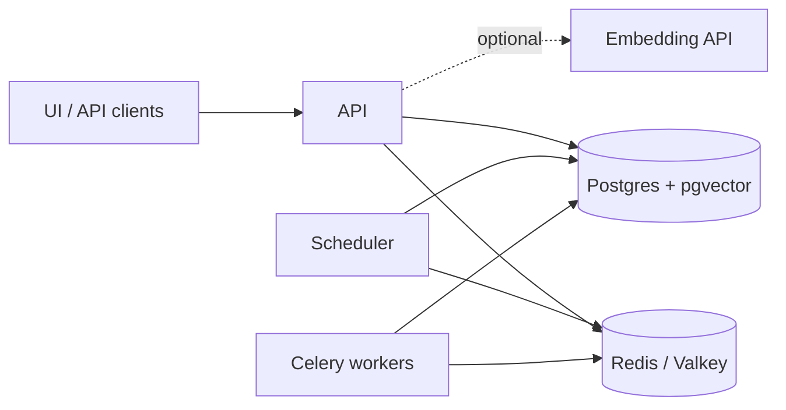

# Running your orchestrator

What changes when your orchestrator runs as more than one local process: which processes there are,
what they depend on, and which settings then matter.

## Processes

Your orchestrator is one codebase, your products, workflows and migrations on top of
orchestrator-core, that runs as up to four kinds of process from the same
[image](container-image.md):

| Process | Command | How many |
|---|---|---|
| API | `python -m uvicorn --host 0.0.0.0 --port 8080 wsgi:app` | one or more |
| Migrations | `python main.py db upgrade heads` | once per release, before the API starts |
| Scheduler | `python main.py scheduler run` | exactly one, if you use [scheduled tasks](../guides/tasks.md#the-scheduler) |
| Celery workers | `python -m celery -A <module> worker -E -Q <queues>` | per queue, with `EXECUTOR=celery`; see [Scaling](../guides/scaling.md) |



- Run the migrations from one process at a time.
- Two schedulers run every task twice. Load the
  [initial schedules](../guides/tasks.md#initial-schedules) before starting it.
- Flower, a monitoring UI for Celery, is optional and not part of orchestrator-core.

## Dependencies

### Postgres with pgvector

Postgres 15 or later with the [pgvector](https://github.com/pgvector/pgvector) extension available;
the `pgvector/pgvector` images include it. The migrations create five extensions, `uuid-ossp`,
`ltree`, `unaccent`, `pg_trgm` and `vector`, and creating `vector` requires a superuser. If the
migrations run as an ordinary user, create them in your database beforehand as a superuser:

```sql
CREATE EXTENSION IF NOT EXISTS "uuid-ossp" WITH SCHEMA public;
CREATE EXTENSION IF NOT EXISTS ltree;
CREATE EXTENSION IF NOT EXISTS unaccent;
CREATE EXTENSION IF NOT EXISTS pg_trgm;
CREATE EXTENSION IF NOT EXISTS vector;
```

The orchestrator's database user must own the database, or have `CREATE` on it and on the `public`
schema.

### Redis or Valkey

Redis, or its open-source fork [Valkey](https://valkey.io), holds what processes share: the
scheduler's queue, the Celery broker, the distributed lock and websocket broadcasts. You need it for
the scheduler, Celery, or more than one API replica. orchestrator-core runs unchanged on Valkey.

### An embedding API

Optional, for [AI search](../reference-docs/ai-search.md#enabling-embeddings). Set
`EMBEDDING_DIMENSION` before the migrations first run if your model's dimension is not 1536.

## Settings

Settings are environment variables; [Settings](../reference-docs/app/settings-overview.md) lists all
of them. Keep `OAUTH2_ACTIVE` on outside local development. These matter once there is more than one
process:

| Setting | Default | Set it to | Why |
|---|---|---|---|
| `DATABASE_URI` | a local database | your database | |
| `CACHE_URI` | `redis://localhost:6379/0` | your Redis/Valkey | |
| `SESSION_SECRET` | random per process | one shared random value | with several API replicas, sessions break when a request reaches another replica |
| `DISTLOCK_BACKEND` | `memory` | `redis` | locks must hold across processes |
| `WEBSOCKET_BROADCASTER_URL` | `memory://` | your `CACHE_URI` | every client must see every update |
| `EXECUTOR` | `threadpool` | `celery` | to run workflows in Celery workers |
| `TESTING` | `true` | `false` | when true, the API waits for every workflow it starts or resumes to finish |

## Health

`GET /api/health/` returns `"OK"` when the API can reach the database. It needs no authentication.
