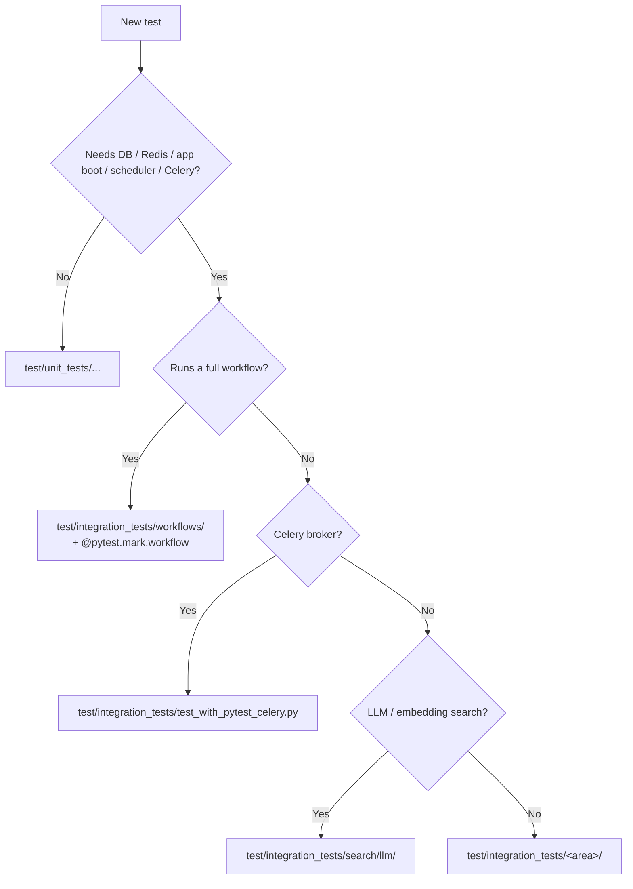

# Testing strategy and writing tests

This guide covers how to write tests for workflows and domain models using
orchestrator-core. For setup instructions (services, running tests), see
[development.md](../contributing/development.md).

## Test layout — unit vs integration

The test suite is split into two layers:

| Layer | Path | Needs Postgres / Redis? | Default `pytest` collects? |
|-------|------|-------------------------|----------------------------|
| Unit | `test/unit_tests/` | No | Yes |
| Integration | `test/integration_tests/` | Yes | No (run explicitly) |

**Unit tests** are pure: pydantic validators, parsers, traversers, generic
filters/sorters, etc., exercised with mocks. They do not touch the database,
Redis, the FastAPI app, the scheduler, or Celery.

**Integration tests** are everything else: REST/GraphQL endpoint tests,
domain-model persistence, full-workflow runs (`@pytest.mark.workflow`),
metrics, scheduler/process tests, search-indexing tests, Celery tests, and
LLM/embedding tests.

Within `test/integration_tests/` the structure mirrors the production tree
(`api/`, `db/`, `domain/`, `graphql/`, `services/`, `workflows/`, …) plus a
`fixtures/` package with the shared product, subscription and process
factories.

### Where to put a new test



### Running each layer

```shell
# Unit tests + doctests (no services)
uv run pytest

# All integration tests except Celery and LLM (use dedicated commands for those)
uv run pytest test/integration_tests \
    --ignore=test/integration_tests/test_with_pytest_celery.py \
    --ignore=test/integration_tests/search/llm

# Celery integration tests
uv run pytest test/integration_tests/test_with_pytest_celery.py

# LLM / embedding-based search tests
uv run pytest test/integration_tests/search/llm
```

### Provisioning Postgres + Redis

`test/integration_tests/fixtures/services.py` resolves how the services are
made available, in this order:

1. **`DATABASE_URI` and `CACHE_URI` set in the environment** — used as-is.
   This is what CI uses, and what downstream projects (e.g.
   `example-orchestrator`) depend on.
2. **Otherwise, testcontainers fallback** — if both env vars are unset, the
   test session starts ephemeral Postgres + Redis containers via
   [testcontainers-python](https://testcontainers-python.readthedocs.io/) and
   removes them when the session ends. Requires Docker to be reachable and
   the `dev` dependency group installed.
3. **Otherwise, abort** with an actionable message.

Partial env configuration (only one of the two URIs set) is rejected so the
test setup never silently mixes a real service with an ephemeral one. The
bundled `docker/pytest-support/docker-compose.yaml` continues to work
unchanged for contributors who prefer that flow.

## Test helpers

Workflow tests use a set of helpers from `test.integration_tests.workflows`:

```python
from test.integration_tests.workflows import (
    WorkflowInstanceForTests,
    assert_aborted,
    assert_assignee,
    assert_awaiting_callback,
    assert_complete,
    assert_failed,
    assert_product_blocks_equal,
    assert_state,
    assert_state_equal,
    assert_step_name,
    assert_success,
    assert_suspended,
    assert_waiting,
    extract_error,
    extract_state,
    resume_workflow,
    run_workflow,
    run_form_generator,
)
```

`run_workflow(workflow_key, input_data)` starts a workflow and returns `(result, process, step_log)`.
`resume_workflow(process, step_log, input_data)` resumes a suspended workflow and returns `(result, step_log)`.

The `assert_*` helpers for terminal state each raise with a descriptive message on failure:

- `assert_complete(result)` — asserts the workflow completed successfully.
- `assert_success(result)` — asserts the result is a success (use when you want to check `issuccess()` rather than `iscomplete()`).
- `assert_failed(result)` — asserts the workflow failed.
- `assert_suspended(result)` — asserts the workflow is suspended at an input step.
- `assert_waiting(result)` — asserts the workflow is in a waiting state.
- `assert_awaiting_callback(result)` — asserts the workflow is waiting for a callback.
- `assert_aborted(result)` — asserts the workflow was aborted.

`assert_state(result, expected)` checks that the result state contains at least the keys in `expected`.
`assert_state_equal(result, expected, excluded_keys=None)` checks the full state for equality, minus a set of excluded keys (defaults to `process_id`, `workflow_target`, `workflow_name`).

`assert_assignee(log, expected)` and `assert_step_name(log, expected)` inspect the last entry of the step log — useful for verifying which step a workflow stopped on and who it was assigned to.

`assert_product_blocks_equal(expected, actual)` compares lists of product block instance dicts, sorting by block type before comparison.

`extract_state(result)` unwraps the state dict from a result; `extract_error(result)` pulls the error string from a failed result.

## Writing a workflow test

### Simple workflow (no suspension)

Mark workflow tests with `@pytest.mark.workflow`. The `responses` HTTP mock fixture is active automatically (see [HTTP mocking](#http-mocking)); include it in the test signature only when you need to register mocks with `responses.add()`:

=== "`orchestrator-core` ≥ 5.0"

    ```python
    import pytest
    from orchestrator.core.db import ProductTable
    from sqlalchemy import select
    from test.integration_tests.workflows import assert_complete, extract_state, run_workflow

    @pytest.mark.workflow
    def test_create_my_product(responses, db_session):
        product = db_session.scalars(select(ProductTable).where(ProductTable.name == "MyProduct")).one()

        result, process, step_log = run_workflow(
            "create_my_product",
            [{"product": product.product_id}, {"customer_id": CUSTOMER_ID, "field": "value"}],
        )

        assert_complete(result)
        state = extract_state(result)
        assert state["field"] == "value"
    ```

=== "`orchestrator-core` < 5.0"

    ```python
    import pytest
    from orchestrator.db import ProductTable
    from sqlalchemy import select
    from test.unit_tests.workflows import assert_complete, extract_state, run_workflow

    @pytest.mark.workflow
    def test_create_my_product(responses, db_session):
        product = db_session.scalars(select(ProductTable).where(ProductTable.name == "MyProduct")).one()

        result, process, step_log = run_workflow(
            "create_my_product",
            [{"product": product.product_id}, {"customer_id": CUSTOMER_ID, "field": "value"}],
        )

        assert_complete(result)
        state = extract_state(result)
        assert state["field"] == "value"
    ```

The `input_data` argument is a list of dicts — one dict per form page in the workflow. Create workflows typically take `[{"product": product_id}, {...field inputs...}]`.

### Multi-step workflow (with suspension)

When a workflow suspends at an `inputstep`, assert the suspension, inspect state, then resume with the next form's data:

```python
@pytest.mark.workflow
def test_create_with_approval(responses, db_session):
    product = db_session.scalars(select(ProductTable).where(ProductTable.name == "MyProduct")).one()

    result, process, step_log = run_workflow(
        "create_my_product",
        [{"product": product.product_id}, {"customer_id": CUSTOMER_ID}],
    )
    assert_suspended(result)

    state = extract_state(result)
    assert state["customer_id"] == CUSTOMER_ID

    result, step_log = resume_workflow(process, step_log, {"approved": True})
    assert_complete(result)
```

Pass only the new form's data to `resume_workflow` — it merges into the existing state automatically.
Repeat the `assert_suspended` / `resume_workflow` cycle for each suspension point.

### Testing an ad-hoc workflow

To test a workflow defined inline (not registered in `ALL_WORKFLOWS`), use `WorkflowInstanceForTests` as a context manager:

=== "`orchestrator-core` ≥ 5.0"

    ```python
    from orchestrator.core.targets import Target
    from orchestrator.core.workflow import begin, done, inputstep, step, workflow
    from test.integration_tests.workflows import WorkflowInstanceForTests, assert_complete, assert_suspended, resume_workflow, run_workflow

    def test_my_inline_workflow():
        @step("Do work")
        def do_work():
            return {"result": 42}

        @workflow(target=Target.CREATE)
        def my_wf():
            return begin >> do_work >> done

        with WorkflowInstanceForTests(my_wf, "my_wf"):
            result, process, step_log = run_workflow("my_wf", {})
            assert_complete(result)
    ```

=== "`orchestrator-core` < 5.0"

    ```python
    from orchestrator.targets import Target
    from orchestrator.workflow import begin, done, inputstep, step, workflow
    from test.unit_tests.workflows import WorkflowInstanceForTests, assert_complete, assert_suspended, resume_workflow, run_workflow

    def test_my_inline_workflow():
        @step("Do work")
        def do_work():
            return {"result": 42}

        @workflow(target=Target.CREATE)
        def my_wf():
            return begin >> do_work >> done

        with WorkflowInstanceForTests(my_wf, "my_wf"):
            result, process, step_log = run_workflow("my_wf", {})
            assert_complete(result)
    ```

## HTTP mocking

The `responses` fixture is `autouse=True`, meaning it is active for every test automatically.
Any HTTP call that is not mocked will raise an exception and fail the test.
Any mock that is registered but never called will also fail the test — register only what your workflow actually uses.

Register mocks before running the workflow:

```python
@pytest.mark.workflow
def test_with_external_call(responses, db_session):
    responses.add(
        "POST",
        "https://external.example.com/api/endpoint",
        body='{"status": "ok"}',
        content_type="application/json",
    )

    result, process, step_log = run_workflow("my_workflow", [...])
    assert_complete(result)
```

If your URL includes a query string, pass `match_querystring=True` to `responses.add()` or the mock will not match:

```python
responses.add(
    "GET",
    "https://api.example.com/items?id=123",
    body='{"id": 123}',
    content_type="application/json",
    match_querystring=True,
)
```

Skipping the `match_querystring` flag on a query-string URL is a common source of mocks silently not matching.

To opt a specific test out of the responses mock entirely, mark it with `@pytest.mark.noresponses`.

## Writing subscription fixtures

When creating a subscription fixture in `conftest.py` for use in workflow tests, always set `insync=True`:

```python
gen_subscription = MyProductInactive.from_product_id(
    product_id, customer_id=CUSTOMER_ID, insync=True
)
```

Omitting `insync=True` will cause any workflow test consuming that subscription to fail with a message about an active process — the framework thinks the subscription is mid-process and refuses to proceed.

## Writing domain model tests

Domain model tests exercise product types and product blocks directly, without running a workflow.

### Testing default field values

```python
from products.product_types.my_product import MyProductInactive

def test_my_product_defaults():
    subscription = MyProductInactive.from_product_id(product_id, customer_id=CUSTOMER_ID)
    assert subscription.pb.some_field == "expected_default"
```

### Testing save and load

Define a fixture in `conftest.py` that creates and persists the subscription, then load it from the database in the test:

```python
def test_my_product_save_and_load(my_product_subscription_id):
    subscription = MyProduct.from_subscription(my_product_subscription_id)
    assert subscription.status == SubscriptionLifecycle.ACTIVE

    subscription.pb.some_field = "updated"
    subscription.save()

    reloaded = MyProduct.from_subscription(my_product_subscription_id)
    assert reloaded.pb.some_field == "updated"
```

## Testing form generators

Use `run_form_generator` to test multi-page form logic in isolation, without running a full workflow:

```python
from test.integration_tests.workflows import run_form_generator

def test_my_form_generator():
    forms, result = run_form_generator(
        my_form_generator({"state_field": "value"}),
        extra_inputs=[{"page_1_field": "input"}],
    )
    assert result["page_1_field"] == "input"
    assert result["computed_field"] == "expected"
```

Note that `run_form_generator` intentionally bypasses Pydantic validation — ensure `extra_inputs` matches the expected types as if validation had run.

## Unit-testing decorated step functions with `orig()`

Workflow steps are decorated functions: at runtime the orchestrator runs them
inside a workflow process, threading state through and persisting results.
That makes them awkward to unit test — calling the step directly would invoke
the engine's runtime machinery (process IDs, transactional commits, retry
policy), which is not what you want when all you care about is the pure
business logic inside the function body.

`orchestrator.core.utils.functional.orig` returns the undecorated callable:

```python
from collections.abc import Callable

def orig(func: Callable) -> Callable:
    """Return the function wrapped by one or more decorators."""
    f = func
    while hasattr(f, "__wrapped__"):
        f = f.__wrapped__
    return f
```

### When to use `orig()`

Use `orig(step_function)(...)` when you want to test:

- The pure business logic inside a step function
- Validation and error paths that are not state-dependent
- Pure transformations on subscription / product / form data

These are unit tests by definition — no DB, no engine, no persistence — and
belong in `test/unit_tests/`.

```python
# test/unit_tests/workflows/test_my_step.py
from orchestrator.core.utils.functional import orig
from my_orchestrator.workflows.my_workflow import compute_new_state


def test_compute_new_state_pure_logic():
    state = {"port_speed": "10G", "vlan": 100}
    result = orig(compute_new_state)(state)
    assert result["port_speed"] == "10G"
    assert result["pretty_name"] == "10G port (vlan 100)"
```

### When NOT to use `orig()`

`orig()` skips the engine. Do **not** use it when the thing under test is the
engine's behaviour. Use the workflow runner helpers and place the test in
`test/integration_tests/workflows/` instead, when verifying:

- Workflow execution end-to-end
- Step ordering, suspend / resume / callback semantics
- Retry behaviour
- Database persistence (a step writing to `db.session` only sees a real
  engine when called through `runwf`)
- Scheduler, process, or Celery interaction

## Test markers

| Marker | When to use |
|--------|-------------|
| `@pytest.mark.workflow` | All workflow tests — required for correct test collection and fixtures |
| `@pytest.mark.integration` | Integration test (requires Postgres / Redis / app boot). Implied by the directory layout but may be applied explicitly. |
| `@pytest.mark.postgres` | Test requires a Postgres database. |
| `@pytest.mark.redis` | Test requires a Redis cache. |
| `@pytest.mark.noresponses` | Tests that make real HTTP calls (rare; use with caution) |
| `@pytest.mark.celery` | Tests requiring Celery worker support |
| `@pytest.mark.search` | Tests requiring the `search` extra |
| `@pytest.mark.acceptance` | Acceptance tests (handled separately from unit tests) |
