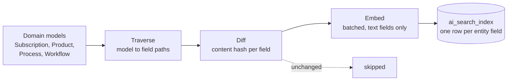
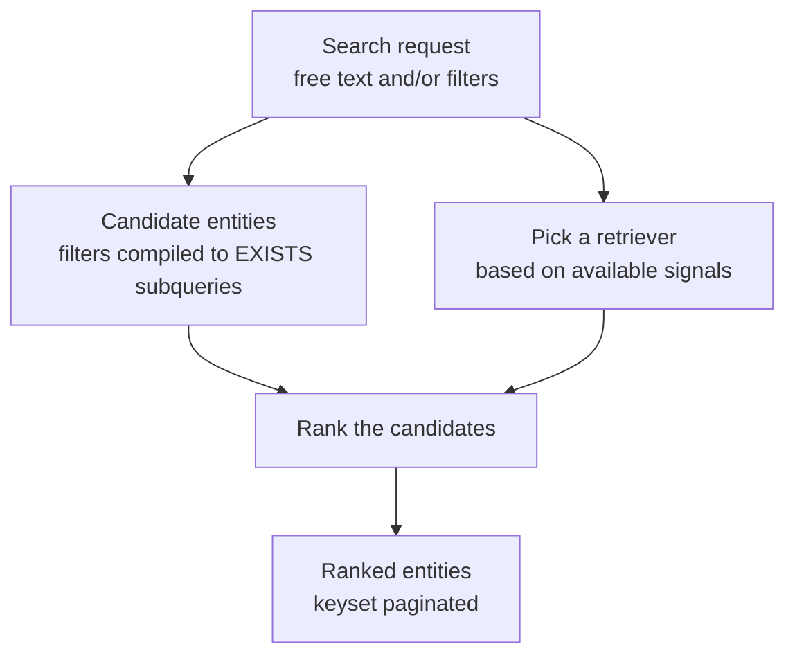

# AI / Hybrid Search

AI / Hybrid Search finds subscriptions, products, processes and workflows by combining several
kinds of matching (by meaning, by spelling, by structure and by exact value) over a single
PostgreSQL index.

It exists because keyword search answers only one kind of question. A user who types
`amsterdam node` wants results even if the description says "Amsterdam router"; a user who types
`nod` wants results despite the typo; and a UI that offers "status is active **and** start date
after 2025-01-01" needs typed, per-field filtering. Classic keyword search does none of these
well. AI / Hybrid Search indexes **every field of every entity as its own row**, so all four
kinds of matching run against the same data.

It is the successor to the [classic search](search.md) implementations and is the search behind
`/api/search`, the GraphQL `search` field, and the orchestrator's agent tools.

## How it compares to classic search

|                | Classic search                                                          | AI / Hybrid Search                                                  |
|----------------|-------------------------------------------------------------------------|---------------------------------------------------------------------|
| Data structure | `subscriptions_search` materialized view, plus `WHERE` clauses on entity tables | `ai_search_index` table, one row per entity field                    |
| Matches on     | whole-word keywords in one text blob per subscription                    | individual field values, by meaning, spelling, exact value or path  |
| Query shape    | a query string, e.g. `tag:L2VPN -status:active`                          | free text plus a typed filter tree                                   |
| Entities       | subscriptions (text search); others by DB-column filtering               | subscriptions, products, processes, workflows                        |
| Freshness      | view refreshed at most once every two minutes                            | index updated by the standard workflow decorators, or on demand via the CLI |
| Status         | text search on subscriptions is **deprecated** since 5.0                 | current                                                              |

Classic search is still in place and still documented in [Search](search.md). New integrations
should use AI / Hybrid Search.

## Key ideas

### One row per field

A traditional search index stores one document per record. This subsystem stores one row per
**field**, in a table called `ai_search_index`. A subscription with 40 fields contributes 40 rows.

Each row records where the value came from as a dotted path like `subscription.node.name`,
stored in a PostgreSQL [`ltree`](https://www.postgresql.org/docs/current/ltree.html) column.
`ltree` is a column type for hierarchical labels; it lets the database ask "is this path below
`subscription.node`?" using an index, rather than by string matching.

Two things follow from this layout:

- A query can address one field precisely ("status equals active") without the engine knowing
  anything about the product model. The subsystem is schema-agnostic: new product blocks become
  searchable simply by being indexed.
- The number of *rows* grows with your data, but the number of distinct *paths* only grows with
  your schema. A UI that needs "which fields can I filter on?" reads the much smaller
  [`ai_search_paths`](#the-distinct-paths-table) table instead.

### Four ways to match

| Match type          | Answers                                    | Built on                                                        |
|---------------------|--------------------------------------------|-----------------------------------------------------------------|
| **Semantic**        | "which values *mean* something similar?"    | vector embeddings, compared with [pgvector](https://github.com/pgvector/pgvector) |
| **Fuzzy**           | "which values are *spelled* similarly?"     | trigrams, via the `pg_trgm` extension                            |
| **Structured**      | "which entities have a field under this path?" | `ltree` path operators                                        |
| **Exact / typed**   | "which entities have status = active?"      | typed casts and comparisons on the value column                  |

**Trigrams** are three-character slices of a word: `node` becomes `nod`, `ode`. Two strings that
share many trigrams are similar, so `nod` still matches `node` and typos still find their target.
This is what makes fuzzy matching tolerant of spelling.

### What embeddings add

An **embedding** is a vector (list) of numbers that represents the meaning of a piece of text. Texts with
similar meanings get numerically close vectors, so "closeness" becomes a distance calculation the
database can index and sort by.

Embeddings are what let a search for `amsterdam router` return a subscription described as
"AMS core node". There is no shared keyword, only shared meaning. They are generated by an
external embedding API (through [LiteLLM](https://docs.litellm.ai/)) and stored alongside the
value in the same row.

Embeddings are **optional**. See [Running without embeddings](#running-without-embeddings).

## How it works

### Indexing (write path)



A traverser walks a domain model and emits one `(path, value, type)` triple per leaf field.
Nested models extend the path; list elements get a numeric segment (`block.0`, `block.1`). The
field's type comes from the model's *type hint*, not from the value, so a field declared `str`
is still compared as a string when its value happens to look like a number.

Each field is hashed. Only fields whose hash changed are written, and paths that traversal no
longer produces are deleted, so re-indexing an unchanged entity does almost no work. Text values
are embedded in batches sized against the embedding model's context window; everything else is
stored with no embedding.

Indexing is triggered from three places:

- **Workflow steps**: the `create_workflow`, `modify_workflow`, `terminate_workflow` and
  `reconcile_workflow` decorators append two steps, `refresh_subscription_search_index` and
  `refresh_process_search_index`. The first re-indexes the workflow's subscription, the second
  re-indexes the workflow's own process record. Both catch their own errors, so a failed re-index
  never fails the workflow. `validate_workflow` and the bare `@workflow` decorator do not append
  these steps, so a subscription or process changed by such a workflow keeps its previous index
  entry until something re-indexes it. Add the two steps (`orchestrator.core.workflows.steps`) to
  your own step list when the workflow changes indexed data.
- **REST endpoints**: product and process updates re-index the entity they changed.
- **The CLI**: see [Building and refreshing the index](#building-and-refreshing-the-index).

### Searching (read path)



A request becomes a typed query object. Filters narrow the candidate entities; the free-text part
decides *how* those candidates are ranked. The engine picks the retriever automatically:

| Available signals                      | Retriever      | Ranking                                             |
|----------------------------------------|----------------|------------------------------------------------------|
| Text **and** an embedding               | **Hybrid**     | trigram and semantic rankings fused (see [RRF](#ranking-formulas)) |
| Text that is a UUID                     | **Fuzzy**      | highest trigram similarity wins                      |
| Filters only                            | **Structured** | no relevance ranking; ordered by a chosen field      |

Any free text, single-word or a whole phrase, is fuzzy-matched on the full text *and* ranked
semantically. In a domain where most searches are identifiers, names and descriptions, the
trigram signal is the strongest one, so it is always included; the semantic source keeps
plain-language queries working when no field contains the words. The only text that is not
embedded is a UUID, which has no meaning to embed and routes to fuzzy matching.

The pure **Semantic** retriever (closest embedding wins) is available as an explicit
`retriever` override only. Callers can override the retriever explicitly. If an override needs an
embedding and none can be produced, the request fails with a clear error rather than silently
returning different results; under automatic routing the same situation falls back to fuzzy on
the full text.

Process searches use a variant of the hybrid retriever that also searches the `state`
JSONB of the process's most recent step. Process steps are deliberately left out of the index to
keep its size manageable, so that column is read and matched at query time instead: candidates
are found with a substring `ILIKE`, then scored with the same trigram similarity used for indexed
fields. These rows never contribute a semantic score. Matches are reported under the path
`process.last_step.state`.

Results are entities, not fields, and are paginated with a keyset (cursor) rather than `OFFSET`,
so pages stay stable while data changes underneath.

## What you can search, and where

Four entity types are indexed: **subscriptions**, **products**, **processes** and **workflows**.
All three interfaces run the same engine.

| Interface   | Where                       | What it offers                                                                             |
|-------------|-----------------------------|--------------------------------------------------------------------------------------------|
| **REST**    | `/api/search` (authenticated) | `POST /subscriptions`, `/products`, `/processes`, `/workflows` to search; `GET /paths` for field autocomplete; `GET /definitions` for the operators valid per UI type; `GET /queries/{id}`, `/results`, `/export` to re-run or export a saved query |
| **GraphQL** | root fields                 | `search`, `searchPaths`, `searchDefinitions`, `searchQuery`, `searchQueryResults`, `searchQueryExport`, mirroring REST |
| **Agent tools** | `/api/agent`            | `search`, `aggregate`, `discover_filter_paths`, `get_valid_operators`, `resolve_entity`, `export_query`, exposed as read-only [MCP](mcp.md) tools when `MCP_ENABLED` is set |

The REST and GraphQL search routers are always registered, and the agent tools are ordinary REST
endpoints that are always available. Only surfacing them over MCP is opt-in: that needs
`MCP_ENABLED=True` and the `mcp` extra installed. See [MCP Server](mcp.md).

Queries are stored in `search_queries` and addressed by `query_id`, so a caller can page through,
re-run or export a search without re-sending it. The agent `search` and `aggregate` tools always
store their query and return the id. REST and GraphQL store it when a result has a next page, and
put the id in the page cursor, which is also what keeps paging consistent while data changes.

!!! note "The LLM agent itself is not part of orchestrator-core"

    Core provides the tools an agent calls and stores query and conversation state for it. The
    agent loop lives in a separate package. A typical agent sequence is
    `discover_filter_paths` → `get_valid_operators` → `search`/`aggregate` → `export_query`.

## Running it

### Enabling embeddings

Search works out of the box without any embedding configuration. To enable semantic and hybrid
retrieval, point the orchestrator at an embedding provider:

```shell
EMBEDDING_API_ENABLED=True
EMBEDDING_API_KEY=sk-...                        # your provider's API key
EMBEDDING_MODEL=openai/text-embedding-3-small   # default; any LiteLLM model id
EMBEDDING_DIMENSION=1536                        # must match the model's output size
```

The [5.0 upgrade guide](../guides/upgrading/5.0.md) covers first-time setup end to end, including
the required PostgreSQL extensions. All settings are listed under
[Settings](#settings).

### Running without embeddings

`EMBEDDING_API_ENABLED` defaults to `False`. Indexing then stores every row with
`embedding = NULL` and searches use fuzzy and structured retrieval only, so anything that would
have been ranked semantically falls back to fuzzy. Runtime embedding failures behave the same
way, except when a request names `semantic` or `hybrid` explicitly: those return an error rather
than falling back. See [Searching](#searching-read-path).

### Building and refreshing the index

Workflows keep subscriptions and processes up to date on their own. Use the CLI for the initial
build, and after bulk changes:

```shell
python main.py index subscriptions
python main.py index products
python main.py index processes
python main.py index workflows
```

Each command accepts:

| Option                | Effect                                                     |
|-----------------------|------------------------------------------------------------|
| `--<entity>-id UUID`  | index a single entity, e.g. `--subscription-id`             |
| `--force-index`       | re-index every field, ignoring the content hashes           |
| `--dry-run`           | make no database writes and no embedding calls              |
| `--show-progress`     | show a progress bar                                        |

`python main.py index rebuild-paths` recomputes the
[distinct-paths table](#the-distinct-paths-table) from scratch.

`python main.py search` runs individual search strategies from a shell (`structured`, `semantic`,
`fuzzy`, `hierarchical`, `hybrid`, plus `generate-schema` and `nested-demo`), and
`python main.py speedtest quick` measures query performance. These are exploration aids; the
`semantic`, `fuzzy` and `hybrid` commands force the retriever of the same name.

### Running a local embedding server

For a self-hosted endpoint, only OpenAI-compatible APIs are supported. To run
[all-MiniLM-L6-v2](https://huggingface.co/sentence-transformers/all-MiniLM-L6-v2) locally with
[Hugging Face TEI](https://github.com/huggingface/text-embeddings-inference):

```shell
docker run --rm -p 8080:80 ghcr.io/huggingface/text-embeddings-inference:cpu-1.8 \
    --model-id sentence-transformers/all-MiniLM-L6-v2
```

Point the orchestrator at it and declare the model's vector size:

```shell
EMBEDDING_API_BASE=http://localhost:8080/v1
EMBEDDING_DIMENSION=384
EMBEDDING_MAX_BATCH_SIZE=32
```

`EMBEDDING_MAX_BATCH_SIZE` and `EMBEDDING_FALLBACK_MAX_TOKENS` exist for models like this one,
whose limits LiteLLM cannot look up. They are not needed with hosted OpenAI models.

Changing `EMBEDDING_DIMENSION` also requires a resize (see below).

### Changing the embedding dimension

`EMBEDDING_DIMENSION` is baked into the vector column type, so it cannot be changed by
configuration alone:

```shell
python main.py embedding resize
```

!!! warning

    `embedding resize` **deletes every row** from `ai_search_index` and `search_queries` before
    altering the column. Re-index afterwards.

## Implementation reference

Everything below describes how the current implementation works. It is useful for debugging,
performance work and maintenance, but it is not a stable interface.

### Data model

`ai_search_index` is an entity-attribute-value (EAV) table: each scalar field of each entity is
one row.

| Column          | Type                          | Purpose                                                       |
|-----------------|-------------------------------|---------------------------------------------------------------|
| `entity_type`   | `TEXT NOT NULL`               | `SUBSCRIPTION` / `PRODUCT` / `PROCESS` / `WORKFLOW`            |
| `entity_id`     | `UUID NOT NULL`               | the entity this field belongs to                              |
| `entity_title`  | `TEXT`                        | human-readable label for the entity                           |
| `path`          | `LTREE NOT NULL`              | field path, e.g. `subscription.node.name`                     |
| `value`         | `TEXT NOT NULL`               | the field value, stringified                                  |
| `value_type`    | `field_type NOT NULL`         | how to interpret and compare `value`                          |
| `embedding`     | `VECTOR(EMBEDDING_DIMENSION)` | embedding of the value text; `NULL` when not embeddable        |
| `content_hash`  | `VARCHAR(64) NOT NULL`        | SHA-256 of the field, for change detection                    |

The primary key is `(entity_id, path)`. `value_type` is a PostgreSQL enum generated from
`FieldType`: `string`, `integer`, `float`, `boolean`, `datetime`, `uuid`, `block`,
`resource_type`.

The content hash covers `path`, `value`, `value_type` **and** `entity_title`, so renaming an
entity re-indexes all of its rows.

Only non-empty text values that do not *look* like a UUID, number, boolean or date are embedded.
The embedded text is `"{path}: {value}"`, which gives the model the field name as context.

Supporting tables:

- **`search_queries`**: stored queries, with their parameters as JSONB and their embedding.
  `run_id` is `NULL` for ordinary API and agent-tool searches, and set when the query belongs to
  an agent run. This is what `query_id` re-run, paging and export read from.
- **`agent_runs`** and **`graph_snapshots`**: conversation and graph state for an external
  resumable agent. Core writes and reads them but contains no agent itself.

### Indexes

Each index serves one match type:

| Index                            | Definition                                                        | Serves                                     |
|----------------------------------|-------------------------------------------------------------------|--------------------------------------------|
| `ix_flat_embed_hnsw`             | `HNSW (embedding vector_l2_ops) WITH (m=16, ef_construction=64)`   | nearest-neighbour search by L2 distance (`<->`) |
| `ix_flat_value_trgm`             | `GIN (value gin_trgm_ops)`                                        | trigram similarity (`<%`, `word_similarity`) |
| `ix_flat_path_gist`              | `GIST (path gist_ltree_ops)`                                      | `ltree` matching (`~`, `@>`, `<@`)          |
| `ix_flat_path_btree`             | `btree (path)`                                                    | exact path equality, used by the EAV pivot  |
| `ix_ai_search_index_entity_id`   | `btree (entity_id)`                                               | candidate lookups by entity                 |
| `idx_ai_search_index_content_hash` | `btree (content_hash)`                                          | change detection during indexing            |

The HNSW index uses `vector_l2_ops`, so semantic ranking uses **L2 distance (`<->`)**, not cosine
distance.

The hybrid retriever reads its semantic candidates as a `ORDER BY embedding <-> query LIMIT n`
scan of this index. With pgvector's default (non-iterative) scan the index returns at most about
`hnsw.ef_search` rows (default 40) regardless of the `LIMIT`, so the engine sets
`hnsw.iterative_scan = relaxed_order` for the search transaction (via `set_config(..., is_local)`),
which is available from **pgvector 0.8**. On older pgvector the database rejects the setting; the
engine logs that once, runs the search without it, and the semantic source is then capped at
roughly `ef_search` rows.

The migration that creates these also creates the `uuid-ossp`, `ltree`, `unaccent`, `pg_trgm` and
`vector` extensions, unless `vector` already exists and `LLM_FORCE_EXTENSION_MIGRATION` is off.

### Ranking formulas

**Fuzzy**: matches rows where `'<term>' <% value`, restricted to the string-like field types;
an entity's score is the highest `word_similarity(term, value)` among its matched fields.

**Semantic**: considers rows with an embedding; an entity's score is
`1 / (1 + min(embedding <-> query_vector))`, so a smaller distance gives a higher score, bounded
to `[0, 1]`.

**Structured**: no relevance ranking (`score = 1.0`); results are ordered by an optional
`order_by` field materialized from the index rows.

**Hybrid** uses **Reciprocal Rank Fusion (RRF)**: rather than trying to make a distance and a
similarity score comparable, it ranks results separately by each signal and combines the *ranks*.

It draws candidates from two independent sources:

- the **fuzzy source**: the fields that trigram-match the full query text (`'<text>' <% value`),
  best matches first, capped at 100 field rows;
- the **semantic source**: the fields closest to the query embedding (HNSW index scan), capped at
  400 field rows.

Each source is reduced to one row per entity using its *best* field (highest `word_similarity`,
smallest distance) and ranked on its own with a dense rank (equal scores share a rank). The two
rankings are joined with a full outer join, so an entity found by only one source still gets a
score and the missing source contributes `0`. Plain-language queries that no field trigram-matches
therefore come out in the semantic order, while identifiers and names are lifted by the trigram
match. The reported matching field is the best fuzzy field when there is one, otherwise the best
semantic field.

```text
rrf     = 1/(k + sem_rank) + 1/(k + fuzzy_rank)   # k = 60; a NULL rank contributes 0
rrf_max = n_sources / (k + 1)                     # n_sources = 2
beta    = rrf_max * 1.05
perfect = 1 if best_fuzzy_score >= 0.9 else 0
score   = (rrf + beta * perfect) / (beta + rrf_max)   # normalized to [0, 1]
```

Because `beta` exceeds the largest possible `rrf`, any near-exact text match (best fuzzy
similarity ≥ 0.9) always outranks every non-exact result, including entities that only semantic
ranking would have put on top. Ties break on `entity_id`.

### Filters

Structured filtering is a typed tree:

- A **`PathFilter`** is one predicate over one path, written as
  `{path, condition, value_kind}`. It adds a type guard so a numeric filter can never match a
  string row. A dotless path such as `status` matches any path *ending* in that component; a
  dotted path must match exactly.
- A **`FilterTree`** nests `PathFilter`s under `AND` / `OR`, up to five levels deep. Each leaf
  compiles to a correlated `EXISTS (SELECT 1 FROM ai_search_index WHERE entity_id = ... AND ...)`;
  `not_has_component` compiles to `NOT EXISTS`.

Condition types are a union tried in order: date (timestamp casts, half-open `between`), numeric
(bigint/double casts), string (`ilike`, wildcard required), contains (POSIX `~*`), `ltree`
(`matches_lquery`, `is_ancestor`, `is_descendant`, `has_component`, `ends_with`), and equality
(`eq`/`neq`, case-insensitive, boolean-aware) last as the most general.

Requests may also send an Elasticsearch-style DSL, which is converted to a `FilterTree`.

`GET /api/search/definitions` returns the valid operators and value schemas for each UI type,
the `value_kind` a filter declares. Read it from there rather than from this page: it is generated
from the same definitions the query builder uses.

### Query types and persistence

A search is one of four typed query objects:

| Query            | Purpose                                   | Limit    |
|------------------|-------------------------------------------|----------|
| `SelectQuery`    | return matching entities                  | ≤ 100    |
| `ExportQuery`    | bulk export matching entities             | ≤ 10 000 |
| `CountQuery`     | count, optionally grouped                 | n/a      |
| `AggregateQuery` | `COUNT`/`SUM`/`AVG`/`MIN`/`MAX` over matches | n/a   |

Counts and aggregations need field values as columns, so the engine pivots the EAV rows with
`MAX(CASE WHEN path = :p THEN value END)` grouped by `entity_id`. The same pivot powers inline
`response_columns` on search results, temporal grouping (`date_trunc`) and cumulative window sums.

Before any SQL runs, queries are validated against the live index: lquery syntax, whether the
referenced paths exist, whether the filter matches the field's type, and grouping and aggregation
constraints.

### The distinct-paths table

A filter UI needs to know which fields are queryable for an entity type, so it can offer
autocomplete and render the right control per field. That is what `GET /api/search/paths`
(GraphQL `searchPaths`, agent tool `discover_filter_paths`) answers.

Deriving that list by grouping `ai_search_index` on every request is slow, because the work scales
with the number of entities rather than with the schema. The distinct paths are therefore
materialized in a small companion table, `ai_search_paths`:

| Column        | Description                                                                     |
|---------------|---------------------------------------------------------------------------------|
| `entity_type` | `SUBSCRIPTION` / `PRODUCT` / `PROCESS` / `WORKFLOW`                              |
| `path`        | the `ltree` field path, e.g. `subscription.node.name`                            |
| `value_type`  | the field's type, used to pick the UI control                                    |
| `refcount`    | how many `ai_search_index` rows currently carry this `(entity_type, path, value_type)` |

The primary key is `(entity_type, path, value_type)`, so there is exactly one row per distinct
path, typically a few thousand against millions of index rows. The endpoint filters this table
by `entity_type`, matches an optional `ltree` prefix, and can rank the result by trigram
similarity to a search term, so it stays fast no matter how many subscriptions exist.

Unlike `subscriptions_search`, this table is never bulk-refreshed. A row trigger on
`ai_search_index`, `ai_search_paths_maintain_trg`, keeps it exact: inserts increment a tuple's
`refcount`, deletes decrement it and drop the row at zero, and updates move one count from the old
tuple to the new one only when the tuple actually changes. Re-indexing a changed *value* is a
no-op for this table.

```sql
SELECT tgname, tgenabled FROM pg_trigger WHERE tgname = 'ai_search_paths_maintain_trg';
```

Run `python main.py index rebuild-paths` to recompute the table if it drifts, for example after a
manual `TRUNCATE ai_search_index`, which (unlike `DELETE`) does not fire the trigger.

!!! note

    `ai_search_paths` was added by migration `ca79fd834ba0`. Installations below that revision do
    not have it, and `GET /api/search/paths` fails until they migrate.

### Empty-result broadening for the agent tool

The agent `search` tool runs a broadening waterfall rather than returning nothing. It first runs
the query as asked; if that returns no rows and free text is present, it retries with
progressively looser criteria:

1. drop loose `like` filters, keep high-signal `eq`, range and component filters;
2. drop all filters, rank with hybrid;
3. drop all filters, rank with semantic.

How far it goes is set by the request's `effort`: `low` = no retries, `medium` = one, `high` = all
three. The first rung is skipped when it would be pointless (nothing loose to drop, or nothing
high-signal to keep). With embeddings disabled, the hybrid and semantic rungs degrade to fuzzy.
The response reports which retriever produced the results and whether broadening was used.

### Settings

All embedding settings live in `LLMSettings` (`orchestrator/core/settings.py`).

| Setting                                 | Default                          | Purpose                                                    |
|-----------------------------------------|----------------------------------|------------------------------------------------------------|
| `EMBEDDING_API_ENABLED`                 | `False`                          | master switch; when off, search is fuzzy and structured only |
| `EMBEDDING_MODEL`                       | `openai/text-embedding-3-small`  | LiteLLM model id, in `provider/model` form                  |
| `EMBEDDING_DIMENSION`                   | `1536`                           | vector size (100 to 2000); baked into the column type          |
| `EMBEDDING_API_KEY` / `EMBEDDING_API_BASE` | `""` / `None`                 | credentials and endpoint                                    |
| `EMBEDDING_ENCODING_FORMAT`             | `float`                          | LiteLLM encoding format                                     |
| `EMBEDDING_SAFE_MARGIN_PERCENT`         | `0.1`                            | token-budget headroom per embedding batch                   |
| `EMBEDDING_FALLBACK_MAX_TOKENS`         | `512`                            | context window to assume when the model's is unknown        |
| `EMBEDDING_MAX_BATCH_SIZE`              | `None`                           | maximum items per embedding batch (`None` = unlimited)      |
| `LLM_MAX_RETRIES` / `LLM_TIMEOUT`       | `3` / `30`                       | LiteLLM retry and timeout, used during indexing             |
| `LLM_FORCE_EXTENSION_MIGRATION`         | `False`                          | force `CREATE EXTENSION` in the search migration            |

Live queries do not use `LLM_MAX_RETRIES`/`LLM_TIMEOUT`: they embed with a 5-second timeout and no
retries, because a slow search is worse than one without semantic ranking.

The only related `AppSettings` flag is `MCP_ENABLED` (default `False`), which mounts `/mcp`.

### Where the code lives

| Area                                             | Location                                                              |
|--------------------------------------------------|-----------------------------------------------------------------------|
| Traversal, change detection, embedding, upsert     | `orchestrator/core/search/indexing/`                                  |
| Query objects, validation, SQL building, persistence | `orchestrator/core/search/query/`                                   |
| Retrievers and pagination                          | `orchestrator/core/search/retrieval/`                                 |
| Filter tree and operator definitions               | `orchestrator/core/search/filters/`                                   |
| Field types and the embedding client               | `orchestrator/core/search/core/`                                      |
| Agent broadening waterfall                         | `orchestrator/core/search/fallback.py`                                |
| REST endpoints                                     | `orchestrator/core/api/api_v1/endpoints/search.py` and `mcp_tools.py` |
| GraphQL resolvers                                  | `orchestrator/core/graphql/resolvers/search.py`                       |
| CLI commands                                       | `orchestrator/core/cli/search/`                                       |
| Tables                                             | `orchestrator/core/db/models.py`                                      |
| Migrations                                         | `orchestrator/core/migrations/versions/schema/` (`262744958e0c`, `ca79fd834ba0`) |

For the reasoning behind this design, see
[PostgreSQL hybrid search](https://timfrohlich.com/blog/postgresql-hybrid-search).
