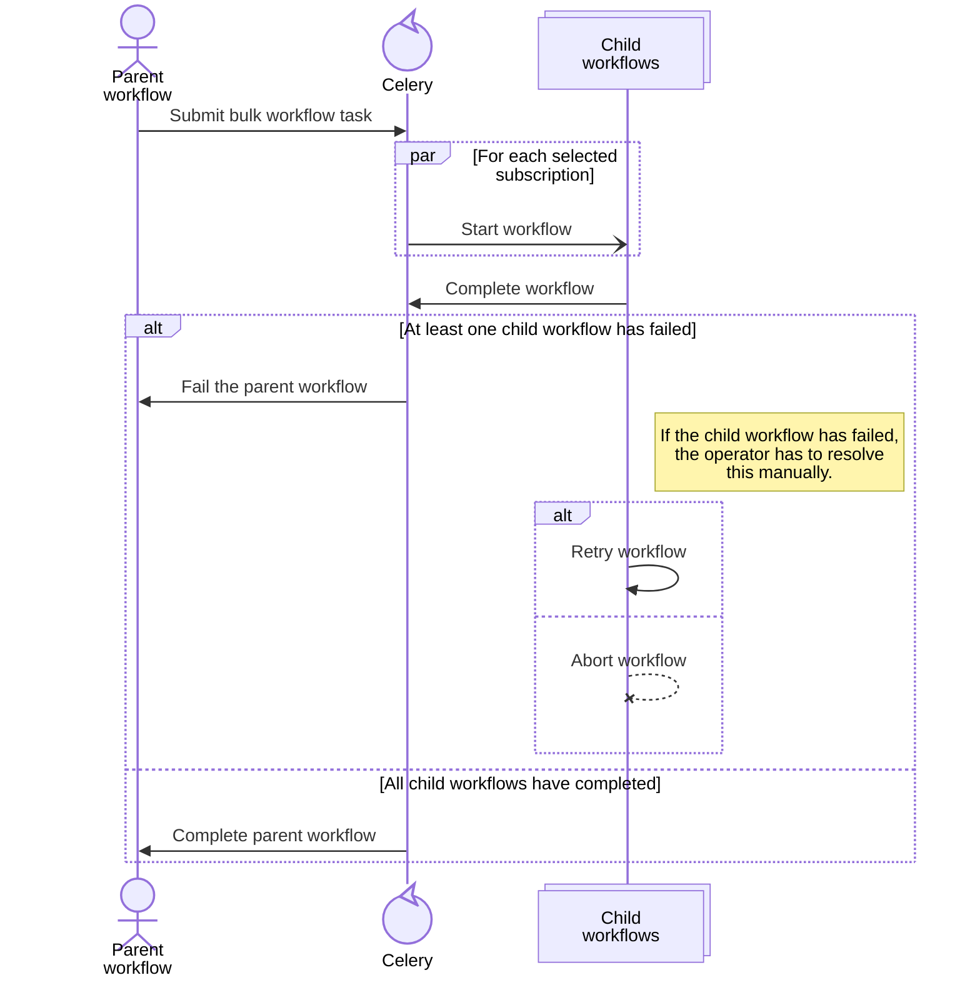

# Parallelization in GÉANT

In GÉANT, there are a few tasks and workflows that make use of parallel execution of workflows. These are mostly used
for mass-migration or -reconciliation. Parallelization takes place outside the orchestrator-core however, as we add
items to the Celery queue directly. This only allows us to run multiple workflows in parallel, and not separate steps.

## Hierarchy

In this section, we will refer to mass-deploy workflows, but their behaviour is identical to how mass-migrate and
-reconcile workflows behave. When running the **workflow** `redeploy_base_config`, the standard set of configuration
statements is applied to an existing router. It can happen that there is a change in this set of statements, and our
base config is updated.

To prevent all router subscriptions from falling out of sync during their nightly validation, we want to redeploy base
config on all routers. For this, we use a special **task** `redeploy_base_config`. The input form of this task allows
the operator to select multiple routers for which the `redeploy_base_config` workflow should run.

```python
@shared_task(ignore_result=False)
def bulk_wf_task(
    wf_payloads: list[dict],
    callback_route: str,
    success_key: str,
    failure_key: str,
) -> None:
    """Kicks off one Celery task per workflow, then runs the final callback."""
    identifiers = {wf_payload["identifier"] for wf_payload in wf_payloads}

    header = [process_one_wf.s(p) for p in wf_payloads]

    chord(header)(
        finalize_bulk_wf.s(
            callback_route,
            list(identifiers),
            success_key,
            failure_key
        )
    )
```

The code snippet shows how we submit a task of multiple instances of the same workflow that gets submitted to Celery.
This causes the workflows to be structured like a parent with multiple child workflows. The parent workflow is
responsible for submitting multiple child workflows, one for each router that is redeployed. Upon completion of all
child workflows, Celery will call back to the parent to signal that the processes have completed. The parent will then
validate whether all child processes have completed successfully. If this is not the case, the parent workflow will
fail.

In the parent workflow, we have the following callback step defined, with an action and an evaluation sub-step.

```python
@step("Start worker to redeploy base config on selected routers")
def start_redeploy_workflows(tt_number: TTNumber, selected_routers: list[UUID], callback_route: str) -> State:
    """Start the massive ``redeploy_base_config_task`` with the selected routers."""
    wf_payloads = []
    for subscription_id in selected_routers:
        wf_payload = BulkWfPayload(
            workflow_key="redeploy_base_config",
            user_inputs=[
                {"subscription_id": str(subscription_id)},
                {"tt_number": tt_number, "is_massive_redeploy": True},
            ],
            callback_route=callback_route,
        )
        wf_payloads.append(wf_payload.model_dump())

    bulk_wf_task.apply_async(args=(wf_payloads, callback_route, _SUCCESS_KEY, _FAILURE_KEY), countdown=5)
    return {_FAILURE_KEY: {}, _SUCCESS_KEY: {}}


@step("Evaluate provisioning proxy result")
def evaluate_results(callback_result: dict) -> State:
    """Evaluate the result of the provisioning proxy callback."""
    failed_wfs = callback_result.pop(_FAILURE_KEY, {})
    successful_wfs = callback_result.pop(_SUCCESS_KEY, {})
    return {"callback_result": callback_result, _FAILURE_KEY: failed_wfs, _SUCCESS_KEY: successful_wfs}
```

Then in the `StepList` of the workflow:

```python
callback_step(
    name="Start running redeploy workflows on selected routers",
    action_step=start_redeploy_workflows,
    validate_step=evaluate_results,
)
```

The parent workflow does not handle retrying child workflows. This is an exercise left to the operator.



Once all child workflows are in a state that is not `failed`, the evaluation step of the parent workflow will report
a success. Note that we do not check if the state is `success`. This allows for the operator to make the call to abort
the child workflow for whatever reason. If this happens, the operator is responsible for any potential manual cleanup,
but the parent workflow can now finish successfully.
