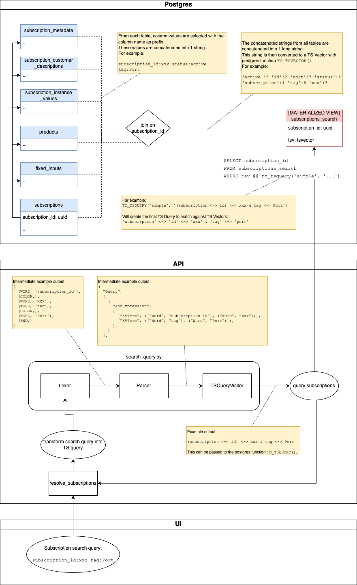

# Search

<!-- TOC -->
- [Search](#search)
  - [Usage](#usage)
  - [Implementation 1: Filter on DB Table](#implementation-1-filter-on-db-table)
  - [Implementation 2: Subscription Search](#implementation-2-subscription-search)
    - [Postgres Text Search](#postgres-text-search)
    - [Materialized View subscriptions\_search](#materialized-view-subscriptions_search)
<!-- TOC -->

The orchestrator-core provides search functionality to find data within the Postgres DB.

The below overview describes which objects can be searched through which endpoint, and the underlying search implementation.

| Object         | REST endpoint                      | GraphQL endpoint               | Implementation      |
|----------------|------------------------------------|--------------------------------|---------------------|
| Subscriptions  | `/api/subscriptions/search?query=` | `subscriptions(query: "...")`  | Subscription Search |
| Processes      |                                    | `processes(query: "...")`      | Filter on DB table  |
| Product Blocks |                                    | `product_blocks(query: "...")` | Filter on DB table  |
| Products       |                                    | `products(query: "...")`       | Filter on DB table  |
| Resource types |                                    | `resource_types(query: "...")` | Filter on DB table  |
| Workflows      |                                    | `workflows(query: "...")`      | Filter on DB table  |

There are 2 implementations:

1. **Filter on DB Table**: generic implementation to search on values in the DB table for an object, or related tables
1. **Subscription Search**: specialized implementation to search for values anywhere in a subscription, such as instance values or customer descriptions

## Usage

Call the REST or GraphQL endpoint with the `query` parameter set to the search query.

Some search query examples for Subscriptions:

| Query                                                    | Matches subscriptions with                                           |
|----------------------------------------------------------|----------------------------------------------------------------------|
| `test`                                                   | `test` in any field                                                  |
| `description:test`                                       | `test` in description field                                          |
| `L2VPN`                                                  | `L2VPN` in any field                                                 |
| `tag:L2VPN`                                              | `L2VPN` in product tag field                                         |
| `tag:(FW \| L2VPN)` <br/> Or: <br/>`tag:FW \| tag:L2VPN` | `FW` **OR** `L2VPN` in product tag field                             |
| `description:test tag:L2VPN`                             | `test` in description field **and** `L2VPN` in product tag field     |
| `description:test -tag:L2VPN`                            | `test` in description field **and NOT** `L2VPN` in product tag field |
| `test 123` <br/> Or: <br/>`123 test`                     | `test` **AND** `123` anywhere
| `"test 123"`                                             | `test 123` anywhere (Phrase search)                                  |
| `test*`                                                  | any field starting with `test` (Prefix search)                       |

Note that:

* For other objects the query syntax is the same
* Searching is case-insensitive
* Ordering of words does not matter (unless it is a Phrase)
* Search words cannot contain the characters `|-*():"` as they are part of the search query grammar

## Implementation 1: Filter on DB Table

This implementation translates the user's search query to `WHERE` clauses on DB columns of the object's DB table. For some objects this extends to related DB tables.

We can distinguish these steps:

* The module `search_query.py` parses the user's query and generates a sequence of sqlalchemy `.filter()` clauses
* The REST/GraphQL endpoint appends these clauses to the sqlalchemy `select()` to find objects that match the user's query

## Implementation 2: Subscription Search

This is a specialized implementation to allow searching values anywhere in a subscription or in related entities, without sacrificing performance.

We can distinguish these steps/components:

 * The DB view `subscriptions_search` is a search index with _Text Search_ (TS) vectors. Both are explained in the next sections
 * The module `search_query.py` parses the user's query into a string that is used to create a TS query
 * The TS query is wrapped in a single sqlalchemy `.filter()` clause to match TS documents in `subscriptions_search` and get the corresponding `subscription_id`
 * The REST/GraphQL endpoint appends this clause to the sqlalchemy `select()` to find subscription objects that match the user's query

The diagram below visualizes the flow and dependencies between components in the Database, API and Frontend.



<!-- search_overview.png can be opened and modified in draw.io -->

### Postgres Text Search

Postgres _Full Text Search_ (TS) has extensive [documentation](https://www.postgresql.org/docs/current/textsearch.html) but we'll cover the fundamentals in this section. TS queries can be done on "normal" DB tables, i.e. without a search index, but this is too slow. It is recommended to maintain a search index which we do in DB view `subscriptions_search`.

**Creating TS vectors**

The query behind `subscriptions_search` retrieves Subscriptions joined with several other tables (as shown in the previous diagram), forming a "document" of keywords that in some way relate to the subscription.

Each document is turned into a _tsvector_ with Postgres function `to_tsvector()` which consists of these phases:

* Parse document into _tokens_: split text into _tokens_ using special characters as delimiters
* Convert tokens into _lexemes_: a lexeme is a normalized token, i.e. this folds upper-case to lower-case. This step can also normalize based on language, but we disable that by using the `'simple'` dictionary (shown in diagram above)
* Create vector optimized for search: store array of _lexemes_ along with positional information

The array of _lexemes_ makes up the tsvector document that we store in `subsriptions_search`, and which we can query through the Postgres function `to_tsquery()`.

We'll demonstrate how this works through a few examples. You can follow along in any  postgres shell (v14 or above). If you have Docker installed, run these commands in separate shells.

```sh
docker run --rm -e POSTGRES_HOST_AUTH_METHOD=trust --name pg15 postgres:15
docker exec -i -t pg15 su - postgres -c psql
```

Translating the input text `'color:Light_Blue count:4'` to a tsvector:

```
postgres=# select to_tsvector('simple', 'color:Light_Blue count:4');
                 to_tsvector
----------------------------------------------
 '4':5 'blue':3 'color':1 'count':4 'light':2
(1 row)
```

The result `'4':5 'blue':3 'color':1 'count':4 'light':2` is an array of lexemes combined with information about their position in the original text.

With Postgres function `to_tsdebug()` one can investigate how the input was parsed.

```
postgres=# select * from ts_debug('simple', 'color:Light_Blue count:4');
   alias   |   description    | token | dictionaries | dictionary | lexemes
-----------+------------------+-------+--------------+------------+---------
 asciiword | Word, all ASCII  | color | {simple}     | simple     | {color}
 blank     | Space symbols    | :     | {}           |            |
 asciiword | Word, all ASCII  | Light | {simple}     | simple     | {light}
 blank     | Space symbols    | _     | {}           |            |
 asciiword | Word, all ASCII  | Blue  | {simple}     | simple     | {blue}
 blank     | Space symbols    |       | {}           |            |
 asciiword | Word, all ASCII  | count | {simple}     | simple     | {count}
 blank     | Space symbols    | :     | {}           |            |
 uint      | Unsigned integer | 4     | {simple}     | simple     | {4}
 ```

Note: when we would write "Light-Blue" with a dash instead of underscore, Postgres translates this into the vector `'blue':4 'light':3 'light-blue':2`, which makes it very complicated to query, in particular for UUID strings. To mitigate this we replace all occurrences of `-` with `_` when creating TS Vectors and before executing TS Queries.

**Querying TS Vectors**

To run queries against TS Vectors we have to prepare a TS Query with Postgres function `to_tsquery()`. We also pass the `'simple'` dictionary here to prevent language-specific normalization.

```
postgres=# select to_tsquery('simple', 'Light_Blue');
     to_tsquery
--------------------
 'light' <-> 'blue'
 ```

The resulting TS query means as much as: `the vector must contain 'light' followed by 'blue'`. Note that the input string has been tokenized similar to TS vectors.

We can execute this TS query against the TS vector:

```
postgres=# select to_tsvector('simple', 'color:Light_Blue count:4') @@ to_tsquery('simple', 'Light_Blue');
 ?column?
----------
 t
(1 row)
```

Returns `t` for `true`.

As a final example we can also add an `OR` condition:

```
postgres=# select to_tsvector('simple', 'color:Light_Blue count:4') @@ to_tsquery('simple', 'color <-> Green | count <-> 4');
 ?column?
----------
 t
(1 row)
```

Which returns true because while the vector does not contain the color green, it does contain count 4.

Note that the `color <-> Green | count <-> 4` string passed to `ts_query()` must be constructed in a specific way.
This happens in the orchestrator-core module `search_query.py` as shown in the overview diagram.

### Materialized View subscriptions_search

As mentioned before, `subscriptions_search` is a DB view which lies at the heart of the implementation.
If you're not familiar with database views; they represent a (usually complicated) database query in the form of a "virtual table".

In this case we're using a [Materialized View](https://www.postgresql.org/docs/current/rules-materializedviews.html#RULES-MATERIALIZEDVIEWS) which is like a normal view, except that the "virtual table" is persisted to save resources and increase performance.
The view's data is persisted until it is refreshed, which can be done manually or through an update trigger. (further explained below)

This table has a [GIN index](https://www.postgresql.org/docs/current/textsearch-indexes.html#TEXTSEARCH-INDEXES) for efficient search queries.

**Triggers**

Database function `refresh_subscriptions_search_view` takes care of refreshing `subscriptions_search`. It is called by triggers on the following tables:

* `fi_refresh_search` on table `fixed_inputs`
* `products_refresh_search` on table `products`
* `siv_refresh_search` on table `subscription_instance_values`
* `sub_cust_desc_refresh_search` on table `subscription_customer_descriptions`
* `sub_refresh_search` on table `subscriptions`

The following query shows the current state of the triggers:

```sql
SELECT tgname, tgenabled
FROM pg_trigger
where pg_trigger.tgname in
    ('fi_refresh_search',
     'products_refresh_search',
     'sub_cust_desc_refresh_search',
     'siv_refresh_search',
     'sub_refresh_search');
```

When all triggers are disabled the output looks like:

```
            tgname            | tgenabled
------------------------------+-----------
 fi_refresh_search            | D
 products_refresh_search      | D
 siv_refresh_search           | D
 sub_cust_desc_refresh_search | D
 sub_refresh_search           | D
```

And when all triggers are enabled the output looks like this:
```
            tgname            | tgenabled
------------------------------+-----------
 fi_refresh_search            | O
 products_refresh_search      | O
 siv_refresh_search           | O
 sub_cust_desc_refresh_search | O
 sub_refresh_search           | O
```

Enabling all triggers is done with these statements:

```sql
ALTER TABLE fixed_inputs ENABLE TRIGGER fi_refresh_search;
ALTER TABLE products ENABLE TRIGGER products_refresh_search;
ALTER TABLE subscription_customer_descriptions ENABLE TRIGGER sub_cust_desc_refresh_search;
ALTER TABLE subscription_instance_values ENABLE TRIGGER siv_refresh_search;
ALTER TABLE subscriptions ENABLE TRIGGER sub_refresh_search;
```

Disabling all triggers is done with these statements:

```sql
ALTER TABLE fixed_inputs DISABLE TRIGGER fi_refresh_search;
ALTER TABLE products DISABLE TRIGGER products_refresh_search;
ALTER TABLE subscription_customer_descriptions DISABLE TRIGGER sub_cust_desc_refresh_search;
ALTER TABLE subscription_instance_values DISABLE TRIGGER siv_refresh_search;
ALTER TABLE subscriptions DISABLE TRIGGER sub_refresh_search;
```

The following query returns the number of seconds since the last refresh, which can be useful for debugging.

```sql
SELECT extract(epoch from now())::int - coalesce(pg_catalog.obj_description('subscriptions_search'::regclass)::int, 0);
```

**Limitations**

Updating the `subscriptions_search` materialized view is expensive and limited to once every 2 minutes.

This means that when 2 changes happen within, say, 5 seconds of each other, the first change will be picked up directly.
However, the second change will only be processed on the next refresh of the view.
So during that period the second change will not show up in the search results.
