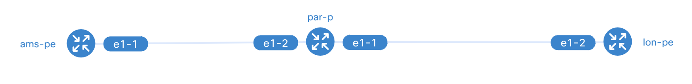

# Bootstrapping the environment


Here is how you can run the orchestrator-core, orchestrator-ui, and netbox with Docker Compose. We have this all
setup in our docker-compose.yml file so that you don't have to think about how to start the applications required for this workshop! If you want to read more about how to manually install the Workflow Orchestrator, please refer to [the beginner workshop here](../beginner/debian.md). The following Docker images are used in this workshop:

* [orchestrator-core](https://github.com/workfloworchestrator/orchestrator-core/pkgs/container/orchestrator-core): The workflow orchestrator step engine.
* [orchestrator-ui](https://github.com/workfloworchestrator/orchestrator-ui/pkgs/container/orchestrator-ui): The
  GUI for the orchestrator-core.
* [netbox](https://docs.netbox.dev/en/stable/): A free IPAM and SoT system.
* [postgres](https://hub.docker.com/_/postgres): The PostgreSQL object-relational database system.
* [redis](https://redis.io/): An open source, in-memory data store used by netbox
* Optional: [containerlab](https://containerlab.dev/): A free network topology simulator that uses containerized
  network operating systems.

!!! danger
    **To run the workshop with container lab, the host architecture must be x86_64 with virtualization
    enabled**

## Step 1 - Cloning the repo
The fist step is to clone the Example orchestrator repository using:
```
git clone https://github.com/workfloworchestrator/example-orchestrator.git
```
At this point, you have a functional environment to start play with. This includes:

* The orchestrator (core and GUI)
* Netbox (the entire stack including database, workers, etc...)
* LSO (to run ansible playbooks)
* An example containerlab topology based on Nokia SRlinux.
* Some examples of Ansible playbooks

The directory structure looks like this:
```
~/example-orchestrator# ls -la
total 144
drwxr-xr-x 14 root root  4096 May 10 10:29 .
drwx------ 16 root root  4096 May 15 06:42 ..
-rw-r--r--  1 root root   147 May  8 10:35 .env.example
drwxr-xr-x  8 root root  4096 May 15 10:15 .git
-rw-r--r--  1 root root    82 May  8 10:56 .gitignore
drwxr-xr-x  2 root root  4096 May  8 10:35 .pictures
-rw-r--r--  1 root root 50000 May  8 10:56 README.md
-rw-r--r--  1 root root   884 May  8 10:35 alembic.ini
drwxr-xr-x  4 root root  4096 May  9 19:42 ansible <<<< Ansible playbooks
drwxr-xr-x  3 root root  4096 May 15 10:16 clab <<<< Containerlab topology
drwxr-xr-x  9 root root  4096 May  8 10:56 docker <<<< Docker folder for config etc..
-rw-r--r--  1 root root  4469 May 10 10:29 docker-compose.yml <<<< The docker compoose file to spin up orchestrator stack
-rw-r--r--  1 root root   920 May  8 10:35 main.py
drwxr-xr-x  3 root root  4096 May  8 10:35 migrations
drwxr-xr-x  5 root root  4096 May  8 10:56 products
-rw-r--r--  1 root root   100 May  8 10:35 pyproject.toml
-rw-r--r--  1 root root    41 May  8 10:35 requirements.txt
drwxr-xr-x  2 root root  4096 May 10 10:46 services
-rw-r--r--  1 root root   942 May  8 10:35 settings.py
drwxr-xr-x  2 root root  4096 May  8 10:35 templates
drwxr-xr-x  2 root root  4096 May  8 10:35 translations
drwxr-xr-x  2 root root  4096 May  8 10:35 utils
drwxr-xr-x  7 root root  4096 May  8 10:56 workflows
```

## Step 2 - Editing the environment
Before starting up the stacks, we have to check the file:

```
docker/orchestrator-ui/orchestrator-ui.env
```

and adjust the LISTENING_IP value:

```
ENVIRONMENT_NAME="Example Orchestrator"

ORCHESTRATOR_API_HOST=http://<$LISTENING_IP>:8080
ORCHESTRATOR_API_PATH=/api
ORCHESTRATOR_GRAPHQL_HOST=http://<$LISTENING_IP>:8080
ORCHESTRATOR_GRAPHQL_PATH=/api/graphql
NEXTAUTH_SECRET=ToDo
```
* if you are running the orchestrator locally, for example on your laptop, use "localhost"
* if you are running the orchestrator on a remote machine, use the IP of that machine, for example 1.2.3.4

## Step 3 - Starting the environment
Once you edited the file, you can start the docker environment with:

### Remote lab environment with LSO and Containerlab
```
COMPOSE_PROFILES=lso docker compose up
```
This will also enable LSO, so network devices will be actually configured. If you don't want this, just use:

### Local environment
```
docker compose up -d
```

and you should be able to view the
applications here:

If you are using your laptop:

1. Orchestrator ui: [Frontend: http://localhost:3000](http://localhost:3000)
2. Orchestrator backend: [REST api: http://localhost:8080/api/redoc](http://localhost:8080/api/redoc) and  
   [Graphql API: http://localbost:8080/api/graphql](http://localbost:8080/api/graphql)
3. Netbox (admin|admin): [Netbox: http://localhost:8000](http://localhost:8000)

If you are using a remote machine:

1. Orchestrator ui: Frontend: http://<$IP_ADDRESS_OF_THE_MACHINE>:3000
2. Orchestrator backend: REST api: http://<$IP_ADDRESS_OF_THE_MACHINE>:8080/api/redoc
   Graphql API: http://<$IP_ADDRESS_OF_THE_MACHINE>:8080/api/graphql
3. Netbox (admin|admin): Netbox: http://<$IP_ADDRESS_OF_THE_MACHINE>:8000

!!! note
    Take your time to familiarise with the applications and make sure they are working correctly. You can then
    continue with the following steps.

## Optional: Step 4 Containerlab
Now that we have our orchestrator stack running, we can spin up the containerlab topology:

```
cd clab
containerlab deploy
```
At the end of this process we can use `containerlab inspect` to check the status of our topology:

```
~/example-orchestrator/clab# containerlab inspect
INFO[0000] Parsing & checking topology file: srlinux01.clab.yaml
+---+-----------------------+--------------+-----------------------+------+---------+----------------+--------------+
| # |         Name          | Container ID |         Image         | Kind |  State  |  IPv4 Address  | IPv6 Address |
+---+-----------------------+--------------+-----------------------+------+---------+----------------+--------------+
| 1 | clab-orch-demo-ams-pe | 46ddee7df745 | ghcr.io/nokia/srlinux | srl  | running | 172.22.0.11/16 | N/A          |
| 2 | clab-orch-demo-lon-pe | fe3f5d6eb35e | ghcr.io/nokia/srlinux | srl  | running | 172.22.0.10/16 | N/A          |
| 3 | clab-orch-demo-par-p  | 4831968e075c | ghcr.io/nokia/srlinux | srl  | running | 172.22.0.9/16  | N/A          |
+---+-----------------------+--------------+-----------------------+------+---------+----------------+--------------+
```

And with the command:
```
containerlab graph
```
we can have a nice rendering of the topology served on port 50080 (for example https://localhost:50080).

The topology we are going to use is something like this one:



The Example orchestrator used in this workshop already has a number of products pre-configured and ready to be used:

* Nodes (including Ansible to deploy example config)
* Core-links (including Ansible to deploy/delete example config)
* Ports
* L2VPN

We can start feeding initial data into the environment and run some workflows!

## Helpful Items

### Resetting Your Environment

To reset the active state of your environment back to scratch, simply use docker compose to delete volumes, like so:

```bash
jlpicard@ncc-1701-d:~$ docker compose down -v
```

You can then restart the containers as described above.
