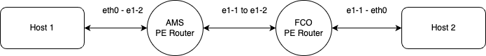

# Bootstrapping the environment
The Example orchestrator used in this workshop already has a number of products pre-configured and ready to be used:

* Nodes
* Core-links
* Ports
* L2VPN

Once you have successfully started the docker environment with `docker compose up -d` you should be able to view the 
applications here:

1. Orchestrator ui: [Frontend: http://localhost:3000](http://localhost:3000)
2. Orchestrator backend: [REST api: http://localhost:8080/api/redoc](http://localhost:8080/api/redoc) and  
   [Graphql API: http://localbost:8080/api/graphql](http://localbost:8080/api/graphql)
3. Netbox (admin|admin): [Netbox: http://localhost:8000](http://localhost:8000)

!!! note
    Take your time to familiarise with the applications and make sure they are working correctly. You can then 
    continue with the following steps.

## Workshop topology
Assuming you have installed the example orchestartor with containerlab integration enabled. We need to build the 
workshop topology that can be used to actually see packets flow. The workflows that you will run in the following 
steps will do the following:
* Seed Netbox
* Provision one P node and 2 PE nodes
* Create an IS-IS cloud to signal MPLS LSP's with backbone links
* Provision customer Ports that can be used in network services

The topology will be as follows:

Host 1 and Host 2 will be pre-provisioned, but the routers will need to be bootstrapped from scratch to work.

### Building the topology by running workflows
The topology can be built by running the following workflows. In total we need to run 10 workflows to setup the:

* Three Node Create workflows
* Three Interface sync workflows
* Two Core Link workflows
* Two Port workflow

Upon running the workflows when containerlab is enabled the Network Resource Manager, will attempt to provision the 
network and create end to end connectivity.