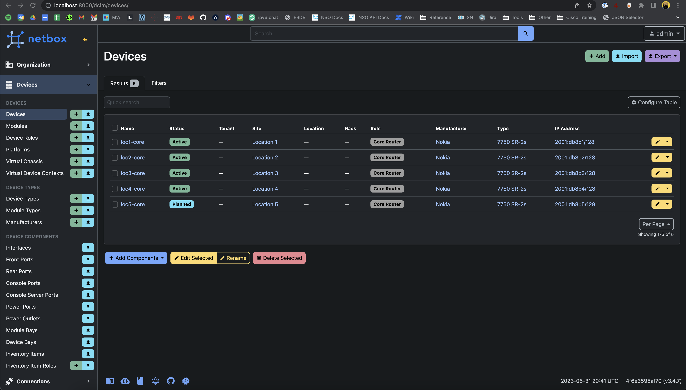

# Node Workflow

## Exercise 1: Update Netbox Status

The `create_node` workflow we outlined in the workflow overview section is implemented with the following StepList:

```python
begin
>> construct_node_model
>> store_process_subscription(Target.CREATE)
>> fetch_ip_address_information
>> provide_config_to_user
>> set_status(SubscriptionLifecycle.PROVISIONING)
>> update_node_status_netbox
```

To see the actual step code, go to `workflows/node/node_create.py`. covering the implementation steps of these details is generally out of scope for this workshop, they simply exist to give us a framework to build off of. The important concept to understand is that we are going to fill out the currently empty `update_node_status_netbox` step to actual perform the functions we need done in netbox.

### Why Update Node Status Externally?

The goal of the orchestrator is generally not to store data in the orchestrator's DB, but rather, to store pointers to data in external systems and keep track of those data. With the way that `create_node` is currently implemented, we have a bug where it is possible to enroll the same node multiple times, due to how we are filtering our list of nodes. To see this bug, take a look at the `get_nodes_list()` function in `create_node.py`, copied here for your convenience:

```python
def get_nodes_list() -> List[Any]:
    """
    Connects to netbox and returns a list of netbox device objects.
    """
    logger.debug("Connecting to Netbox to get list of available nodes")
    node_list = list(netbox.dcim.devices.filter(status="planned"))
    logger.debug("Found nodes in Netbox", amount=len(node_list))
    return node_list
```

This function is quite straightforward and simply connects to netbox and gets a list of all devices that are in the `planned` state using the netbox client. Since we don't have anything in the workflow that then changes that status in netbox from planned to a different state, there is nothing stopping us from enrolling the same router over and over again, which is of course not desirable.

### Implement The Update Step

The `pynetbox` client we are using has a very convenient way of updating items in netbox. If you are familiar with Django (the underlying technology for netbox) or other ORMs the client will feel very familiar to you. The general process is to fetch an object, modify it locally, then save your changes. Thus, to make the update happen in netbox, we need to do a three step process:

1. Use the netbox client to retrieve the device.
2. Update the device status.
3. Save the device changes in netbox.

Using this information, attempt to implement this functionality as described by filling out the `update_node_status_netbox` step in the `create_node.py` file. 

Try to do this on your own, however, if you get stuck, here is a working implementation:

??? example
    ```python
    @step("Update Node Data in Netbox")
    def update_node_status_netbox(
        subscription: NodeProvisioning,
    ) -> State:
        """Updates a node in netbox to be Active"""
        logger.debug("Updating Node status in netbox", node_name=subscription.node.node_name)
        device = netbox.dcim.devices.get(id=subscription.node.node_id)
        device.status = "active"
        if not device.save():
            raise RuntimeError(f"Could not save device status {device.__dict__}")
    ```

Once you have made your implementation, save the file, and the orchestrator backend will hot-reload. Run a new node create workflow on a node. Once you've run the workflow, you should now be able to go into netbox and see nodes set to active, like so:



!!! warning

    Keep in mind that This won't go back and fix the nodes that have been enrolled before we implemented this fix. In a production deployment you would need to go and fix this data manually or via some scripting, however, in this scenario, we can simply reset our environment to a blank slate like so:

    ```bash
    jlpicard@ncc-1701-d:~$ docker compose down -v && docker compose up -d
    ```
