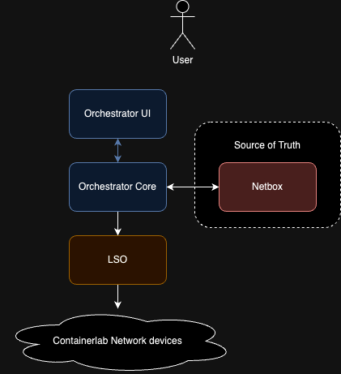
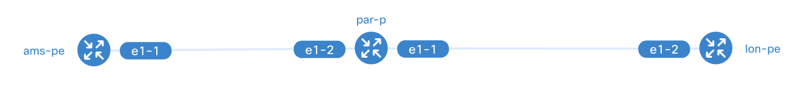

# Example Orchestrator Workshop Overview

## Intended audience

This workshop is intended for those who are interested in using the Workflow Orchestrator as network orchestrator, but
is also accessible to those who are new to the Workflow Orchestrator and would like to use it as a generic orchestrator.
The main goal of this workshop is to introduce you to how to write orchestrator workflows that talk to external systems,
as well as teaching you how to relate products to other products, using the dependency model of the
Workflow Orchestrator.

!!! tip
    Knowledge of the Python programming language, Docker, and the Unix command line interface are prerequisites for this workshop.


## Topics

* **Installation**  
  Detailed instructions are given on how to prepare your environment and install the orchestrator and GUI using docker compose.
* **Start applications**  
  Outline how to start the Workflow Orchestrator backend and GUI using docker compose.
* **Bootstrapping the applications and familiarisation**  
  Through a simple network node and network circuit scenario, a set of products is created showing how domain models are defined.
    * **Domain models**  
    Explains the benefits of the use of domain models and shows how the hierarchy of products, product blocks, fixed inputs and resource types are used to create product subscriptions for customers.
* **L2 Point-to-Point product modelling and workflow**  
  For the L2 Point-to-Point product, we will make the CREATE workflow by using the product generator. The use of input
  forms is explained as part of defining the create workflow. By using this method you should be able to quickly get
  up to speed and start coding quickly

## Workshop folder layout

This workshop uses the following folder layout:

```text
├── migrations
│   └── versions
│   └── schema
├── products
│   ├── product_blocks
│   ├── product_types
│   └── services
│   └── <service>
├── services
│ └── <service>
├── templates
├── translations
├── utils
└── workflows
├── <product>
└── tasks
37 directories, 99 files
```

## Workshop software architecture
The workshop combines a number of opensource software components that can provision a simulated network
running in containerlab. The following diagram shows the logical components of the application and how the data
flows. In reality there are a number of extra services like Postgres and Redis that store the application data of
the Orchestrator, Netbox and LSO.

### Software used in the workshop
* **The orchestrator**: This includes the UI and python backend that will run all workflows. All data is persisted in a Postgres database. Redis is used for caching and syncronisation purposes.
* **[Netbox](https://docs.netbox.dev/en/stable/)**: Netbox is the source of truth for this network topology. It contains all resources that are known
  in the topology: Interfaces, Nodes, IP addresses etc. The Orchestrator will configure Netbox but also retrieve resource from it.
* **[LSO](https://github.com/workfloworchestrator/lso)**: The Network Resource Manager (NRM) of this topology. This software is an API abstraction on top of
  ansible that integrates well with the orchestrator. It is responsible for running ansible jobs to provision the topology.
* **[Container Lab](https://containerlab.dev/)**: This software will manage the (virtual) network topology running the Network Operating System
  of the workshop. Below the network topology is explained.



## Workshop topology
Assuming you have installed the example orchestartor with containerlab integration enabled. We need to build the
workshop topology that can be used to actually see packets flow. The workflows that you will run in the following
steps will do the following:

* Seed Netbox
* Provision two PE nodes
* Create an IS-IS cloud to signal MPLS LSP's with backbone links
* Provision customer Ports that can be used in network services

The topology will be as follows:



Host 1 and Host 2 will be pre-provisioned, but the routers will need to be bootstrapped from scratch to work. This
process will be explained step by step in the last section of this workshop.
