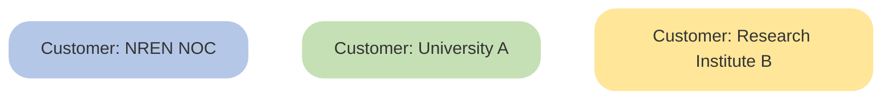
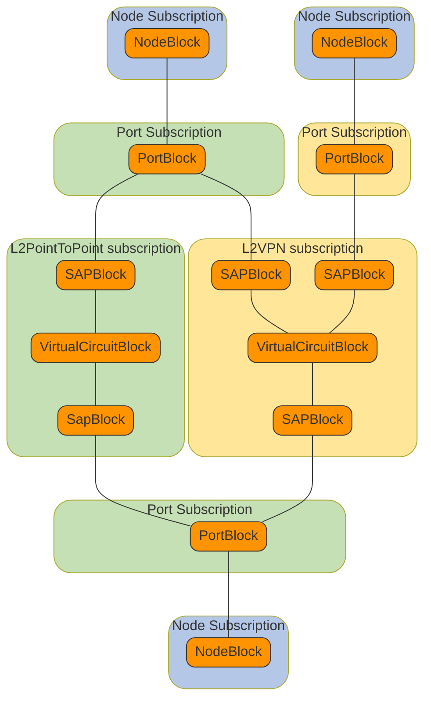

# Scenario

During this workshop a set of products will be used together with the needed workflows to manage enrolling network
nodes into the Workflow Orchestrator and creating circuits between nodes.
The products will be just complex enough to show the basic capabilities of products, product blocks, fixed inputs,
resource types and workflows in the workflow orchestrator. We will cover nesting product blocks and products together.

## Product hiearchy example
In the diagram below you can see how all products and product blocks relate to each other. The example orchestrator
has implemented the following example products and corresponding workflows that can be used to build a basic network
topology and customer facing services:

{{ external_markdown('https://raw.githubusercontent.com/workfloworchestrator/example-orchestrator/master/README.md', '### Implemented products') }}

## Customers

## Example Subscription Diagram

!!! Hint
    Take some time to explore the module described in above. It shows how the product modelling is done in Python.
    Once you are familiar with the code. Continue with the workshop
